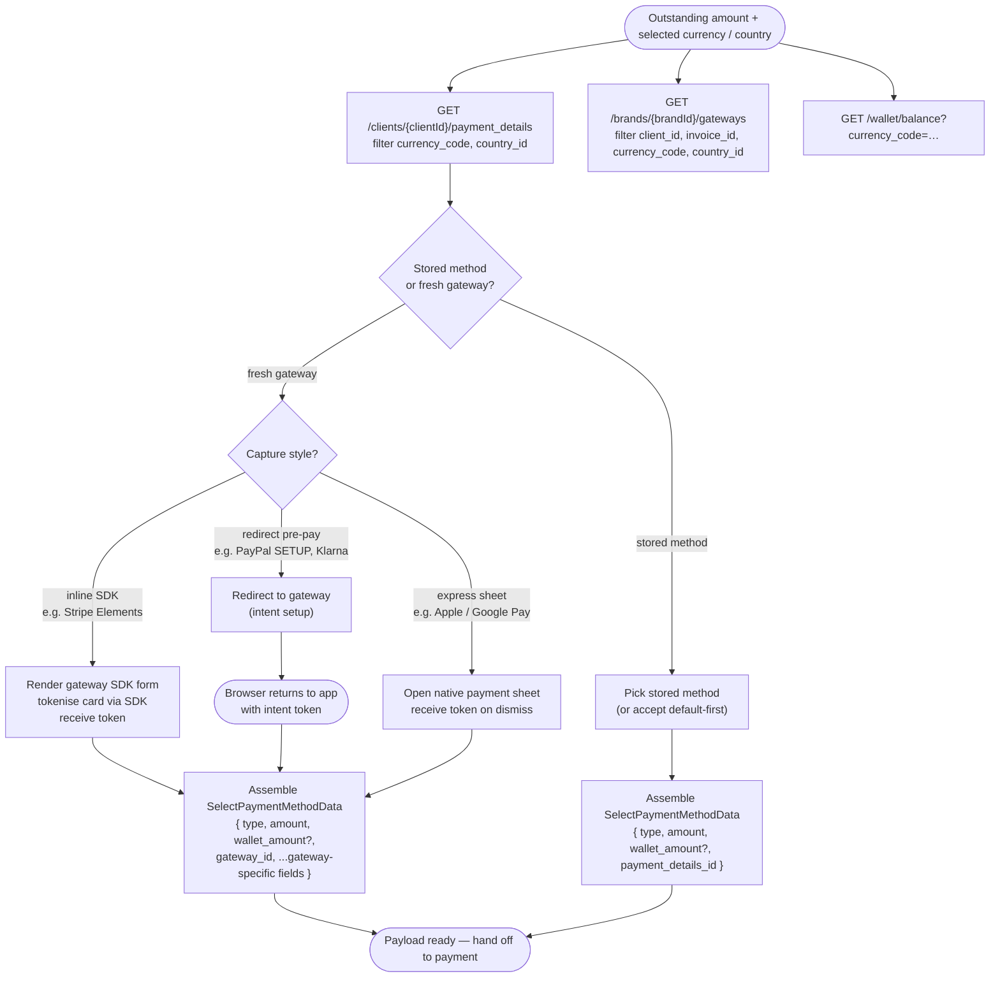

# Module: paymentDetails

## What it is

Payment details **captures** the payment intent — it owns the customer-facing pre-submission half of "how do you want to pay this?" It lists the cards (and other stored payment methods) a client has on file, captures new ones via per-gateway SDK lifecycles (load, render, tokenise, 3DS challenge — all owned here), works out which gateways are eligible for a given amount / currency / country, surfaces the client's wallet balance as a payment source, and produces the selected-method payload (`SelectPaymentMethodData`) that downstream calls submit. It is the layer between the storefront's "pick how you want to pay" UX and the BE-side payment-submission API.

**Capture vs make.** Payment details _captures_ the intent; the sibling `payment` module _makes_ the payment asynchronously via the back end. The boundary is the `SelectPaymentMethodData` payload — payment details builds it, payment receives it and submits to `POST /payments`, then handles the post-submission gateway outcome (inline challenge, offsite redirect, awaiting-client, or immediate success) as documented in payment's "Attempt a payment" flow. The basket-conversion path (`PATCH /orders/{id}/convert`) is owned by `basket`; the invoice record and balance are owned by `invoices`.

Two operating modes share the same data and lifecycle:

- **Pay mode** — the basket or invoice has an outstanding amount, the client picks a stored method or a fresh gateway, and the output is a `SelectPaymentMethodData` payload the basket-conversion call or invoice-payment call consumes.
- **Add mode** — no outstanding amount; the client is storing a card on file outside of a payment, typically from a "My Payment Methods" page or from a free-trial signup where the brand requires card capture up front. The same gateway list is used, filtered to store-capable gateways; output is the new `payment_details_id` registered against the client.

### Keys by lifecycle phase

| Phase    | Keys                                                     | Relevance                                                                                                                                                                                                   |
| -------- | -------------------------------------------------------- | ----------------------------------------------------------------------------------------------------------------------------------------------------------------------------------------------------------- |
| Checkout | `billing.gateway.client_allow_partial_payments`          | Permits the caller to pay less than the full outstanding amount in a single transaction. When off, the partial-payment option is filtered out of the available payment types regardless of gateway support. |
| Checkout | `invoices.common.is_available_pay_later`                 | Permits the caller to bypass payment entirely and convert the basket as unpaid. Forcibly disabled for any non-draft invoice (a basket that has already been part-paid cannot regress to "pay later").       |
| Payment  | `billing.gateway.force_card_storage`                     | When set, every successful payment also stores the card as a reusable payment method on the client (no opt-out on the form).                                                                                |
| Payment  | `billing.gateway.force_auto_payment_for_stored_details`  | When set, any stored payment method created on this brand is flagged `auto_payment: true` — the platform will charge it for subsequent renewals without re-prompting.                                       |
| Payment  | `billing.gateway.allow_card_removal_replacement`         | When off, a client cannot delete their last stored method while there is an active recurring contract billed against it; the back end rejects the deletion.                                                 |
| Payment  | `billing.gateway.enable_shared_invoice_store_on_payment` | Permits a stored method captured on one invoice's payment to be reused against unrelated invoices later.                                                                                                    |

The brand surfaces these keys through `/config/brand/values`; payment details consumes them but does not own them.

## Core concepts

- **Stored payment method** — a `client_payment_details` record on the back end. Belongs to a client, references the gateway it was tokenised against, carries the resolved card metadata (`card_last4`, `card_expire_date`, `card_type`), an `auto_payment` flag, and a `default` flag at most one record can hold per client.
- **Brand gateway** — a `brand_gateway` row: the gateway entry the brand has enabled, ordered, and possibly localised. Carries the gateway's currencies, card types, and provider metadata. The brand gateway list is filtered server-side by the call's `client_id`, `invoice_id`, `country_id`, and `currency_code` — gateways that don't support the combination drop out before they reach the caller.
- **Gateway type** — one of seven wire-level categories (`CARD`, `BANK_TRANSFER`, `DIRECT_DEBIT`, `OFFLINE`, `MOBILE`, `AWAITING_CLIENT`, plus the absent `WALLET` slot). Determines which payment-method form the storefront needs to show and whether the platform expects an SDK-confirmed token or a server-side reference.
- **Payment type** — one of three transaction shapes: `PAY_IN_FULL`, `PARTIAL_PAYMENT`, `PAY_LATER`. The available set is computed per-call from the brand config keys above, the gateway list, and whether the order has an outstanding balance.
- **Pay context vs add context** — the two operating modes named above. The active context filters the gateway list (add-mode shows only store-capable gateways), strips `PAY_LATER` from the payment-type options (you cannot defer a zero-amount card capture), and decides what the capture produces: pay-mode produces a `SelectPaymentMethodData` payload (submitted by sibling `payment`); add-mode produces a new `payment_details_id` via the tokenise-end endpoint (`POST /gateway/frontend/tokenize-end/{gatewayId}`).
- **Tokenise begin / tokenise end** — the two-step handshake for capturing a new card on a gateway that runs an off-site or off-frame flow (3DS challenge, redirect, hosted fields). `tokenize-begin` returns the gateway-specific payload the SDK needs to start its flow; `tokenize-end` finalises the resulting token into a permanent `client_payment_details` row.
- **Account credit (wallet)** — a client's pre-paid balance, returned by `/wallet/balance`. Available as a partial or full payment source; it is netted off the amount before the gateway is asked for the remainder.
- **Selected method payload** — the `SelectPaymentMethodData` envelope (`{ type, amount, wallet_amount, gateway_id?, payment_details_id? }`) basket-conversion and invoice-payment accept. Exactly one of `gateway_id` or `payment_details_id` is populated, the other is stripped before submit.

## Operations

| #   | Capability                                                  | Inputs                                                                                                                                                                                                                                                                     | Outputs                                                                                                                                                                                                                                                                                                                                                                                                                                                                                                                                                           |
| --- | ----------------------------------------------------------- | -------------------------------------------------------------------------------------------------------------------------------------------------------------------------------------------------------------------------------------------------------------------------- | ----------------------------------------------------------------------------------------------------------------------------------------------------------------------------------------------------------------------------------------------------------------------------------------------------------------------------------------------------------------------------------------------------------------------------------------------------------------------------------------------------------------------------------------------------------------- |
| 1   | **List a client's stored payment methods**                  | `clientId`; optional filters `currency_code`, `country_id`, `active`, `brand_id`                                                                                                                                                                                           | Array of `client_payment_details` records the client owns on the brand, sorted with the `default` method first. Filtering is server-side: passing `currency_code` and `country_id` narrows the list to methods whose gateway supports the combination. `GET /clients/{clientId}/payment_details`.                                                                                                                                                                                                                                                                 |
| 2   | **List brand-eligible gateways for a payment context**      | `brandId`; optional `basket_id` (shortcut — derives `currency_code` from basket currency and `country_id` from the basket's bound address); optional `client_id`, `invoice_id`, `currency_code`, `country_id` (can also be passed explicitly, with or without `basket_id`) | Array of `brand_gateway` rows the brand has enabled and that pass the supplied filters. Gateways match on a 2-way filter: currency, country, or both — some gateways are anchored to one currency irrespective of country (most card gateways), others to one country irrespective of currency (most local bank transfer / direct-debit providers), and some require both to match. Each row carries the gateway's currencies, card types, provider, payment-type list, and `store_on_payment` / `store_outside_payment` flags. `GET /brands/{brandId}/gateways`. |
| 3   | **Read the client's wallet balance**                        | (current actor) + `currency_code`                                                                                                                                                                                                                                          | The client's pre-paid credit split into `online`, `offline`, `total` and `negative_allowance` buckets, each keyed by currency. The selected currency's `total.amount_converted` is the figure available as a partial payment source. `GET /wallet/balance`.                                                                                                                                                                                                                                                                                                       |
| 4   | **Format an arbitrary amount in a given currency**          | `currency_id`, `prices: number[]`                                                                                                                                                                                                                                          | A locale-aware formatted total string for the supplied numeric values. Used to display the running "you pay" / "wallet covers" / "outstanding" trio without the storefront having to know currency decimal rules. `POST /cart/calculate`.                                                                                                                                                                                                                                                                                                                         |
| 5   | **Begin storing a card on a gateway (SDK / redirect flow)** | `gatewayId`, gateway-specific payload (return URL, currency, address, optional `invoice_id` for shared-store-on-payment)                                                                                                                                                   | A gateway-specific response the SDK or redirect step consumes (e.g. a Stripe setup intent client secret, a hosted-fields URL). The output shape varies per provider — it is the per-gateway payload the SDK consumes verbatim, and the wrapper layer does not interpret it. `POST /gateway/frontend/tokenize-begin/{gatewayId}`.                                                                                                                                                                                                                                  |
| 6   | **Finalise a stored card after the SDK confirms**           | `gatewayId`, `client_id`, gateway-returned token bag (provider-specific keys)                                                                                                                                                                                              | The newly-created `client_payment_details` row, including its `id` (the value the storefront wires into subsequent `payment_details_id` selections), `sca_verified`, `auto_payment`, and `next_action` (populated when a further SCA step is required). `POST /gateway/frontend/tokenize-end/{gatewayId}`.                                                                                                                                                                                                                                                        |
| 7   | **Create a stored card directly (no SDK handshake)**        | `clientId`, raw card fields (`card_num`, `card_expire_date`, `card_cvv`, `card_type`, `cardholder_name`, `address_id`, `gateway_id`), `return_url`, optional `auto_payment`                                                                                                | The created `client_payment_details` row. Carries `sca_verified` and `next_action` — `sca_verified: false` plus a populated `next_action.url` means the caller must redirect the client through the URL before the method is usable. `POST /clients/{clientId}/payment_details`. Used by gateways that accept raw card data via the server (Sage Pay Direct, Worldpay JSON, PayPal Pro).                                                                                                                                                                          |
| 8   | **Delete a stored payment method**                          | `paymentDetailId`                                                                                                                                                                                                                                                          | Removes the record from the client. Rejected by the back end with `409`-shaped errors when `allow_card_removal_replacement` is off and the method is the last one backing an active auto-payment contract. `DELETE /clients/{clientId}/payment_details/{paymentDetailId}`.                                                                                                                                                                                                                                                                                        |
| 9   | **Set a stored method as default**                          | `paymentDetailId`                                                                                                                                                                                                                                                          | Promotes the named method to `default: true` and demotes whichever other record previously held the flag. The default is what `payment_details` listing returns first; the platform uses it as the implicit choice when auto-payments fire on renewals. `PATCH /clients/{clientId}/payment_details/{paymentDetailId}` with `{ default: true }`.                                                                                                                                                                                                                   |
| 10  | **Toggle auto-payment on a stored method**                  | `paymentDetailId`, `auto_payment: boolean`                                                                                                                                                                                                                                 | Updates the method's `auto_payment` flag. Forcibly held at `true` when the brand's `force_auto_payment_for_stored_details` key is set — the back end rejects attempts to flip it off. `PATCH /clients/{clientId}/payment_details/{paymentDetailId}` with `{ auto_payment }`.                                                                                                                                                                                                                                                                                      |
| 11  | **Resume a pending tokenise after an off-site redirect**    | redirect query params (`operation_id`, gateway-specific tokens like `setup_intent`, `setup_intent_client_secret`)                                                                                                                                                          | The same response as capability 6 — the newly-created `client_payment_details` row. The resume path reads the pending operation envelope from session-scoped storage (keyed by `operation_id`) and calls tokenise-end with the gateway-returned tokens; it exists because 3DS / SCA / PayPal-style flows force a full-page redirect mid-handshake. `POST /gateway/frontend/tokenize-end/{gatewayId}`.                                                                                                                                                             |

> **Submission to `POST /payments` is sibling `payment`'s capability, not surfaced here.** Capture stops at producing the `SelectPaymentMethodData` payload; submission, response parsing, and approval-url handling are documented in the `payment` foundation doc.

## Data shape

### Stored payment method — `IPaymentDetail`

```ts
// Returned by GET /clients/{clientId}/payment_details (one per array entry),
// POST /clients/{clientId}/payment_details (single record),
// POST /gateway/frontend/tokenize-end/{gatewayId} (single record, wrapped),
// PATCH /clients/{clientId}/payment_details/{id} (updated single record).
type StoredPaymentMethod = {
  id: string;
  client_id: string;
  user_id: string; // "sys" for self-service storefront flows
  name: string | null; // human label, e.g. "Mastercard ending 4444"

  // Gateway link
  gateway_id: string;
  gateway: BrandGateway; // with-relation: full gateway record

  // Card metadata (populated for CARD type; null-ish for bank transfer / direct debit)
  card_type: string; // "mastercard", "visa", "amex", …
  card_last4: string;
  card_expire_date: string; // "1/2025" — month/year, no zero-pad
  card_num: null | string; // null except in rare admin-import flows
  card_token: string; // opaque gateway-side token
  card_cvv: null | string; // never returned after capture

  // Direct-debit / SEPA metadata (populated when type !== CARD)
  sepadd_iban: null | string;
  sepadd_bic: null | string;
  ukdd_account_number: null | string;
  ukdd_account_sortcode: null | string;
  allow_bacs: null | string;
  allow_cheque: null | string;

  // Address link (billing address for the method)
  address_id: string;
  address: Address; // with-relation

  // Currency link (null when the method is currency-agnostic)
  currency_id: string | null;
  currency: Currency | null; // with-relation

  // Flags
  type: number; // GatewayTypes — see enum below
  default: boolean; // exactly one stored method per client carries true
  active: boolean;
  can_delete: boolean; // server-resolved against allow_card_removal_replacement
  auto_payment: boolean; // platform charges this method for renewals
  autopayment_blocked: boolean; // BE-side block (e.g. last 3DS failed)
  autopayment_blocked_reason: string | null;
  manual: boolean; // staff-entered rather than gateway-tokenised
  sca_verified: boolean; // true once the method has cleared a successful SCA
  next_action: { url: string } | null; // populated mid-redirect; redirect the client there
  payment_method_type: string | null; // provider-specific sub-type (e.g. "ideal", "sepa_debit")
  pre_expiry_notification: string | null; // date the BE schedules the "your card expires" email
  errors: unknown[]; // gateway-side validation errors carried on the record

  // Audit
  created_at: string;
  updated_at: string;
  deleted_at: string | null;

  // Embedded client record (with-relation), available when the listing was fetched with `with=client`
  client: Client;
};
```

Cross-reference: `IPaymentDetail` is defined in `packages/types/src/models/paymentDetails.ts`; the typed contract is narrower than the fixture (it omits `default`, `can_delete`, `payment_method_type`, `autopayment_blocked*`, `pre_expiry_notification`, `manual`, `errors`) — follow the fixture, those fields are real on the wire.

### Brand gateway — `IBrandGateway`

```ts
// Returned by GET /brands/{brandId}/gateways (one per array entry).
type BrandGateway = {
  id: string;
  brand_id: string;
  gateway_id: string;
  active: boolean;
  visible: boolean;
  order: number; // brand-curated display order

  // Embedded gateway record
  gateway: {
    id: string;
    name: string; // "Stripe", "GoCardless", …
    name_translated: string;
    short_description: string | null;
    short_description_translated: string | null;
    provider: string; // GatewayProviderCodes, e.g. "Stripe_PaymentIntents"
    payment_instructions: string; // free-text shown for offline gateways
    payment_instructions_translated: string;
    type: GatewayTypes; // see enum below
    auth_type: "settings" | "oauth";
    gateway_provider_id: string;
    org_id: string;

    // Store / payment behaviour flags
    is_stored: boolean; // brand has enabled storing on this gateway
    use_frontend_implementation: boolean; // gateway runs an SDK in the browser (vs server-only)
    allow_manual_store: boolean;
    require_stored: boolean;
    store_on_payment: boolean; // capturing a payment also stores the card
    store_on_payment_force: boolean; // … and the customer cannot opt out
    store_outside_payment: boolean; // the ADD flow is supported on this gateway

    // Eligibility
    currencies: { currency_id: string; currency_code: string }[];
    card_types: { id: string; name: string; code: string }[];
    countries: { country_id: string }[]; // empty array means "no country restriction"

    // Provider-side capabilities (mirrored from the gateway_provider record)
    gateway_provider: {
      id: string;
      name: string;
      code: string; // GatewayProviderCodes
      type: GatewayTypes;
      store_type: "either" | "payment" | "outside";
      auth_type: "settings" | "oauth";
      external_payment: boolean;
      external_store: boolean;
      external_billing_charge: boolean;
      needs_address: boolean;
      requires_name: boolean;
      store_on_payment: boolean;
      store_on_payment_force: boolean;
      store_outside_payment: boolean;
      supports_refund: boolean;
      supports_frontend_implementation: boolean;
      supported_currencies: string[] | null;
      display_fields: string; // comma-separated field codes the form should render
      instructions: string;
    };

    webhook_url: string; // platform callback URL the gateway calls back to
    hash: string; // settings-fingerprint; changes when the brand reconfigures
    oauth_application_access_token_id: string | null;

    gateway_settings: (
      | {
          id: string;
          private: true; // private settings are returned as id+private only
        }
      | {
          id: string;
          gateway_id: string;
          field: string; // "publicKey", "stored", "paymentMethodCard", …
          value: string; // always string on the wire; cast per-field
          private: false;
          created_at: string;
          updated_at: string;
          deleted_at: string | null;
        }
    )[];

    translations: unknown[];
  };

  created_at: string;
  updated_at: string;
  deleted_at: string | null;
};

enum GatewayTypes {
  // packages/types/src/data/enums/gateway.ts
  CARD = 1,
  BANK_TRANSFER = 2,
  DIRECT_DEBIT = 3,
  OFFLINE = 5,
  MOBILE = 6,
  AWAITING_CLIENT = 10
}
```

### Wallet balance — `IWalletBalance`

```ts
// Returned by GET /wallet/balance.
type WalletBalance = {
  online: Record<CurrencyCode, WalletCurrencyBalance>;
  offline: Record<CurrencyCode, WalletCurrencyBalance>;
  total: Record<CurrencyCode, WalletCurrencyBalance>;
  negative_allowance: Record<CurrencyCode, WalletCurrencyBalance>;
};

type WalletCurrencyBalance = {
  amount: number; // in the wallet's own currency
  amount_formatted: string;
  amount_converted: number; // in the requested display currency
  amount_converted_formatted: string;
  currency: Currency;
};
```

### Selected method payload — `SelectPaymentMethodData`

```ts
// Input to POST /payments and to the basket-conversion call. Exactly one of
// gateway_id or payment_details_id is populated; the other is stripped before submit.
type SelectPaymentMethodData = {
  type: PaymentType; // PAY_IN_FULL | PARTIAL_PAYMENT | PAY_LATER
  amount: number;
  wallet_amount?: number; // 0 if not using account credit
  gateway_id?: string; // fresh-gateway flow
  payment_details_id?: string; // stored-method flow
  return_url?: string; // redirect-shaped gateways
  cancel_url?: string;
};

enum PaymentType {
  PAY_IN_FULL = "pay_in_full",
  PARTIAL_PAYMENT = "partial_payment",
  PAY_LATER = "pay_later"
}
```

## Dependencies

### Dependants — modules that read from this one

| Module    | Weight | Reads                                                                        | Why                                                                                                                                                                                                                            |
| --------- | ------ | ---------------------------------------------------------------------------- | ------------------------------------------------------------------------------------------------------------------------------------------------------------------------------------------------------------------------------ |
| `payment` | 5      | `SelectPaymentMethodData` payload, `GatewayTypes` and `GatewayContext` enums | Submits the captured payload to `POST /payments` and handles the gateway's response.                                                                                                                                           |
| `basket`  | 4      | stored method list, selected payment payload, payment-type enum              | The basket carries a `payment_details_id` / `gateway_id` it submits at conversion; it reads the filtered stored-method list so it can preselect the default, and the payment-type list to know whether `PAY_LATER` is allowed. |
| `orders`  | 4      | stored method shape, payment-type enum                                       | The invoice / order view shows the method that paid each transaction and offers the same payment-type choices when retrying a failed charge.                                                                                   |

Presentation layer — payment-method management pages (list, add, edit default, delete), checkout payment step, and the invoice "pay now" surface all read the stored-method list, the gateway list, the wallet balance, and the payment-type set. The presentation layer renders the gateway-specific form (card fields, hosted SDK container, bank transfer instructions) but defers the SDK lifecycle to the `payment` module.

The `query` HTTP transport layer and the `routing` module are excluded — they cover most modules and are not domain dependants.

### This module's own dependencies

- **HTTP transport layer** — bearer-token-authenticated requests, currency injection on listing calls, error normalisation, mutation invalidation keyed by `["paymentDetail", "stored"]`.
- **Session** — for the calling client's id, authentication signal, and the auth-subscription that re-loads the gateway list on token change.
- **Brand** — for `brandId`, default currency, and the brand-config keys enumerated in "Keys by lifecycle phase".
- **Routing** — for reading the off-site-redirect query params (`operation_id`, gateway-specific setup-intent params) when resuming a tokenise-end after the client returns.
- **Payment** — sibling module that owns the `make` half of the lifecycle: takes the `SelectPaymentMethodData` payload, submits it to `POST /payments`, drives the client through any redirect / inline challenge the response signals, and reconciles the gateway-webhook → invoice-paid handshake. Payment details produces the payload and hands off; the sibling picks up from there.
- **Shared types / enums** — `IPaymentDetail`, `IBrandGateway`, `IGateway`, `IWalletBalance`, `SelectPaymentMethodData`, `PaymentType`, `GatewayTypes`, `GatewayContext`, `GatewayProviderCodes`, `BrandConfigKeys`, `InvoiceStatus`, `PaymentMethodType` in `packages/types/src/models/` and `packages/types/src/data/enums/`.

## API endpoints

### Stored payment methods (per-client)

#### List a client's stored payment methods

```bash
curl -s "$API/api/clients/{clientId}/payment_details?limit=0&brand_id={brandId}&country_id={countryId}&currency_code=USD&active=true&with=gateway,client&order=-default,id&lang=en-US" \
  -H "Authorization: Bearer $ACCESS_TOKEN"
```

```json
{
  "status": "ok",
  "data": [
    {
      "id": "3de78642-de53-9714-ee0c-21208469530d",
      "client_id": "8d632507-9806-5d1e-48dc-8174e234e98d",
      "user_id": "sys",
      "name": "Mastercard ending 4444",
      "currency_id": null,
      "default": true,
      "address_id": "825d96e7-63ed-0913-46df-417482528340",
      "card_type": "mastercard",
      "card_last4": "4444",
      "card_expire_date": "1/2025",
      "allow_bacs": null,
      "allow_cheque": null,
      "gateway_id": "4d036794-24d0-e710-9d5a-3153698d582e",
      "type": 1,
      "pre_expiry_notification": "2025-01-26",
      "manual": false,
      "next_action": null,
      "sca_verified": false,
      "auto_payment": true,
      "payment_method_type": null,
      "autopayment_blocked": false,
      "autopayment_blocked_reason": null,
      "active": true,
      "can_delete": true,
      "errors": [],
      "gateway": {
        "id": "4d036794-24d0-e710-9d5a-3153698d582e",
        "name": "Stripe",
        "provider": "Stripe_PaymentIntents",
        "type": 1,
        "is_stored": true,
        "use_frontend_implementation": true,
        "store_on_payment": true,
        "store_outside_payment": true
      }
    }
  ],
  "total": 1
}
```

When the calling token is not authorised to read the requested client, the platform returns `403` with `error.message = "Unauthorized access to client!"` and `data: null` — observed on `GET /api/clients/{otherClientId}/payment_details` with a token belonging to a different client.

#### Create a stored card directly (raw-card gateways)

```bash
curl -s -X POST "$API/api/clients/{clientId}/payment_details?lang=en-US" \
  -H "Authorization: Bearer $ACCESS_TOKEN" \
  -H "Content-Type: application/json" \
  -d '{
    "card_type": "visa",
    "card_num": "4111111111111111",
    "card_expire_date": "12/2028",
    "card_cvv": "123",
    "cardholder_name": "Dom Da Costa",
    "name": "Visa ending 1111",
    "address_id": "{addressId}",
    "gateway_id": "{gatewayId}",
    "return_url": "https://my.brand.com/payment/return?operation_id=...",
    "auto_payment": true
  }'
```

Response is a single `IPaymentDetail` record matching the shape in the listing call. `sca_verified: false` plus a populated `next_action.url` means the back end is asking the caller to redirect the client through the URL to clear an SCA step before the method is usable.

#### Set a stored method as default / toggle auto-payment

```bash
curl -s -X PATCH "$API/api/clients/{clientId}/payment_details/{paymentDetailId}?lang=en-US" \
  -H "Authorization: Bearer $ACCESS_TOKEN" \
  -H "Content-Type: application/json" \
  -d '{ "default": true, "auto_payment": true }'
```

#### Delete a stored method

```bash
curl -s -X DELETE "$API/api/clients/{clientId}/payment_details/{paymentDetailId}?lang=en-US" \
  -H "Authorization: Bearer $ACCESS_TOKEN"
```

### Brand gateway list

Server-side filter is **2-way** — each gateway matches against currency, country, or both. Most card gateways are currency-anchored (one currency, any country); most local bank-transfer / direct-debit providers are country-anchored (one country, any currency); some require both to match.

Filter inputs can be passed explicitly (`currency_code`, `country_id`) **or** derived implicitly via `basket_id` — supplying `basket_id` uses the basket's currency and the country from its bound address. The two forms can be combined when a caller wants to override one axis (e.g. pass `basket_id` plus an explicit `currency_code` to evaluate gateway eligibility against a hypothetical currency switch).

```bash
curl -s "$API/api/brands/{brandId}/gateways?limit=0&client_id={clientId}&invoice_id={invoiceId}&country_id={countryId}&currency_code=USD&active=true&with=gateway.gateway_provider,gateway.card_types&order=order&lang=en-US" \
  -H "Authorization: Bearer $ACCESS_TOKEN"
```

Equivalent using the basket shortcut:

```bash
curl -s "$API/api/brands/{brandId}/gateways?limit=0&basket_id={basketId}&active=true&with=gateway.gateway_provider,gateway.card_types&order=order&lang=en-US" \
  -H "Authorization: Bearer $ACCESS_TOKEN"
```

```json
{
  "status": "ok",
  "data": [
    {
      "id": "5d085e69-d562-3719-706f-218e940d4237",
      "gateway_id": "4d036794-24d0-e710-9d5a-3153698d582e",
      "brand_id": "47d73824-8507-9315-e54f-81e642d59e06",
      "active": true,
      "order": 1,
      "visible": true,
      "gateway": {
        "id": "4d036794-24d0-e710-9d5a-3153698d582e",
        "name": "Stripe",
        "provider": "Stripe_PaymentIntents",
        "type": 1,
        "auth_type": "settings",
        "is_stored": true,
        "use_frontend_implementation": true,
        "allow_manual_store": true,
        "require_stored": false,
        "store_on_payment": true,
        "store_on_payment_force": false,
        "store_outside_payment": true,
        "webhook_url": "https://api.brand.com/omnibridge/callback/4d036794-...",
        "currencies": [
          { "currency_id": "...", "currency_code": "USD" },
          { "currency_id": "...", "currency_code": "GBP" },
          { "currency_id": "...", "currency_code": "ZAR" }
        ],
        "card_types": [
          { "id": "...", "name": "Visa", "code": "visa" },
          { "id": "...", "name": "MasterCard", "code": "mastercard" },
          {
            "id": "...",
            "name": "American Express",
            "code": "american-express"
          }
        ],
        "gateway_settings": [
          { "field": "publicKey", "value": "pk_test_...", "private": false },
          { "field": "stored", "value": "1", "private": false },
          { "field": "frontendImplementation", "value": "1", "private": false },
          { "field": "paymentMethodCard", "value": "1", "private": false },
          { "field": "paymentMethodSepaDebit", "value": "1", "private": false },
          { "field": "paymentMethodIdeal", "value": "1", "private": false },
          { "field": "showStoredDetails", "value": "1", "private": false }
        ],
        "gateway_provider": {
          "code": "Stripe_PaymentIntents",
          "type": 1,
          "store_type": "either",
          "external_payment": false,
          "external_store": false,
          "supports_refund": true,
          "supports_frontend_implementation": true,
          "needs_address": false,
          "requires_name": false,
          "display_fields": "card_type,card_num,card_expire_date,card_cvv"
        }
      }
    }
  ]
}
```

The `currencies` and `card_types` arrays scope what the gateway is _capable_ of, not what the brand has selected — the query's `currency_code` / `country_id` filters do the brand-policy narrowing server-side.

### Wallet balance

```bash
curl -s "$API/api/wallet/balance?lang=en-US&currency_code=USD" \
  -H "Authorization: Bearer $ACCESS_TOKEN"
```

```json
{
  "status": "ok",
  "data": {
    "online": {
      "USD": {
        "amount": 0,
        "amount_formatted": "$0.00",
        "amount_converted": 0,
        "amount_converted_formatted": "$0.00",
        "currency": {
          "id": "...",
          "code": "USD",
          "prefix": "$",
          "suffix": "",
          "decimals": true,
          "base": true
        }
      }
    },
    "offline": {
      "USD": {
        "amount": 0,
        "amount_formatted": "$0.00",
        "amount_converted": 0,
        "amount_converted_formatted": "$0.00",
        "currency": { "code": "USD" }
      }
    },
    "total": {
      "USD": {
        "amount": 0,
        "amount_formatted": "$0.00",
        "amount_converted": 0,
        "amount_converted_formatted": "$0.00",
        "currency": { "code": "USD" }
      }
    },
    "negative_allowance": {}
  }
}
```

### Format an arbitrary amount

```bash
curl -s -X POST "$API/api/cart/calculate?lang=en-US" \
  -H "Authorization: Bearer $ACCESS_TOKEN" \
  -H "Content-Type: application/json" \
  -d '{ "currency_id": "{currencyId}", "prices": [12.50, 7.49] }'
```

Returns `{ total: number, total_formatted: string }` keyed off the supplied currency.

### Tokenise begin / tokenise end (SDK gateways)

```bash
curl -s -X POST "$API/api/gateway/frontend/tokenize-begin/{gatewayId}?lang=en-US" \
  -H "Authorization: Bearer $ACCESS_TOKEN" \
  -H "Content-Type: application/json" \
  -d '{
    "client_id": "{clientId}",
    "currency_id": "{currencyId}",
    "return_url": "https://my.brand.com/checkout?operation_id=...",
    "invoice_id": "{invoiceId}",
    "auto_payment": true
  }'
```

Response shape is gateway-specific (e.g. Stripe returns a setup-intent client secret; OpenPay returns a redirect URL) and is consumed verbatim by the gateway's own SDK — this layer does not interpret it.

```bash
curl -s -X POST "$API/api/gateway/frontend/tokenize-end/{gatewayId}?lang=en-US" \
  -H "Authorization: Bearer $ACCESS_TOKEN" \
  -H "Content-Type: application/json" \
  -d '{
    "client_id": "{clientId}",
    "client_payment_details_id": "{paymentDetailId}",
    "token": "{providerToken}",
    "auto_payment": true
  }'
```

Response is a single `IPaymentDetail` record (the finalised stored method).

## Flows

### Capture a payment intent

Capture is the pre-`POST /payments` half: list what's eligible, pick a method, run any per-gateway capture handshake required (SDK form, redirect-out-redirect-back, native sheet), and produce the `SelectPaymentMethodData` payload that `payment` will submit. Capture itself can require a redirect (PayPal SETUP, Klarna preflight, etc.) before any payment call is made — the redirect happens _during_ capture, the actual payment runs separately afterwards via `payment`.



Guarantees the platform holds:

- The stored-method list is server-filtered by `currency_code` and `country_id` — methods returned are usable for the current payment without any client-side eligibility checks.
- `default: true` is set on at most one stored method per client; sorting by `default DESC, id ASC` puts it first.
- The brand gateway list is ordered by the brand's curation (`order ASC`); the returned order is the curated render order.
- The `SelectPaymentMethodData` payload is shape-stable across all capture styles. Stored-method capture, inline-SDK capture, redirect-pre-pay capture, and express-sheet capture all produce the same payload shape — the gateway-specific fields differ, but the wrapper is uniform.
- Capture-time redirects (PayPal SETUP, Klarna preflight) are distinct from payment-time redirects: capture-time redirects exchange the user's authorisation for a token that's bundled into the payload; payment-time redirects (3DS, offsite charge) happen _after_ `POST /payments` and are payment's surface.

Constraints the caller has to plan around:

- The amount on the payment payload must match the current outstanding balance (modulo `wallet_amount`) — if the basket has been edited since the gateway list was fetched, the amount used to fetch the list may be stale, and the gateway list itself may need re-fetching (some gateways drop out at lower or higher thresholds, e.g. Stripe has a per-currency minimum).
- `PARTIAL_PAYMENT` is only available when `client_allow_partial_payments` is on at brand level AND the gateway supports it AND the order is in a payable state (`DRAFT`, `ADJUSTED`, `UNPAID`, `OVERDUE`).
- `PAY_LATER` is silently dropped once the invoice leaves `DRAFT` — a half-paid invoice cannot regress to "pay later" even if the brand has the key enabled.
- When `force_card_storage` is on, the customer cannot opt out of storing on payment — the card is stored regardless of any UI-level preference.
- Wallet credit is applied before the gateway charge; if `wallet_amount === amount`, the payload settles entirely from credit and no gateway round-trip happens via `payment`.
- A capture-time redirect (PayPal SETUP / Klarna preflight) releases the browser before any payment has been submitted. If the user abandons mid-redirect, the basket's state is unchanged — there is no payment to roll back, but the captured intent token is lost and capture starts over.

> **Submit + post-submit outcome branches live in `payment`.** This flow ends at "payload ready". Submission via `POST /payments` and the response decision tree — immediate completion, inline 3DS / SDK-rendered challenge (Stripe Elements 3DS, MercadoPago widget), or offsite redirect with positive/negative callback handling — are the sibling `payment` module's surface. See payment's **"Attempt a payment"** flow.

### Store a card outside of a payment (Add mode)

```mermaid
flowchart TD
  start([Client chose 'Add payment method'<br/>currency from client default or brand]) --> listGateways["GET /brands/{brandId}/gateways<br/>filter to store_outside_payment === true"]
  listGateways --> pickGateway["Caller picks gateway"]
  pickGateway --> route{Gateway provider type}
  route -->|SDK / redirect| begin["POST /gateway/frontend/tokenize-begin/{gatewayId}<br/>{ client_id, currency_id, return_url, auto_payment }"]
  route -->|raw card| direct["POST /clients/{clientId}/payment_details<br/>{ card_*, address_id, gateway_id, return_url, auto_payment }"]
  begin --> sdkRun["SDK runs in browser<br/>(card element, 3DS challenge, redirect)"]
  sdkRun --> resume{Returned in-band<br/>or redirected away?}
  resume -->|in-band| end["POST /gateway/frontend/tokenize-end/{gatewayId}<br/>{ client_id, client_payment_details_id, token, auto_payment }"]
  resume -->|redirected| restore["Caller re-enters with operation_id in URL<br/>reads pending op envelope from session storage"]
  restore --> end
  direct --> scaCheck{sca_verified === false<br/>and next_action.url populated?}
  scaCheck -->|yes| scaRedirect["Redirect client to next_action.url<br/>BE flips sca_verified after success"]
  scaCheck -->|no| done([Method stored])
  end --> done
  scaRedirect --> done
```

Guarantees the platform holds:

- The gateway list returned with no `invoice_id` and an `amount` of zero is filtered to gateways that have `store_outside_payment === true` at provider level (and the brand has not disabled it).
- `tokenize-end` is the only call that creates a `client_payment_details` row for SDK gateways; the SDK confirm step alone does not produce a server-side record.
- The newly-created record carries `default: true` if and only if the client has no other active stored method at the moment of creation — the platform sets the flag server-side, the caller doesn't have to.

Constraints the caller has to plan around:

- The `operation_id` query parameter is what bridges the redirect: the storefront writes a pending-operation envelope to session-scoped storage before redirecting, and reads it back on return. Losing the storage entry (e.g. the client opened the return URL in a different browser) makes the resume unrecoverable — the SDK token is single-use.
- Different gateways return different shapes from `tokenize-begin`; the storefront cannot type the response generically — it routes per `gateway.provider`.
- When `force_auto_payment_for_stored_details` is on, the `auto_payment` field on the create call is ignored — the back end stores it as `true` regardless of what the caller sent.
- The Add flow needs a currency even when no amount is being charged — the gateway list cannot be fetched without one. Falling back from caller-supplied currency to the client's first-account currency to the brand default is the typical resolution order.

## Lessons (hard-won)

### The gateway list needs re-fetching when the amount, currency, or country changes

The brand-gateway list is computed server-side against the amount, currency, client country, and (when present) invoice id. A storefront that fetches the list once at "checkout opens" and then lets the customer change their billing address, swap the basket currency, or apply a coupon that drops the total under a gateway's per-currency minimum will be holding a stale list. The customer can pick a gateway the back end has since dropped, and the payment-submit call rejects with a gateway-mismatch error after the capture handshake has already run. The signal that the list is stale is non-obvious: the gateways themselves don't carry an "expiry"; only the four input filters do.

### SDK gateways need an explicit update when the amount or currency changes

Per-gateway SDK lifecycles (Stripe Elements, MercadoPago Brick, PayPal Buttons, Adyen Drop-in) bind to the amount and currency at SDK initialisation, and they don't notice when the surrounding basket changes. Every SDK exposes _some_ update path — but the shape varies. Some provide a refresh / update method that mutates the running instance in place (Stripe Elements' `elements.update({ amount })` is the canonical example); others require a full teardown and re-mount (MercadoPago's `unmount()` → `create()`); others sit somewhere in between (PayPal Buttons can sometimes update funding eligibility without a teardown, but a currency switch forces a script re-load). A storefront that doesn't trigger the gateway's specific update path on amount / currency change produces SDK runtime errors, stale tokenised amounts, or — worst — a confirmed token for the prior amount that the back end rejects at submit. The architectural truth is that the SDK is stateful and the basket is the source of truth; the bridge between them is per-SDK and has to be wired explicitly.

### Stored-method default isn't preserved across currency / country switches

`GET /clients/{clientId}/payment_details` returns the client's methods filtered by currency*code and country_id; the default record is whichever one carries `default: true` \_across all currencies*, not whichever one is default _for the current currency_. A client whose default method is a GBP card will see their USD-eligible methods appear without a clear "use this one" hint when they switch the basket to USD. There is no per-currency default flag — the platform only tracks one.

### `auto_payment: true` is platform consent, not a UI preference

Setting `auto_payment: true` on a stored method commits the client to having that method charged for every future renewal of any recurring contract that doesn't already specify a different method. A storefront that surfaces it as a "remember this card" checkbox conflates two consents (saving the card at all, and being charged on it later). The brand-level `force_auto_payment_for_stored_details` key compounds the confusion: when it's on, the platform writes `auto_payment: true` regardless of the value sent on create — the checkbox the storefront just rendered had no wire-level effect.

### 3DS / SCA redirects can land back with a stale basket

The tokenise-begin → SDK → tokenise-end handshake fans out into a full-page redirect on gateways that run an off-site challenge (Stripe with `requires_action`, PayPal Pro, Worldpay JSON). When the client returns, the basket they left behind may have changed — another tab updated quantities, a session expired, or the brand re-priced. The session-scoped pending-operation envelope is keyed only by `operation_id`; it does not snapshot the basket state. A caller that doesn't re-resolve the basket on the return URL can finalise a payment method against a state that no longer matches what the client is about to pay for.

### Gateway type ≠ stored-method type ≠ payment-method-type

There are three distinct "type" axes in play and they do not all align on the same enum. `gateway.type` (the `GatewayTypes` enum: `CARD`, `BANK_TRANSFER`, `DIRECT_DEBIT`, `OFFLINE`, `MOBILE`, `AWAITING_CLIENT`) describes the wire shape of the gateway. The stored-method record's `type` mirrors the same enum at create-time but is frozen on the record — switching the gateway's type later doesn't re-classify existing methods. The stored-method record's `payment_method_type` is a separate sub-type populated only for multi-method gateways (Stripe's "card" vs "sepa_debit" vs "ideal" sub-flows). A caller that branches on `type` alone will misroute the Stripe-iDEAL case.

### Storing the card on payment isn't always optional

Three flags interact to decide whether the "save this card" choice is real: `gateway.store_on_payment` (does the gateway support the combined flow at all), `gateway.store_on_payment_force` (does the gateway require it for this combo), and the brand's `billing.gateway.force_card_storage` (does the brand mandate it across all gateways). When any of the three resolves to "must store", the customer's preference is moot — the card will be stored. A storefront that always renders the checkbox lets the customer believe they're declining a save that's about to happen anyway.

### `wallet_amount` shifts the gateway-eligibility ground

Netting the wallet balance off the amount can drop the gateway-charge portion below a gateway's per-currency minimum (Stripe's $0.50, OpenPay's MXN 5, etc.). The list returned by `/brands/{brandId}/gateways` was filtered against the full `amount`, not the `amount - wallet_amount` residue. A caller that watches the wallet checkbox without re-checking the gateway list builds a payload against a gateway the platform will reject downstream — the capture surface offers an instrument the residue won't support.

### Payment-type availability resolves across four independent flags

The brand exposes `client_allow_partial_payments`, the gateway exposes `payment_types`, the stored method exposes `auto_payment`, and the storefront exposes a "split payment" toggle. These are four separate truths the customer's selection has to satisfy simultaneously, and they fail closed: partial payment is offered only when all of brand-allows-it AND gateway-supports-it AND order-is-still-draft are true. A single mismatched read of any of them quietly removes the option without an error message — the option simply isn't in the dropdown.

### Listing payment methods is an authorisation surface

`GET /clients/{clientId}/payment_details` is one of the few endpoints that takes a client id in the URL rather than implying it from the token. A staff token can read any client's methods; a client token can only read their own. Trying to fetch another client's methods returns `403` with `error.message = "Unauthorized access to client!"` and `data: null` — a shape distinct from the "list is empty" `200` response (`data: []`). The two responses share `data` semantics but not status, and conflating them silently presents an empty list when the platform is signalling forbidden access.

### Deleting the last card silently changes platform behaviour

When `allow_card_removal_replacement` is off and the method being deleted is the last one backing an auto-paying contract, the back end rejects the delete. When the key _is_ on, the same delete succeeds — but the recurring contract now has no method to auto-charge, and the next renewal will fall through to a manual invoice the customer has to action by hand. The deletion endpoint does not warn about the downstream consequence; the platform just stops auto-charging that contract.
