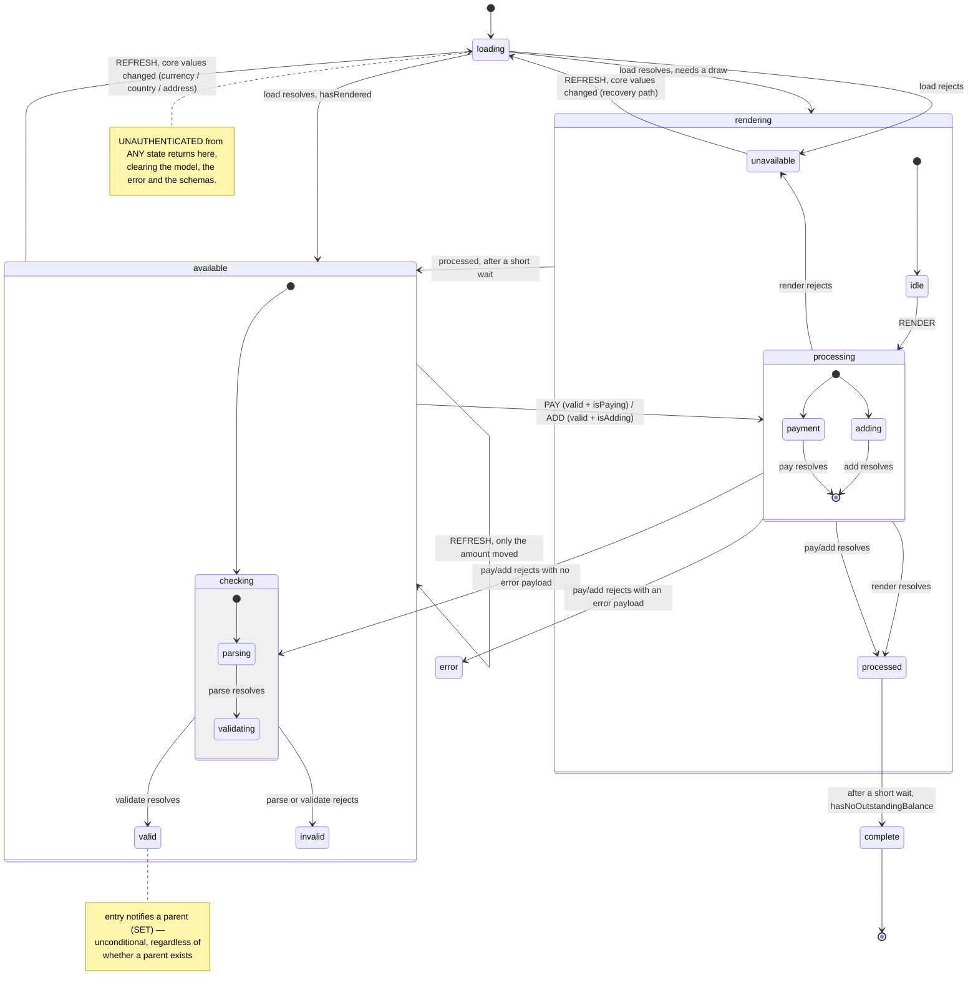
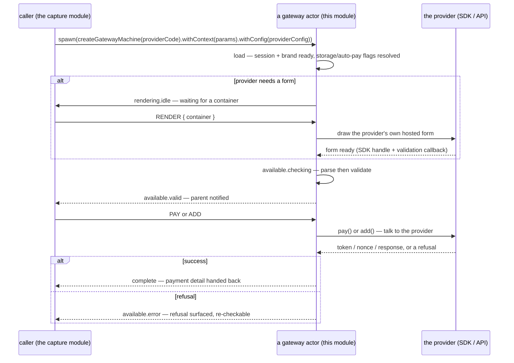
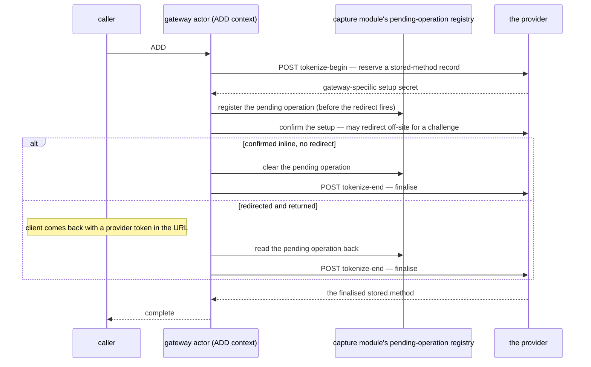

# payment-gateways Architecture

## Overview

One machine factory (`createGatewayMachine`, aliased on export as `gatewayMachine`) that any of eight named provider sub-packages configures via `.withConfig(...)`, one composable (`usePaymentGateway`) that is a pure lens over whatever actor it is given, and a small set of module-level services/schemas/utils every provider variant either uses as-is or overrides.

```
usePaymentGateway.ts          interprets a GIVEN actor, exposes refs + methods
gateway.machine.ts            createGatewayMachine(name) — the shared lifecycle, default actions/guards
payment-gateways.services.ts  load · parse · validate · pay · add (default), plus beginSetup/endSetup helpers
payment-gateways.schemas.ts   useSchema/useUischema — the base form every provider extends
payment-gateways.utils.ts     canBeStored · parseSettings · generateResponseUrls · payer-contact helpers
payment-gateways.types.ts     GatewayContext<T> generic + the PAY/ADD parameter shapes
braintree/  card/  dlocal/  mercadoPago/  nicky/  openPay/  razorpay/  stripe/
  → each: types.ts, plus whichever of services.ts / actions.ts / schemas.ts it needs to override
```

`index.ts` publishes exactly one thing: `gatewayMachine`, re-exported from `gateway.machine.ts`. `usePaymentGateway` is exported from its own file and re-exported onward by the sibling capture module's barrel — nothing in this module's own `index.ts` publishes it directly. Everything else — the eight provider folders, the shared services/schemas/utils, the types — is internal, reached only through whichever consuming module wires a provider's config into `createGatewayMachine`.

## State Machine



### The four services every provider variant supplies

| Service | Default (module-level) behaviour | What a provider variant typically overrides |
| --- | --- | --- |
| `load` | Waits for an authenticated session and a ready brand, rejects an ADD-context spawn if the gateway can't be stored, then reads the two force-storage/auto-pay brand keys into `canStore`/`mustStore`/`mustAutoPay`. | Everything after that: fetching an authorization token, loading a third-party script, constructing the provider's own SDK instance. Always chains through the default first. |
| `render` | N/A at module level — only invoked for a provider whose context isn't `renderless`. | Mounting the provider's own hosted form into the offered container, and wiring a validation callback the machine can call back into. |
| `validate` | Runs the captured model against the current schema. | Folding a provider's own SDK-reported validity into the same error shape, and any provider-specific post-parse checks (e.g. an expiry-date-in-the-past check). |
| `pay` / `add` | `pay` resolves the model as-is; `add` runs the shared `beginSetup → endSetup` handshake, rejecting up front if the gateway can't be stored. | Talking to the provider's own SDK to produce a token/nonce/response, then folding it into the field bag the caller submits. |

### Guards worth knowing

- **`hasRendered`** — `renderless || sdk is already set`. Decides whether `loading` routes straight to `available` (no draw needed) or through `rendering` first.
- **`hasChanged`** — compares `amount`, `orderId`, `currency.id`, `address.id` between the current context and an incoming `REFRESH`. Only a genuine change re-runs `checking`; an amount-only shift alone routes straight back into it without a fresh `load`.
- **`isPaying` / `isAdding`** — read the spawn-time `ctx` (`PAY` / `ADD`) to decide which of `PAY` / `ADD` the `valid` state actually wires; the other event is simply absent from `nextEvents` in that context.
- **`noErrorProvided`** — a `pay`/`add` rejection carrying no payload at all routes back to `checking` rather than `error` — the machine treats "the provider gave us nothing to show" as recoverable rather than as a reportable refusal.

### Recovery from `unavailable`

`unavailable` accepts one event: `REFRESH`, guarded by `hasChanged`. On recovery it clears the SDK (so `hasRendered` re-evaluates false and the machine re-mounts a fresh element rather than trusting a stale one) and clears the error before returning to `loading`. This is the path a caller relies on to recover a gateway that failed to load purely because the amount was below a provider's minimum — raising the amount and sending `REFRESH` is what un-sticks it.

## Provider Wiring

Every provider variant is a plain object merged over the shared machine via `.withConfig({ actions, services, guards })` — nothing about the state graph itself changes per provider, only what its actions/services/guards *do*. The table below is what each sub-package actually overrides (a blank cell means it takes the shared default as-is):

| Provider | `services` overridden | `actions` overridden | `schemas` overridden |
| --- | --- | --- | --- |
| `braintree` | `load`, `render`, `validate`, `pay`, `add` | `updateSdk`, `setErrorSDK`, `cleanupSdk` | — |
| `card` | **deprecated** — `pay` only (raw-card storage direct to the capture module's own record endpoint). The platform no longer stores card details server-side, so nothing routes a live gateway here. | `setSchemas`, `setModel` | card-number/expiry/CVV fields |
| `dlocal` | — (renderless, generic services) | `setSchemas` | payer document (+ email/phone when missing) |
| `mercadoPago` | `load`, `render`, `pay`, `add` | `cleanupSdk` | — |
| `nicky` | — (renderless, generic services) | `setSchemas`, `setModel` | payer email (when missing) |
| `openPay` | `load`, `render`, `validate`, `pay`, `add` | `setSchemas`, `setModel` | raw card fields under an `openpay` sub-object |
| `razorpay` | `load`, `render`, `pay`, `add` | `setSchemas` | payer email (when missing); storage fields forced read-only |
| `stripe` | `load`, `render`, `validate`, `pay`, `add` | `updateSdk`, `setError`, `setErrorSDK`, `cleanupSdk` | — |

A ninth provider that fits an existing family (SDK-embedded, redirect-with-a-small-form, or fully generic) needs only the rows it genuinely differs on — most of the table above is one or two overrides, not a from-scratch rebuild.

## Data Flow

### Driving a gateway from spawn to a decision



### An off-site redirect (the one provider whose confirmation step can leave the page)



## Dependencies

### payment-gateways Depends On

| Module | Why |
| --- | --- |
| `session-store` | Gates every network call behind a live, authenticated session; an unauthenticated session returns every gateway to `loading` and clears its model. |
| `brand` | The two force-storage/auto-pay config keys read during `load`, and the brand's own consent-disclaimer copy the composable surfaces. |
| `query` | The HTTP layer (`useQuery().get/post`, `useUrl`) behind every provider-detail and tokenise call. |
| `system-localisation` | Fallback error copy when a provider gives no message of its own; locale for a provider's own hosted-form language. |
| `feedback` | Surfaces a payment failure as a user-visible notification for the one failure shape the shared machine treats as unexpected rather than as validation. |
| capture module (sibling) | Read/write access to the pending-operation registry an off-site redirect needs to survive a full-page navigation; type-only reference to the shape a completed capture's output must match. |
| `@upmind-automation/types` | `GatewayTypes`, `GatewayContext` (the PAY/ADD enum), `GatewayStoreType`, `BrandConfigKeys`, and the model types this module reads or produces. |
| headless `utils` | The state-read helpers, error mapping/parsing, model parsing against a schema, and the timing constants the machine's delays are keyed to. |

### Modules That Depend On payment-gateways

| Module | How |
| --- | --- |
| capture module (sibling) | Spawns the chosen provider's configured machine as a child of its own capture flow, reads `usePaymentGateway`'s lifecycle back to know when a capture is complete, and imports the store-capability check and the zero-decimal-currency list directly. |

No other domain module reaches this one directly — every other consumer of a driven gateway goes through the capture module's own composables.

## Integration Points

- **payment-gateways → the provider's own SDK/API.** Every provider variant either loads a third-party script (Stripe, Braintree, MercadoPago, OpenPay, RazorPay) or talks to this module's own two tokenise endpoints directly (the raw-card and document-collecting families). This module owns the whole exchange; nothing outside it talks to a provider's SDK.
- **payment-gateways → the capture module's pending-operation registry.** The one provider variant whose own confirmation step can leave the page (an off-site 3DS/SCA challenge) registers a pending operation there before the redirect fires, and reads it back on return — see the Data Flow diagram above.
- **payment-gateways → the capture module's payload shape.** A completed capture's output is typed against the very payload shape the capture module assembles for submission — this module never submits anything itself; it only produces the field bag the capture module folds in.
