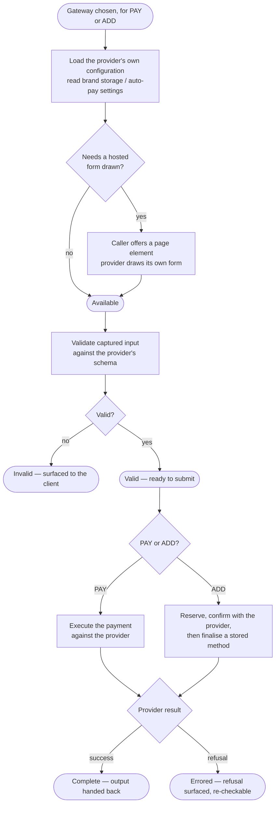
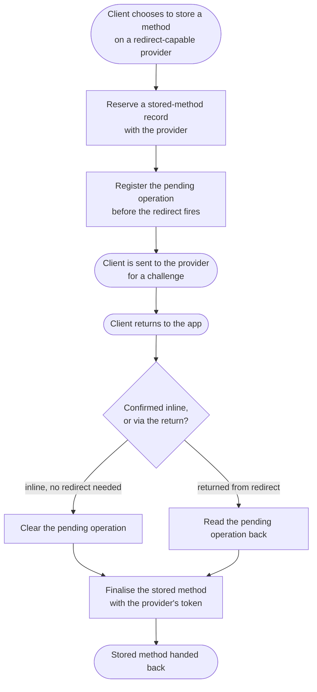

# Module: paymentGateways

## What it is

Payment gateways is the one contract every payment provider is driven through once it has been chosen — an SDK-embedded card form, an offsite-redirect provider, an offline/manual instruction set, or a wallet that needs no capture at all. (A raw server-side card capture variant also exists but is deprecated — see gotchas.) A caller never branches on which provider is in play: it spawns the gateway, reads one set of lifecycle and capability flags, captures whatever the gateway's own form asks for, and submits. What comes back is either a completed payment detail or a translated refusal.

**Choosing vs driving.** A sibling capture module decides which gateways are eligible for a given amount, currency and country, and assembles the payload a payment submission ultimately needs; payment gateways picks up once ONE of those gateways has been chosen, and owns the whole provider-specific lifecycle from that point on — load the provider's own configuration, draw a hosted form only if the provider needs one, validate what the client enters, and execute the payment (or the store-a-method call) against that specific provider. The relationship runs both ways: the sibling spawns and drives a gateway as a child of its own capture flow, and a gateway's completed output is typed against the very payload shape the sibling assembles.

### Keys by lifecycle phase

| Phase   | Keys                                                    | Relevance                                                                                                                               |
| ------- | ------------------------------------------------------- | --------------------------------------------------------------------------------------------------------------------------------------- |
| Payment | `billing.gateway.force_card_storage`                    | When set, a store-capable gateway stores the card on every successful payment and the client is given no choice about it.               |
| Payment | `billing.gateway.force_auto_payment_for_stored_details` | When set, any method stored while paying is marked to be charged automatically on future renewals, regardless of what the client chose. |

## Core concepts

- **Provider variant** — every named gateway (a card-SDK embed, an offsite-redirect checkout, a document-collecting redirect, a raw-card form) plugs its own load/render/validate/submit behaviour into the same shared lifecycle contract. A caller reading the contract cannot tell which variant it is looking at from the shape of what comes back.
- **Pay context vs Add context** — the same lifecycle serves two purposes from one spawn: paying a chargeable amount, or storing a payment method with nothing owed. The active context decides which submit event is wired, what the captured form asks for, and what a completed capture produces — a payment detail for the amount paid, or a newly stored method's id.
- **Renderless gateway** — a gateway that needs no hosted form drawn at all, either because every field on its form is read-only or because it has no provider SDK to mount. It is never asked to draw anything and reaches its driveable state without a draw step.
- **Store-capable gateway** — whether a gateway can be used to store a method outside of a payment is computed from three flags on the gateway record: whether storing is enabled at all, whether the provider itself supports stored methods, and whether storage is available outside of a payment specifically (as opposed to only as a side effect of paying). A gateway that only stores as a side effect of a payment is not treated as store-capable for a standalone store request.

## Operations

| #   | Capability                                             | Inputs            | Outputs                                                                                                                                                                |
| --- | ------------------------------------------------------ | ----------------- | ---------------------------------------------------------------------------------------------------------------------------------------------------------------------- |
| 1   | **Read the gateway's current lifecycle position**      | —                 | one label: loading, needing a form drawn, ready to be driven (valid / invalid / errored), busy with the provider, settled, or unable to load                           |
| 2   | **Read the combined readiness and capability picture** | —                 | flags for whether payment is needed, the gateway is available, processing, complete, dirty, valid, errored, renderless, carries a renderer, or is unsupported          |
| 3   | **Read what has been captured so far**                 | —                 | the current form value held for this gateway                                                                                                                           |
| 4   | **Read the form the gateway still needs completed**    | —                 | a schema and layout describing the remaining fields, empty for a gateway that needs no form                                                                            |
| 5   | **Read the gateway's own payment instructions**        | —                 | free-text guidance an offline or manual gateway carries for the client                                                                                                 |
| 6   | **Read the brand's consent disclaimer**                | —                 | the copy a client must accept before paying, sourced from brand configuration rather than the gateway                                                                  |
| 7   | **Read the refusal detail**                            | —                 | the last error message, plus field-level validation detail when specific fields were rejected                                                                          |
| 8   | **Capture what a client enters**                       | a value           | records it against the gateway without asking it to proceed                                                                                                            |
| 9   | **Clear captured input**                               | —                 | discards captured input and any error, without leaving the driveable state                                                                                             |
| 10  | **Submit the gateway**                                 | an optional value | re-captures first if the value changed since it was last recorded, then asks the gateway to proceed; settles with a completed payment detail or the provider's refusal |
| 11  | **Draw the gateway's hosted form**                     | a page element    | offers the gateway a place to draw its own form; does nothing for a gateway that needs none                                                                            |
| 12  | **Wait for the gateway to leave its startup phase**    | —                 | resolves once the gateway is driveable, or resolves false once it settles as unable to load                                                                            |

## Data shape

### The chosen gateway record

```ts
import type { GatewayTypes } from "@upmind-automation/types";

// The fields this module reads off the gateway record a caller hands it.
// The wider record (currencies, card types, provider capabilities) is the
// sibling capture module's own concern; only the fields below drive this
// module's own behaviour.
type Gateway = {
  id: string;
  type: GatewayTypes; // CARD | BANK_TRANSFER | DIRECT_DEBIT | OFFLINE | MOBILE | AWAITING_CLIENT | ...
  payment_instructions: string; // shown verbatim when non-empty
  is_stored: boolean;
  store_on_payment: boolean;
  store_outside_payment: boolean;
  use_frontend_implementation?: boolean; // false ⇒ the provider has no browser SDK to drive here
  gateway_provider?: {
    code: string; // selects which provider variant drives this gateway
    store_type: "none" | "either" | "always";
  };
  // Provider-specific settings, always string-valued on the wire.
  gateway_settings: { field: string; value: string; private: boolean }[];
};
```

Example `gateway_settings` field names actually read: `publicKey`, `merchantId`, `testMode`, `stored`, `frontendImplementation`, `paymentMethodCard`, `paymentMethodPayPal`, `paymentMethodSepaDebit`, `paymentMethodIdeal`. Every value is a string even where it represents a boolean (`"1"`/`"0"`) or a number.

### The captured-input model

The base shape every provider variant shares, extended per-variant:

```ts
type BaseModel = {
  gateway_id: string;
  store_on_payment?: boolean;
  store_on_payment_auto_payment?: boolean;
};

// Raw server-side card capture
type RawCardModel = BaseModel & {
  card_num: string;
  card_expiry: string; // MM/YY
  card_cvv: string;
  cardholder_name?: string; // required only when the provider itself requires a name
  store: false; // this variant never stores independently of a payment
};

// A provider that needs the payer's own document / email / phone collected
// when the client has none on file
type DocumentCollectingModel = BaseModel & {
  payment_method_addition: {
    document?: string; // format and label vary by country
    email?: string; // only present when the payer has no email on file
    phone?: string; // only present when the payer has no phone on file
  };
};

// A provider whose SDK returns its own token / payment-method id
type TokenModel = BaseModel & {
  payment_method_addition: {
    payment_method_id?: string;
    token?: string;
    payment_method_type?: string;
  };
};

// A provider whose SDK returns a nonce rather than a token
type NonceModel = BaseModel & {
  payment_method_addition: { payment_method_nonce: string };
};

// A provider whose entire checkout response is carried through as-is
type FullResponseModel = BaseModel & {
  payment_method_addition: Record<string, unknown>; // the provider's own response, verbatim
};
```

### The completed-capture output

```ts
// PAY context — folded into the wider selected-method payload the sibling
// capture module assembles and submits.
type PayOutput = {
  gateway_id: string;
  payment_method_addition?: Record<string, unknown>;
  // …plus whichever raw-card / document fields the model above carried
};

// ADD context — the pair the sibling capture module needs to finalise a
// stored method.
type AddOutput = {
  gatewayId: string;
  data: {
    client_payment_details_id: string;
    auto_payment: boolean;
    // …plus whichever provider-specific token/nonce/response fields
    // the provider variant produced
  };
};
```

A fresh-gateway PAY output names a gateway but carries no charge instrument on its own — the amount and the client identity are supplied by whoever assembles the wider submission payload; this module only ever contributes the gateway's own field bag.

## Dependencies

### Dependants — modules that read from this one

| Module                   | Weight | Reads                                                                                                                                                               | Why                                                                                                                                                                     |
| ------------------------ | ------ | ------------------------------------------------------------------------------------------------------------------------------------------------------------------- | ----------------------------------------------------------------------------------------------------------------------------------------------------------------------- |
| capture module (sibling) | 6      | the lifecycle/capability surface, the shared context and parameter types, the store-capability check, the zero-decimal-currency list, per-provider extension points | Spawns the chosen gateway as a child once a client selects it, drives it through PAY or ADD, and reads its lifecycle back to decide when the wider capture is complete. |

No other domain module reads this one directly — every other consumer reaches a driven gateway through the capture module's own composables, never by spawning one itself.

### This module's own dependencies

- **HTTP transport layer** — bearer-token-authenticated requests to the provider-detail and tokenise endpoints, with per-provider caching disabled so a fast-changing setup token is never served stale.
- **Session** — a live, authenticated session gates every network call; an unauthenticated session returns every gateway to its startup phase and clears whatever had been captured.
- **Brand configuration** — the two force-storage / force-auto-payment keys read once per load, plus the brand's own consent-disclaimer copy.
- **Localisation** — provider-agnostic error copy shown when a provider gives no message of its own.
- **The sibling capture module** — supplies the canonical shape a completed capture's output is typed against, and its pending-operation registry is read and written across an off-site redirect on the one provider variant whose confirmation step can leave the page. This module never calls into the sibling's own endpoints.
- **Shared enums** — the gateway-type and pay/add-context enumerations that every provider variant reads off the record and the model it is given.

## API endpoints

### Read a gateway's own frontend setup details

1. **Method + URL** — `GET /gateway/frontend/{gatewayId}`
2. **Role** — returns whatever a provider's own SDK needs to initialise or to open its checkout — an authorisation token for one provider family, an order/customer/key bundle for another. Called during load for the provider families that need this before they can render, and again immediately before submitting for the families whose provider needs live, freshly-issued values rather than ones fetched at load time.
3. **Curl example**:

```bash
curl -s "$API/gateway/frontend/{gatewayId}?currency=GBP&client_id={clientId}&amount=50.00&return_url=https://my.brand.com/payment/return" \
  -H "Authorization: Bearer $ACCESS_TOKEN"
```

4. **Sample response** (one provider family's shape — the field names under `gateway_specific` vary by provider):

```json
{
  "status": "ok",
  "data": {
    "return_url": "",
    "cancel_url": "",
    "notify_url": "",
    "gateway_specific": {
      "clientToken": "..."
    }
  }
}
```

5. **Fixture reference** — `get-gateway-frontend-id-case-details-braintree.json` (200); `get-gateway-frontend-id-case-details-stripe.json` (422 — the call requires an amount and a currency; omitting either is refused, not defaulted).

### Begin storing a payment method

1. **Method + URL** — `POST /gateway/frontend/tokenize-begin/{gatewayId}`
2. **Role** — reserves a stored-method record ahead of a provider handshake and returns whatever gateway-specific secret the provider's own confirmation step needs (a setup-intent client secret for one provider family; nothing further for others, which confirm with only the token their own SDK already produced).
3. **Request body**:

```ts
type TokenizeBeginBody = {
  return_url: string; // where the client lands if the provider's own step redirects off-site
};
```

4. **Curl example**:

```bash
curl -s -X POST "$API/gateway/frontend/tokenize-begin/{gatewayId}" \
  -H "Authorization: Bearer $ACCESS_TOKEN" \
  -H "Content-Type: application/json" \
  -d '{ "return_url": "https://my.brand.com/payment/return" }'
```

5. **Sample response**:

```json
{
  "status": "ok",
  "data": {
    "client_payment_details": {
      "id": "...",
      "gateway_id": "...",
      "client_id": "..."
    },
    "gateway_specific": {
      "client_secret": "...",
      "setup_intent_id": "..."
    }
  }
}
```

6. **Fixture reference** — `post-gateway-frontend-tokenize-begin-id-case-begin-stripe.json` (200), with equivalent captures for five further provider families (`begin-braintree`, `begin-openpay`, `begin-mercadopago`, `begin-razorpay`, `begin-dlocal`).

### Finalise a stored payment method

1. **Method + URL** — `POST /gateway/frontend/tokenize-end/{gatewayId}`
2. **Role** — finalises the record `tokenize-begin` reserved, once the provider's own step has confirmed a token. The response is the same stored-method record shape the sibling capture module's own listing returns.
3. **Request body** — the fields present depend on the provider family; every call carries the reserved record's id and whether the method should auto-charge future renewals:

```ts
type TokenizeEndBody = {
  client_payment_details_id: string;
  auto_payment: boolean;
  token?: string; // provider-issued token/nonce, family-dependent
  [providerSpecificField: string]: unknown;
};
```

4. **Curl example**:

```bash
curl -s -X POST "$API/gateway/frontend/tokenize-end/{gatewayId}" \
  -H "Authorization: Bearer $ACCESS_TOKEN" \
  -H "Content-Type: application/json" \
  -d '{ "client_payment_details_id": "{reservedId}", "auto_payment": true, "token": "{providerToken}" }'
```

5. **Fixture reference** — `post-gateway-frontend-tokenize-end-id-case-end-refused-stripe.json` (422) plus five further provider families' refusal captures. A confirmed success on a forged token is not obtainable outside a real provider SDK running in a browser, so every recorded capture of this endpoint is the refusal shape below.

### Store a card directly, with no provider handshake

1. **Method + URL** — `POST /clients/{clientId}/payment_details`
2. **Role** — the raw-card provider family's own store path: when the client asks to store the card being paid with, this posts the entered card fields straight to the client's stored-method record, with no tokenise handshake at all. The back end refuses this path outright for a gateway whose provider is only reachable via its own frontend implementation.
3. **Request body**:

```ts
type StoreCardBody = {
  card_type: string;
  card_num: string;
  card_expire_date: string; // MM/YYYY
  card_cvv: string;
  name?: string;
  address_id: string;
  gateway_id: string;
  cardholder_name?: string;
  return_url: string;
  auto_payment?: boolean;
};
```

4. **Curl example**:

```bash
curl -s -X POST "$API/clients/{clientId}/payment_details" \
  -H "Authorization: Bearer $ACCESS_TOKEN" \
  -H "Content-Type: application/json" \
  -d '{ "card_type": "visa", "card_num": "4111111111111111", "card_expire_date": "12/2028", "card_cvv": "123", "address_id": "{addressId}", "gateway_id": "{gatewayId}", "return_url": "https://my.brand.com/payment/return", "auto_payment": true }'
```

5. **Sample response** (refused — the targeted gateway requires its own frontend implementation):

```json
{
  "status": "error",
  "error": {
    "code": 409,
    "message": "Please, use the Frontend implementation of Stripe in order to save cards!"
  }
}
```

6. **Fixture reference** — `post-clients-id-payment-details-case-store-on-payment.json` (409). A confirmed success needs a gateway that genuinely accepts a server-side card post rather than requiring its own frontend implementation; none is recorded.

## Failure modes

Every recorded capture across all four endpoints above is a hard failure — no soft-failure shape (a `2xx` with a downgraded or empty result) has been observed on any of them:

1. **Hard success** — `2xx` + `status: "ok"` + the record or provider payload populated as expected.
2. **Hard failure** — `4xx` + `status: "error"` + either `error.data` naming the specific field(s) rejected (a missing `amount`/`currency` on the setup-details read, a missing `client_payment_details_id` on finalisation) or `error.message` naming a policy refusal (a gateway that requires its own frontend implementation refusing a direct card store).

A provider's own runtime refusal (a declined card, a failed 3DS challenge, a dismissed checkout modal) is reported entirely inside the provider's own SDK response, not as an HTTP failure from any endpoint above — it surfaces to the caller as the gateway's refusal detail (Operation 7), not as a rejected request.

## Flows

### Drive a gateway from spawn to a decision

Every named provider variant runs the same sequence: load whatever it needs, draw a form only if it has one, validate what the client entered, then submit. This is the sequence every gateway follows regardless of which provider is behind it, and regardless of whether the outcome is a payment or a stored method.



Guarantees the platform holds:

- Every named provider reaches the same driveable state through the same sequence, whatever it is behind the scenes.
- A refusal returns the gateway to a re-checkable state rather than ending the lifecycle — the client can correct input and resubmit without starting over.
- A gateway needing no form (every field read-only, or no provider SDK at all) is never asked to draw one.

Constraints the caller has to plan around:

- The gateway must be running as a child of some parent — reaching the valid state notifies a parent unconditionally, and a parentless gateway stalls there rather than settling.
- Drawing the hosted form settles before the draw has actually finished — a caller that needs to know the form is mounted has to check the gateway's own state afterwards.
- Nothing about the sequence waits for the caller; a consumer that captures input before the gateway leaves its startup phase is writing into a gateway that isn't listening yet.

### Resume a stored-method capture after an off-site redirect

Only the provider variant whose own confirmation step can leave the page (a 3DS/SCA-style challenge) follows this pattern; every other provider variant confirms inline, without ever leaving.



Guarantees the platform holds:

- The record reserved at the start of the handshake is the same one finalised at the end — the two calls are keyed together by its own id, not by anything the redirect itself carries.
- A confirmation that completes inline clears the pending operation itself, so nothing stale is left behind once a capture completes without ever leaving the page.

Constraints the caller has to plan around:

- The pending operation is written before the redirect fires — a caller relying on in-memory state alone loses the handshake the moment the page navigates away.
- The provider-issued token read back on return is single-use; replaying the same finalise call after it has already succeeded, or been refused, is not a retry path.

## Lessons (hard-won)

- **A completed draw is not the same as a settled draw request.** The capability that offers a gateway a place on the page settles before the gateway has actually finished mounting its own hosted form — a caller awaiting it to know the form is ready gets a false positive and has to poll the gateway's own state instead.
- **A gateway must run as a child of some parent.** Reaching the driveable-and-valid state unconditionally sends a notification upward. Driven standalone with no parent, the gateway still reaches that internal state, but the notification has nowhere to go and the caller observing it sees the gateway stall there rather than settle.
- **A zero-decimal currency is not simply "no cents".** Converting an amount into a provider's minor-unit format is currency-dependent: most currencies multiply by 100, a currency with no minor unit at all is passed through unchanged, and at least one currency with an unusual minor-unit convention needs its own rounding rule. Treating every currency the same overcharges — or undercharges — by two orders of magnitude.
- **The completed-capture field bag has no single shape.** Depending on which provider drove the capture, what comes back is a token/nonce bag, an entire third-party checkout response carried through verbatim, or a set of raw card fields — there is no one envelope a caller can destructure blindly across every provider.
- **Whether a payer's contact details need collecting is not a property of the gateway.** A handful of providers require the payer's email (and sometimes phone) in the submitted form, but only when the paying client has none on file already — a guest always needs it, a signed-in client sometimes does. The check is evaluated fresh against the client's own record on every load, not read off the gateway or the provider.
- **Storability outside of a payment does not simply follow the storage flag.** A gateway that stores only as a side effect of paying (rather than independently) is deliberately excluded from a standalone store request, even though its storage flag reads true — the two are different capabilities the record does not distinguish by name alone.
- **The country used to validate a payer's document is not always available.** A capture with no payment amount in play (a standalone store request) may carry no billing address at all; the document format falls back from the client's own recorded location, to the billing address's country, to the country conventionally associated with the payment currency — in that order — before a request can be built at all.
