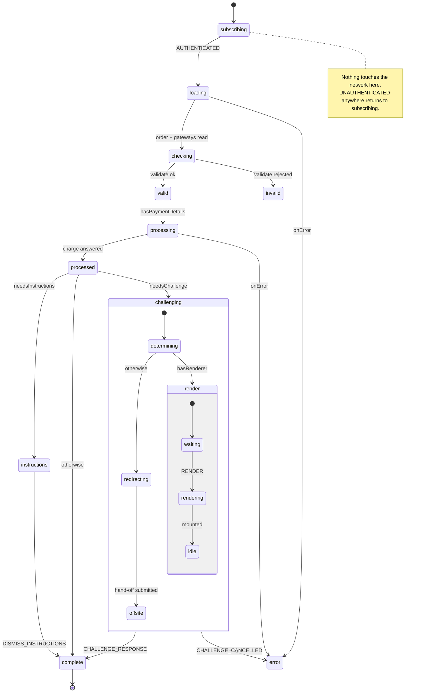
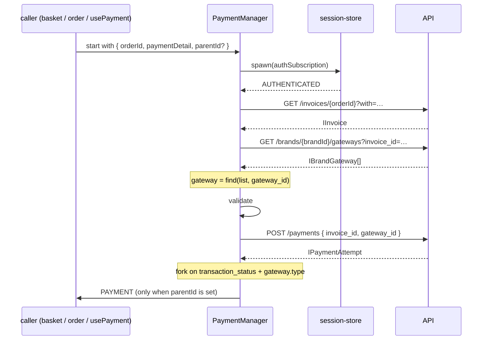

# payment Architecture

## Overview

One `PaymentManager` XState machine, four services over three endpoints, and a thin composable that interprets the machine as a root. There is no scope builder, no actor arm, and no schema layer — the module is a single linear attempt with a three-way fork at the end.

```
usePayment.ts        interprets the machine as a ROOT, exposes refs + methods
payment.machine.ts   PaymentManager — the whole flow
payment.services.ts  load · update · validate · redirect · render
payment.mappers.ts   mapApproval · mapRenderer · hasRenderer
payment.utils.ts     submitViaForm — the cross-origin hand-off
renderers/           per-provider inline challenge registry (MercadoPago today)
```

`index.ts` publishes exactly two runtime members — `usePayment` and `paymentMachine` — plus the types. Everything else is internal and reached through the composable or the machine.

## State Machine



### The three-way fork

`processed` is a **delayed** transition (`after: { wait }`, where `wait` is `useTime().WAIT`), and its three guarded branches are evaluated in order:

| Guard | Condition | Target |
| ----- | --------- | ------ |
| `needsChallenge` | the attempt carries an `approval_url` | `challenging` |
| `needsInstructions` | `transaction_status === WAITING` **and** `gateway.type === AWAITING_CLIENT` | `instructions` |
| — | neither | `complete` |

Order matters. A response that is both `WAITING` and carries an `approval_url` goes to `challenging`, never to `instructions`. Reordering these branches or dropping the delay mis-routes every payment silently, which is why the module's suite drives the challenge arm on a real recorded provider response.

### Terminal states

- `complete` — `type: "final"`, with `data` returning the payment attempt. A parent's `onDone` receives it.
- `instructions` — waits for `DISMISS_INSTRUCTIONS`. Not final; the customer has to act outside the app first.
- `error` — entry action `escalateError`. Not final; `UNAUTHENTICATED` still returns to `subscribing`.

### Handing up to a parent

Two actions send to a parent, and **both are guarded by `parentId`**:

| Action | Fires on | Sends |
| ------ | -------- | ----- |
| `providePayment` | the charge succeeding (`processing.onDone`) | `{ type: "PAYMENT", data: payment }` |
| `escalateError` | entering `error` | the `ResponseError`, via `escalate` |

Unguarded, `sendParent` throws at a root and **aborts the transition it is part of** — which silently freezes the machine in the state it was leaving. The success limb froze in `processing` for exactly that reason until it was guarded. See [gotchas.md](./gotchas.md).

## Data Flow



## Sub-Composables

**None.** This is a flat composable — no `useMeta()` / `useContext()` / `useActions()` split. `usePayment` returns ten members directly: `isReady`, `meta`, `context`, `errors`, `payment`, `pay`, `refresh`, `renderChallenge`, `completeChallenge`, `cancelChallenge`.

State is read through the shared platform utilities (`stateMatches`, `useContext`), never re-derived. `meta` is one `computed` over the state value; `context`, `errors` and `payment` are `useContext` reads over machine context.

## Services

| Service | Endpoint | Notes |
| ------- | -------- | ----- |
| `load` | `GET /invoices/{orderId}` then `GET /brands/{brandId}/gateways` | Two chained reads. The second is filtered server-side by `client_id`, `invoice_id`, `country_id`, `currency_code` taken off the loaded order, so the list only ever contains gateways eligible for **this** attempt. Returns `{ rawOrder, gateway }`. |
| `validate` | none | Local. Rejects before anything is charged. |
| `update` | `POST /payments` | The charge. Body is `{ invoice_id, gateway_id }` plus the method's own fields. |
| `redirect` | none | Calls `submitViaForm` with the mapped `approval`. Leaves the page. |
| `render` | none | Resolves the provider's renderer from `renderers/` and mounts it into the caller's container. |

`load`'s gateway lookup is in-memory: the chosen gateway is `find(brandGateways, ["gateway_id", paymentDetail.gateway_id])`. There is no per-gateway endpoint.

## Dependencies

### payment Depends On

| Module | Why |
| ------ | --- |
| `session-store` | `authSubscription` — the callback actor that gates every network call behind a live session. |
| `payment-details` | `PaymentDetailData`, the method payload this module submits. Type-only. |
| `query` | The HTTP layer (`useQuery().get/post`, `useUrl`) and its cache keys. |
| `brand` | `brandId`, for the brand-scoped gateway list. |
| `system-analytics` | `useDataLayer` — the `begin_offsite_payment` event. |
| `@upmind-automation/types` | `IInvoice`, `IGateway`, `IPaymentAttempt`, `TransactionStatus`, `GatewayTypes`, `GatewayProviderCodes`, `Methods`, `Targets`. |
| `utils` | `stateMatches`, `useContext`, `mapToHeadlessError`, `useValidationParser`, `useTime`, `responseCodes`. |

### Modules That Depend On payment

| Module | How |
| ------ | --- |
| `basket` | `basket.machine.ts` invokes `paymentMachine` as the `payment` child during checkout, passing `parentId: "basketManager"`. |
| `orders` | `order.machine.ts` invokes it in the `paying` state, passing `parentId: "orderManager"`; `useOrder` surfaces the result. |

Both are the module's real consumers. Nothing in the tree imports `usePayment` — the composable is the **root** entry point, kept working and proven, but currently unused by production code.

## Integration Points

- **`payment-details` → payment.** The hand-off is the `paymentDetail` object. This module never re-tokenises, never re-lists gateways for selection, and never edits a stored method.
- **payment → `invoices`.** The module reads the invoice for amounts and history but never writes it. Settlement lands server-side; a consumer re-reads the invoice to see the new balance.
- **payment → the provider.** Two shapes only: an offsite form submission (`submitViaForm`), and an inline renderer mounted into a caller-owned element. Nothing else reaches a third-party origin.
- **The `renderers/` registry.** Keyed by `GatewayProviderCodes`. A provider with no entry gets the ordinary offsite route; adding one is a single map entry plus a `ChallengeRenderer`.
