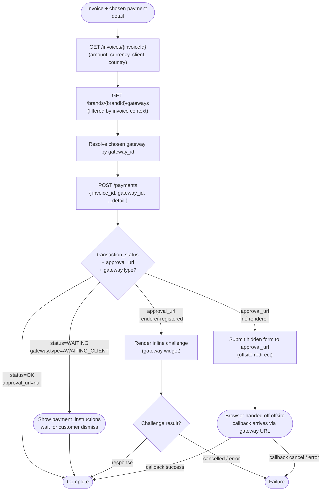

# Module: payment

## What it is

payment **makes** the actual payment (async) — it takes the captured payment-method payload, submits it to the back end via `POST /payments`, and handles whatever the gateway returns afterwards: immediate success, awaiting-client instructions, an offsite redirect, or an inline 3-D Secure challenge. It is the layer between the captured `SelectPaymentMethodData` payload and the eventual settlement of the invoice.

**Capture vs make.** The sibling `paymentDetails` module _captures_ the payment intent (lists eligible gateways, picks one, tokenises via SDK, produces the payload). payment _makes_ the payment — submits the payload, runs the gateway-outcome decision tree (covered in the "Attempt a payment" flow below), and reconciles against the invoice. Stored cards and the per-gateway SDK lifecycle live in `paymentDetails`; the invoice record + balance live in `invoices`; the basket-to-invoice conversion call lives in `basket`. payment reads the invoice and the gateway list as context but doesn't own them. Refunds and the historical payment ledger ride on the invoice — this module is scoped to the _charge_ attempt, not the historical record.

## Core concepts

- **Gateway** — a configured payment processor on a brand. Carries identity (id, name, provider code), payment policy (`type`, `store_type`, `is_stored`, `use_frontend_implementation`, `allow_manual_store`), supported `currencies` and `card_types`, and free-form `payment_instructions` for awaiting-client flows. A brand can configure many gateways; one is chosen per attempt.
- **Gateway provider** — the underlying integration (Stripe, PayPal, MercadoPago, Offline, etc.) referenced by `code` (a `GatewayProviderCodes` enum value) and `type` (a `GatewayTypes` enum value: card, redirect, awaiting-client, etc.). The provider defines display fields, auth policy, refund support, and whether a frontend implementation is available.
- **Payment detail** — the resolved payment instrument for one attempt. Either a reference to a stored payment method or a one-off set of fields keyed by gateway. Owned by `paymentDetails`; payment carries the reference (`gateway_id`, optional `payment_details_id`, gateway-specific fields) on the POST.
- **Payment attempt** — the back-end record returned by `POST /payments`. Carries `transaction_status` (`OK`, `WAITING`, `REJECTED`, etc.), `transaction_type` (a `TransactionTypes` enum value), `transaction_id`, and an optional `approval_url` describing how to complete the attempt offsite. A `WAITING` status combined with an `AWAITING_CLIENT` gateway type means the customer has to act outside the app (bank transfer, etc.) before the platform recognises the payment.
- **Approval** — the offsite hand-off shape derived from `approval_url`. Carries `url`, `method`, and `fields` to submit as a hidden form. The shape covers both PayPal-style redirects and 3-D Secure offsite flows.
- **Challenge** — the in-app post-POST step some gateways require: either an inline gateway-rendered widget (MercadoPago today; other providers as they're added) or an offsite redirect that comes back via a callback URL. The presence of `approval_url` triggers a challenge; whether it renders inline depends on whether a provider-specific renderer is registered.

## Operations

| #   | Capability                                       | Inputs                                                                                          | Outputs                                                                                                                                                                                                                                                                                                                                                                                 |
| --- | ------------------------------------------------ | ----------------------------------------------------------------------------------------------- | --------------------------------------------------------------------------------------------------------------------------------------------------------------------------------------------------------------------------------------------------------------------------------------------------------------------------------------------------------------------------------------- |
| 1   | **Read an invoice with payment context**         | `invoiceId`                                                                                     | The invoice record hydrated with the relations needed to attempt payment: client, address, currency, gateway (if previously chosen), payment history, products, promotions, taxes, contract, custom fields. Used to know how much is owed, in which currency, against which client and country.                                                                                         |
| 2   | **List gateways eligible for an invoice**        | `brandId`, `invoiceId`, `clientId`, `countryId`, `currencyCode`, optional `active=true` filter  | An ordered list of brand-gateway records the back end says are eligible for this attempt. The filter set (`client_id`, `invoice_id`, `country_id`, `currency_code`) is applied server-side — supplying it narrows the response to gateways that match every constraint. Each row exposes the gateway, its provider, currencies, card types, and an `order` field used to sort the list. |
| 3   | **Read the chosen gateway**                      | a loaded brand-gateway list, a `gateway_id` from the chosen payment detail                      | The matching `IGateway` record, picked from the brand-gateway list by `gateway_id`. Carries provider code, type, frontend-implementation flag, payment-instructions, and the policy flags (`store_on_payment`, `is_stored`, `allow_manual_store`) that determine downstream behaviour. Derived in-memory from capability 2 — not a separate BE call.                                    |
| 4   | **Submit a payment for an invoice**              | `invoiceId`, payment detail (`{ gateway_id, payment_details_id?, ...gateway-specific fields }`) | A `PaymentAttempt` record with `transaction_status`, `transaction_type`, `transaction_id` (or `null` when the attempt has no transaction yet), and `approval_url` (or `null` when no further action is required). The combination of these three fields drives the next step: complete, awaiting instructions, or challenge.                                                            |
| 5   | **Resolve the next step from a payment attempt** | a `PaymentAttempt`, the chosen gateway                                                          | One of: _complete_ (no `approval_url`, no awaiting-client gateway), _awaiting instructions_ (`transaction_status = WAITING` AND `gateway.type = AWAITING_CLIENT` — show the gateway's `payment_instructions` and wait for the customer to dismiss), or _challenge_ (any `approval_url`). Derived from the response — not a separate BE call.                                            |
| 6   | **Render an inline challenge**                   | the chosen gateway, the `PaymentAttempt`, an HTML container element                             | A gateway-specific UI mounted into the container. Currently available for MercadoPago; the provider registry decides whether a given gateway provider has an inline renderer. The renderer reports completion via a callback carrying the gateway's response data.                                                                                                                      |
| 7   | **Hand off to an offsite challenge**             | the `approval_url` from a `PaymentAttempt`                                                      | The browser is redirected (or a hidden form is submitted) to the gateway's offsite URL with the fields and method specified by `approval_url`. The next signal arrives via the gateway's callback URL; this module does not hold the connection open.                                                                                                                                   |

## Data shape

### Payment attempt — returned by `POST /payments`

```ts
type PaymentAttempt = {
  // Status codes from the TransactionStatus enum.
  // OK = the transaction succeeded immediately;
  // WAITING = the platform is waiting for an external signal
  //   (combine with gateway.type = AWAITING_CLIENT for "show instructions");
  // REJECTED, CANCELLED, ERROR = failure paths.
  transaction_status: "OK" | "WAITING" | "REJECTED" | "CANCELLED" | "ERROR";

  // TransactionTypes enum (e.g. 21 = PAYMENT). The numeric value covers
  // PAYMENT, REFUND, AUTHORISE, CAPTURE, etc.; consumers usually only care
  // that the type matches the intent they submitted.
  transaction_type: number;

  // null when no transaction has been opened yet (e.g. an OK response on an
  // offline gateway that does not generate a transaction id).
  transaction_id: string | null;

  // Present when the attempt needs an offsite hand-off (PayPal, 3-D Secure
  // redirect) or an inline gateway widget. null when nothing further is
  // required from the caller.
  approval_url: {
    url: URL["href"]; // gateway endpoint to submit to / redirect to
    method: "GET" | "POST"; // HTTP method to use
    fields: Record<string, string>; // form fields to attach (3DS payload, return URLs, etc.)
  } | null;
};
```

### Approval (mapped from `approval_url`) — internal hand-off shape

```ts
// Built from `approval_url` by collapsing any query-string parameters on the
// gateway URL into the `fields` bag so a single hidden-form submission covers
// the whole hand-off. Both offsite redirects and inline challenges consume
// this shape; renderers receive it via the payment context.
type Approval = {
  url: string; // gateway URL, query-string stripped
  method: "GET" | "POST";
  fields: Record<string, string>; // merged fields (original payload + extracted query params)
};
```

### Gateway record — returned inside `GET /brands/{brandId}/gateways`

```ts
// One row per gateway configured on a brand. The eligibility list is
// ordered server-side by `order`; consumers preserve that order.
type BrandGateway = {
  id: string; // brand-gateway id (NOT the gateway id)
  brand_id: string;
  gateway_id: string; // the gateway this row attaches to the brand
  active: boolean; // brand can use this gateway
  visible: boolean; // surface in the picker
  default: boolean; // brand's preferred gateway
  order: number; // display order within the brand
  created_at: string;
  updated_at: string;
  deleted_at: string | null;
  gateway: Gateway; // populated by the `with=gateway.*` expand
};

type Gateway = {
  id: string;
  name: string; // brand-facing label, e.g. "Stripe"
  name_translated: string; // localised version
  provider: string; // gateway-provider code (mirrors gateway_provider.code)
  type: number; // GatewayTypes enum: 1=card, 2=redirect, 5=offline/awaiting-client, etc.
  auth_type: "settings" | "oauth2" | "none";
  gateway_provider_id: string;
  org_id: string;

  // Policy flags
  is_stored: boolean; // gateway supports stored payment details
  store_on_payment: boolean; // gateway can store a method during a payment
  store_on_payment_force: boolean; // gateway always stores during a payment
  store_outside_payment: boolean; // gateway can store a method outside of a payment
  allow_manual_store: boolean; // staff can manually store on the gateway
  require_stored: boolean; // gateway demands a stored detail (no one-off payments)
  use_frontend_implementation: boolean; // gateway can be driven from the client (vs server-only)
  sca_verified: boolean; // SCA / 3DS verification supported

  // Free-form instructions shown when the gateway is the awaiting-client type
  // (bank transfer, etc.). Markdown allowed.
  payment_instructions: string;
  payment_instructions_translated: string;

  // Provider-defined settings exposed for the front end. Private settings
  // are returned as { id, private: true } only — values stay server-side.
  gateway_settings: Array<{
    id: string;
    field?: string; // present on non-private settings
    value?: string; // present on non-private settings
    private: boolean;
    gateway_id?: string;
    created_at?: string;
    updated_at?: string;
    deleted_at?: string | null;
  }>;

  // Supported currencies / card types — narrows the catalogue picker.
  currencies: Array<{ currency_id: string; currency_code: string }>;
  card_types: Array<{
    id: string;
    name: string; // e.g. "Visa", "MasterCard"
    code: string; // e.g. "visa", "mastercard"
    created_at: string | null;
    updated_at: string | null;
    deleted_at: string | null;
  }>;

  // Hand-off shape exposed for gateways that need to call back into the app
  // with a specific URL / method / fields combination (some PSPs return this
  // up-front rather than per-attempt). When present, it mirrors approval_url
  // on PaymentAttempt and feeds the same form-submission path.
  next_action: {
    url: string;
    method: string;
    fields: Record<string, any>;
  } | null;

  webhook_url: string | null; // PSP-side callback configured on the gateway
  hash: string; // gateway-config hash for cache busting
  provider_logo: string | null;
  translations: unknown[];

  gateway_provider: GatewayProvider; // populated by `with=gateway.gateway_provider`
};

type GatewayProvider = {
  id: string;
  code: string; // GatewayProviderCodes enum value, e.g. "Stripe_PaymentIntents"
  name: string;
  name_translated: string;
  type: number; // GatewayTypes enum (mirrors gateway.type)
  store_type: "none" | "either" | "always"; // GatewayStoreType
  auth_type: "none" | "settings" | "oauth2"; // GatewayAuthType
  external_payment: boolean; // payment happens off-platform
  external_store: boolean; // storing a method happens off-platform
  external_billing_charge: boolean;
  needs_address: boolean; // gateway requires a billing address on the attempt
  requires_name: boolean;
  store_on_payment: boolean;
  store_on_payment_force: boolean;
  store_outside_payment: boolean;
  supports_refund: boolean;
  supports_frontend_implementation: boolean;
  supported_currencies: string[] | null;
  display_fields: string | null; // CSV of field codes the provider expects on a one-off attempt
  oauth_application_code: string | null;
  short_description: string | null;
  short_description_translated: string | null;
  instructions: string;
  translations: unknown[];
  external: boolean;
  created_at: string;
  updated_at: string;
};
```

### Payment-detail input — what the caller submits on `POST /payments`

```ts
// The body for POST /payments. `invoice_id` is added by this module; the
// rest is the resolved payment detail provided by paymentDetails. Wallet
// amount support is on the wire but not currently exercised by this module.
type PaymentPost = {
  invoice_id: string; // the invoice being charged
  gateway_id: string; // chosen gateway (from the eligibility list)
  payment_details_id?: string; // when paying with a stored card / detail
  // Gateway-specific one-off fields (e.g. tokenised card, redirect return urls,
  // SCA challenge result) ride here keyed by the provider's display_fields.
  // Shape is provider-defined and validated server-side.
  [providerField: string]: unknown;
};
```

Relevant enum references in `@upmind-automation/types`:

- `GatewayTypes` and `TransactionStatus` from `packages/types/src/data/constants/`
- `TransactionTypes` from `packages/types/src/data/constants/`
- `GatewayProviderCodes`, `GatewayStoreType`, `GatewayAuthType`, `GatewayContext` from `packages/types/src/data/enums/gateway.ts`
- `Methods` from `packages/types/src/models/methods.ts` (used by `approval_url.method` and the form-submission hand-off)

## Dependencies

### Dependants — modules that read from this one

| Module                     | Weight | Reads                                                                                                     | Why                                                                                                                                                                                                                                   |
| -------------------------- | ------ | --------------------------------------------------------------------------------------------------------- | ------------------------------------------------------------------------------------------------------------------------------------------------------------------------------------------------------------------------------------- |
| `basket`                   | 2      | payment attempt result, gateway eligibility list, chosen-gateway record                                   | Checkout's terminal step. Once the basket converts to an invoice, the basket flow drives a payment attempt against that invoice and waits for the attempt to resolve before declaring checkout complete.                              |
| `orders` (invoice payment) | 2      | payment attempt result, gateway eligibility list, chosen-gateway record                                   | Paying an existing invoice from the client portal. Same hand-off shape as checkout: read the invoice, read the eligibility list, attempt the payment, resolve the result.                                                             |
| Presentation layer         | —      | payment-attempt status, gateway picker rows, gateway instructions, challenge container, approval redirect | Checkout payment step (gateway picker + one-off vs stored toggle), invoice payment page (same surfaces, post-conversion), the inline-challenge mount point, the offsite-redirect intermediate page, the awaiting-instructions screen. |

> `query` (the HTTP transport layer) and `routing` (app-level navigation) reference most modules but are not domain consumers. Treat their fan-in as universal infrastructure rather than module-specific.

### This module's own dependencies

- **HTTP transport layer** — bearer-token attachment, locale injection, currency injection on the eligibility list, error-shape normalisation (including `Unprocessable_Entity` field-level parsing).
- **Invoice (read-side)** — the invoice record is the source of truth for amount, currency, client, and country; the payment call needs the invoice id and reads everything else off the invoice record.
- **Brand (id only)** — the eligibility list is brand-scoped (`/brands/{brandId}/gateways`); only the brand id is consumed.
- **Payment details** — resolves the payment instrument the customer chose (stored card, one-off card, alternative method). The chosen detail's `gateway_id` is what picks the gateway out of the eligibility list. Payment never opens or stores a detail itself.
- **Session / auth** — the payment endpoints all require a bearer token; the attempt cannot proceed without an authenticated session, and an auth loss mid-flow invalidates any in-progress attempt against the back end.
- **Shared types / enums** — `IGateway`, `IGatewayProvider`, `IBrandGateway`, `IGatewaySetting`, `ICardType`, `IGatewayCurrency` from `packages/types/src/models/gateways.ts`; `IPaymentAttempt`, `IPayment` from `packages/types/src/models/payment.ts`; `IInvoice` from `packages/types/src/models/invoices.ts`; `IPaymentDetail` from `packages/types/src/models/paymentDetails.ts`; `GatewayTypes`, `TransactionStatus`, `TransactionTypes`, `Methods` from `packages/types/src/data/constants/`; `GatewayProviderCodes`, `GatewayStoreType`, `GatewayAuthType`, `GatewayContext` from `packages/types/src/data/enums/gateway.ts`.

## API endpoints

### `GET /invoices/{invoiceId}`

Read the invoice the payment is being attempted against. Hydrated with the relations needed to surface what's being charged, in which currency, against which client and country, plus prior payment history for retries and partial payments.

```bash
curl -s "$API/invoices/63250798-065d-1e20-388f-8174e234e98d?with=brand,taxes,client,gateway,gateway.gateway_provider,status,contract,payments,products,promotions,client.tags,products.tags,taxes.tax_tag_data,custom_fields.field,affiliate_commissions,products.product.image,account.affiliate_referral.affiliate_account.account.client&lang=en-US" \
  -H "Authorization: Bearer $ACCESS_TOKEN"
```

Response is the canonical `IInvoice` shape — full record is large and documented in the `invoices` module's data shape. The fields the payment flow keys off are `id`, `client_id`, `currency_id` / `currency.code`, `address.country_id`, `total_amount`, `paid_amount`, `status_id`, and the embedded `payments[]` array for retry / partial-payment context. Full capture available at [`tests/fixtures/recordings/get-invoices-63250798-065d-1e20-388f-8174e234e98d.json`](../../../../../../tests/fixtures/recordings/get-invoices-63250798-065d-1e20-388f-8174e234e98d.json).

### `GET /brands/{brandId}/gateways`

List the gateways the brand has configured and the back end deems eligible for this attempt. Filters are applied server-side: `client_id`, `invoice_id`, `country_id`, `currency_code`, `active=true`. Each row is ordered by the brand's configured `order` column. Use `with=gateway.gateway_provider,gateway.card_types` to inline the provider record and card-type list per gateway.

```bash
curl -s "$API/brands/47d73824-8507-9315-e54f-81e642d59e06/gateways?limit=0&client_id=8d632507-9806-5d1e-48dc-8174e234e98d&invoice_id=63250798-065d-1e20-388f-8174e234e98d&country_id=2785d26e-9678-3d16-75ec-314502e70439&currency_code=USD&active=true&with=gateway.gateway_provider,gateway.card_types&order=order&lang=en-US" \
  -H "Authorization: Bearer $ACCESS_TOKEN"
```

```json
{
  "status": "ok",
  "data": {
    "1": {
      "id": "5d085e69-d562-3719-706f-218e940d4237",
      "gateway_id": "4d036794-24d0-e710-9d5a-3153698d582e",
      "brand_id": "47d73824-8507-9315-e54f-81e642d59e06",
      "active": true,
      "order": 1,
      "visible": true,
      "gateway": {
        "id": "4d036794-24d0-e710-9d5a-3153698d582e",
        "name": "Stripe",
        "name_translated": "Stripe",
        "provider": "Stripe_PaymentIntents",
        "type": 1,
        "auth_type": "settings",
        "gateway_provider_id": "20403869-6e54-721d-59a5-18d9305e7d23",
        "is_stored": true,
        "use_frontend_implementation": true,
        "allow_manual_store": true,
        "require_stored": false,
        "store_on_payment": true,
        "store_on_payment_force": false,
        "store_outside_payment": true,
        "payment_instructions": "",
        "currencies": [
          {
            "currency_id": "e47d7382-4850-7931-56c8-1e642d59e063",
            "currency_code": "USD"
          },
          {
            "currency_id": "3825d96e-763e-d091-3dc4-174825283406",
            "currency_code": "GBP"
          }
        ],
        "card_types": [
          {
            "id": "24d03679-424d-0e71-04b3-153698d582e8",
            "name": "Visa",
            "code": "visa",
            "created_at": null,
            "updated_at": null,
            "deleted_at": null
          }
        ],
        "gateway_provider": {
          "id": "20403869-6e54-721d-59a5-18d9305e7d23",
          "name": "Stripe",
          "code": "Stripe_PaymentIntents",
          "type": 1,
          "store_type": "either",
          "auth_type": "settings",
          "external_payment": false,
          "external_store": false,
          "supports_frontend_implementation": true,
          "needs_address": false,
          "requires_name": false,
          "store_on_payment": true,
          "supports_refund": true,
          "store_outside_payment": true
        }
      }
    }
  }
}
```

> Sample trimmed for readability — the full response is keyed by positional index (`"1"`, `"2"`, …) preserving server-side `order`, each row carrying the full `IBrandGateway` shape inclusive of `gateway_settings` (private settings are returned as `{ id, private: true }` only). Full capture available at [`tests/fixtures/recordings/get-brands-47d73824-8507-9315-e54f-81e642d59e06-gateways-2d2b5513.json`](../../../../../../tests/fixtures/recordings/get-brands-47d73824-8507-9315-e54f-81e642d59e06-gateways-2d2b5513.json).

### `POST /payments`

Submit a payment attempt against an invoice. Body carries `invoice_id`, the `gateway_id` resolved from the chosen payment detail, and any gateway-specific fields (a tokenised card, the stored `payment_details_id`, return URLs, an SCA challenge result, etc.). Returns a `PaymentAttempt` whose three response fields (`transaction_status`, `approval_url`, plus the chosen gateway's `type`) determine the next step: complete, awaiting instructions, or challenge.

```bash
curl -s "$API/payments?lang=en-US" \
  -X POST \
  -H "Authorization: Bearer $ACCESS_TOKEN" \
  -H "Content-Type: application/json" \
  --data '{
    "invoice_id": "63250798-065d-1e20-388f-8174e234e98d",
    "gateway_id": "4d036794-24d0-e710-9d5a-3153698d582e",
    "payment_details_id": "8d632507-9806-5d1e-48dc-8174e234e98d"
  }'
```

```json
{
  "status": "ok",
  "data": {
    "transaction_status": "OK",
    "transaction_type": 21,
    "approval_url": null,
    "transaction_id": null
  },
  "error": null,
  "messages": []
}
```

A response with `approval_url` populated indicates a challenge (offsite redirect or inline) is required before the platform recognises the payment. A `transaction_status = WAITING` response combined with a gateway whose `type = AWAITING_CLIENT` indicates the customer must act outside the app (bank transfer, etc.) — the gateway's `payment_instructions` are surfaced verbatim. Validation failures return `Unprocessable_Entity` with per-field errors keyed back to the submitted body shape.

## Flows

The module exposes one multi-step interaction. The branches off the central attempt cover every gateway shape the platform supports.

### Attempt a payment



Guarantees the platform holds:

- The eligibility list is the authority on what can be used for this attempt. Filtering by `client_id`, `invoice_id`, `country_id`, and `currency_code` happens server-side; a gateway absent from the list is not a valid choice regardless of what's configured on the brand.
- The four-field tuple on the response (`transaction_status`, `transaction_type`, `transaction_id`, `approval_url`) is exhaustive. There are no out-of-band side channels — the next step is always derivable from the response combined with the chosen gateway's `type`.
- A validation failure leaves the invoice unchanged. The 422 response carries per-field errors but the invoice's balance and status are untouched, and the attempt can be retried with a corrected body.
- The same `POST /payments` covers every gateway shape. Stored cards, one-off cards, redirects, awaiting-client flows, and inline-3DS gateways all route through the same call; the response shape decides what happens next.

Constraints the caller has to plan around:

- An offsite redirect releases the browser. Once the form submits to the gateway's URL, the next signal arrives via the gateway's own callback URL — not via any in-app channel. Consumers cannot keep state in a closure or a ref across the redirect.
- The customer-cancel path on an offsite redirect has no in-band signal. The back button from the gateway returns the browser to the app at the URL the consumer pushed before the form submitted; whether that page treats the visit as "cancelled" or "retrying" is a consumer-side decision.
- An inline challenge depends on a gateway-specific renderer being registered for the provider code. Providers without a renderer fall through to the offsite path even when `use_frontend_implementation` is true on the gateway.
- A `WAITING` response on an awaiting-client gateway is success-shaped on the wire (`transaction_status = WAITING`, not an error code) but represents an indeterminate outcome. The payment is recognised only when the back end posts a matching incoming transaction against the invoice — which can take days. The consumer's only signal at attempt time is the gateway's `payment_instructions`.
- The gateway-eligibility list refreshes against the invoice's _current_ `country_id` and `currency_code`. Either changing mid-checkout invalidates a previously-selected gateway.

## Lessons (hard-won)

### Eligibility depends on a five-tuple, not just on what the brand has configured

A gateway being active on a brand is necessary but not sufficient. The actual eligible set is filtered server-side by `brand_id`, `invoice_id`, `client_id`, `country_id`, and `currency_code` — change any of those and the list shifts. A consumer that caches the list against the brand id alone will surface gateways that won't accept the attempt; a consumer that builds the picker from the unfiltered brand-level configuration will surface gateways whose provider rejects the invoice's currency or country.

### The next step is a three-axis decision, not a status string

`transaction_status` alone does not tell the caller what to do. `OK` with no `approval_url` is complete; `OK` with an `approval_url` is a challenge; `WAITING` with an awaiting-client gateway is "show instructions and wait for the back end to recognise the payment"; `WAITING` on any other gateway type is a different kind of pending. The decision is `transaction_status × approval_url × gateway.type` — flatten any axis and the consumer will treat a challenge as complete or a complete attempt as awaiting.

### Offsite redirects sever the in-app state thread

The moment the browser submits the hidden approval form, anything held in memory by the application is gone. The next time the application boots, it has to rehydrate from the URL, the session, and whatever the back end now says about the invoice. A consumer that assumes it can "wait" for the redirect to return and resume from where it was will deadlock on every offsite gateway. The platform does not surface a "resumable attempt" handle — the consumer's only re-entry point is reading the invoice's payment state on next boot.

### Inline-challenge support is gateway-by-gateway

Some gateways expose an SDK that can render a 3-D Secure challenge inline (MercadoPago today). Most do not. A consumer that ships an inline-challenge surface without a per-gateway fallback to the offsite redirect will silently fail for every gateway whose provider has no registered renderer — the response shape is identical (an `approval_url` is present in both cases), so there is no error to surface; the UI just won't render anything. The decision of which path to take is keyed on the gateway's provider `code`, not on `use_frontend_implementation`.

### Awaiting-client gateways are success-shaped but indeterminate

An awaiting-client gateway (bank transfer, offline) responds to `POST /payments` with `transaction_status = WAITING`. There is no failure; there is also no payment yet. The platform recognises the payment when the back end posts a matching incoming transaction against the invoice — which can be hours or days later, and is mediated by reconciliation processes the consumer cannot see or trigger. The only thing the consumer can do at attempt time is render the gateway's `payment_instructions` verbatim and stop waiting. A consumer that polls the invoice for completion will keep polling indefinitely.

### Private gateway settings are returned as id-only stubs

Settings rows on a gateway carry a `private: true` flag for any value that must not reach the front end (PSP secret keys, etc.). Those rows come back as `{ id, private: true }` and nothing else — no `field`, no `value`. A consumer that walks `gateway_settings` looking for a key by field name will silently miss every private setting; one that destructures `field` and `value` without a guard will read `undefined` and treat it as "the setting is unset". The presence of an entry in `gateway_settings` is not the same as the entry being readable.

### A gateway's `payment_instructions` is markdown

The string is markdown-formatted (headings, lists, code blocks) sourced from the back end and translated per locale. Rendered as plain text it loses most of its meaning; rendered with HTML-escape it shows literal `#` and `*` characters. The platform expects a markdown renderer on the receiving end — and the content is brand-authored, so it can contain anything markdown supports including links and inline HTML.

### Validation errors come back keyed to the provider's field names

A 422 on `POST /payments` returns per-field errors whose keys match the gateway provider's `display_fields` (a CSV declared on the provider). For a card-on-file flow the keys are `payment_details_id`, `gateway_id`; for a one-off card the keys can include `card_type`, `card_num`, `card_expire_date`, `card_cvv`. A consumer that attaches errors against a generic "card form" shape will mis-route them; the field names on the form have to match the provider's `display_fields` for inline error attachment to work.
