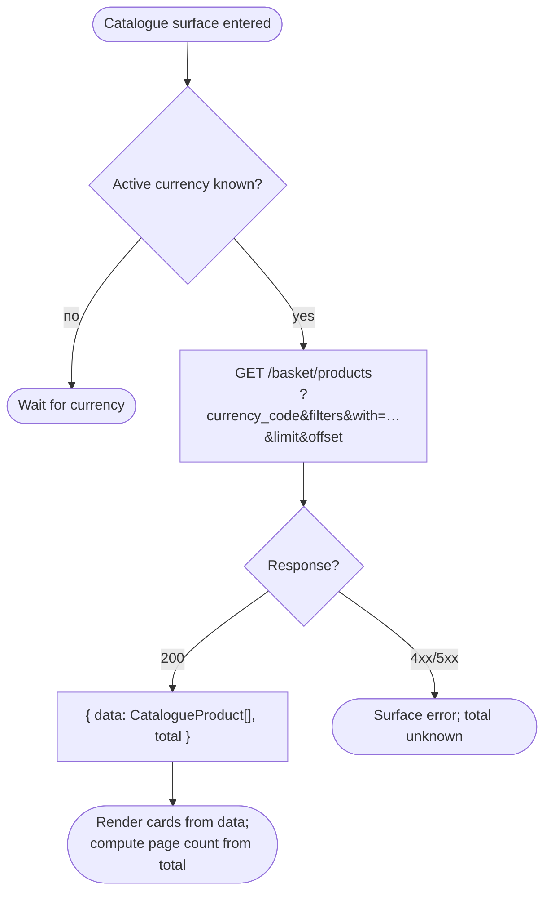
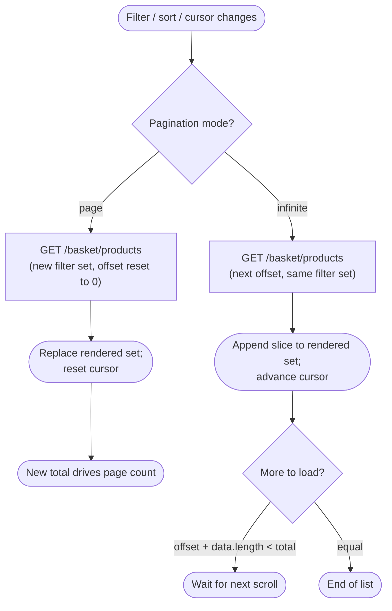
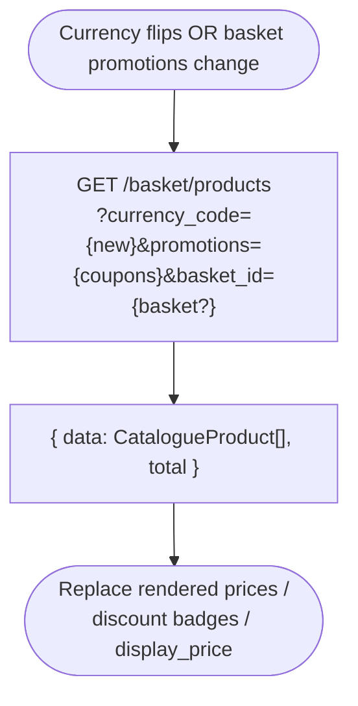

# Module: productCatalogue

## What it is

The product catalogue is the browse surface of the storefront. It serves _lists_ of sellable products — paginated grids, category-scoped lists, search results, filtered subsets — each entry rendered as a card with identity assets, a headline price, and just enough relation data to support a card UI (primary image, category breadcrumb, available options at-a-glance). One request returns many products; one product returns the _card-shape_ of itself, not the full configurator shape.

Once a customer drills into a card, the single-product read, the initial configuration form, and the seating call into a basket all live in `product`; product picks up after the catalogue card is clicked. In-basket re-resolve / edit / remove of an already-seated entry lives in `basketProduct`. Category structure (the tree, breadcrumb hierarchy, subcategory metadata) lives in `productCategories`. The catalogue read participates in _one_ basket-aware concern: when a `basket_id` is supplied alongside the list request, the prices that come back reflect promotions already applied to that basket and option overrides already bound on its lines — used by "in your basket" badging and basket-aware upsell surfaces. The catalogue does not mutate the basket; reconciliation of catalogue cards against current basket lines is the caller's join.

## Core concepts

- **Catalogue read** — one HTTP call that returns a page of products in card-shape: identity, primary image, the prices array filtered to the active currency, headline display price, and the configurable-options grid at-a-glance. Same per-item shape as the single-product read in `product`, returned in bulk.
- **Card-shape product** — the product record as it appears in a catalogue list response. Carries the same fields as the single-product read because the back end emits one product type — but list responses are typically requested with a slimmer `with` expand than the configure-surface read (no `provision_blueprint.category`, no per-option `icon` expand by default).
- **Category-scoped list** — a catalogue read filtered by `filter[products_category_id]` returning only products in the supplied category id. The category itself (and its subcategory tree) is loaded from `productCategories`.
- **Coupon-scoped list** — a catalogue read with one or more coupon codes attached via `promotions=`. Returned price rows carry `price_discounted`, `monthly_price_from_discounted`, and a populated `promotions` array reflecting the resolved discount. **Coupon scoping is per-call, not per-line:** the `promotions=` query parameter applies the listed coupons to every price row on every product in the response uniformly, evaluating each against the platform's stacking rules. This is distinct from the per-line `promotions: [{ promocode }]` field on `BasketProductCreate` / `BasketProductUpdate` (see [basketProduct.md](../../basketProduct/docs/foundation.md)), which attaches a coupon to a single basket-product after seating. Same wire concept (a coupon code); different scoping surface (whole-catalogue browse vs single-line edit).
- **Basket-scoped list** — a catalogue read with `basket_id=` supplied. Returned price rows additionally reflect any coupons and option overrides already bound on the basket's lines — the prices a customer would see for these products _in the context of their current basket_.
- **Pagination cursor** — `limit` + `offset` query parameters select a page; the response carries a `total` for the unfiltered-by-pagination set, enabling page count derivation.

## Operations

| #   | Capability                                                      | Inputs                                                                                                                                                                                                                               | Outputs                                                                                                                                                                                                                                                                                                      |
| --- | --------------------------------------------------------------- | ------------------------------------------------------------------------------------------------------------------------------------------------------------------------------------------------------------------------------------ | ------------------------------------------------------------------------------------------------------------------------------------------------------------------------------------------------------------------------------------------------------------------------------------------------------------ |
| 1   | **Read a page of catalogue products**                           | active currency `{ id?, code? }`, optional category id filter, optional coupon code list, optional `basket_id`, optional product-id filter, optional free-text query, pagination `{ limit, offset }`, sort `{ property, direction }` | Array of card-shape product records for the requested slice, plus a `total` integer for the unpaginated set. Each item carries identity assets, the prices array for the active currency, the configurable-options grid, the primary image, and the inlined category record up to five levels of breadcrumb. |
| 2   | **Read the next page of an in-progress browse**                 | the previous page cursor (limit + offset)                                                                                                                                                                                            | The next slice in card-shape, appended to the previously-loaded set.                                                                                                                                                                                                                                         |
| 3   | **Re-resolve the current list against a different category**    | active category id (or absence for "all")                                                                                                                                                                                            | The same list operation re-filtered server-side; the previously-rendered set is replaced by the new category's products.                                                                                                                                                                                     |
| 4   | **Re-resolve the current list against a different coupon set**  | comma-separated coupon codes                                                                                                                                                                                                         | The same list operation with `promotions=` carrying the new codes; resolved promotions ride on each returned price row.                                                                                                                                                                                      |
| 5   | **Re-resolve the current list against a free-text query**       | query string (matched server-side against product name + description)                                                                                                                                                                | The same list operation with `query=` carrying the search term.                                                                                                                                                                                                                                              |
| 6   | **Re-resolve the current list against a specific id set**       | array of product ids                                                                                                                                                                                                                 | The same list operation scoped to the supplied ids (used to load "the products in the customer's basket" as a catalogue surface, or to back the recommendation/featured strips).                                                                                                                             |
| 7   | **Read the same list scoped to a basket's promotional context** | `basket_id`, all of the above inputs                                                                                                                                                                                                 | The same list with prices, discounts, and applied promotions re-computed server-side against the supplied basket's currently-bound coupons and option overrides. Used by "in your basket" badging, mini-cart upsell, and basket-aware recommendation surfaces.                                               |
| 8   | **Sort the current list**                                       | sort property (`order`, `name`, `price`), direction                                                                                                                                                                                  | The same list re-ordered server-side.                                                                                                                                                                                                                                                                        |
| 9   | **Refresh the current list against the latest server state**    | —                                                                                                                                                                                                                                    | Re-fetches the page with the current cursor and filters; used after an external event the catalogue's prices depend on (currency switch, basket promotion change, coupon application elsewhere).                                                                                                             |
| 10  | **Invalidate the cached catalogue state**                       | —                                                                                                                                                                                                                                    | Drops any cached page slice the transport layer holds for catalogue reads so the next caller re-fetches from the back end.                                                                                                                                                                                   |

> Domain-name products are excluded from catalogue results at the request level — the catalogue read always filters `filter[provision_blueprint.category.code|neq]=domain-names`. Domain registration / transfer / lookup is a separate surface owned by `domain`; the catalogue does not list domains as cards.

## Data shape

### Catalogue list response — returned by `GET /basket/products`

```ts
type CatalogueListResponse = {
  status: "ok";
  data: CatalogueProduct[]; // one card-shape product per entry
  total: number; // total products matching the filter set (ignores limit/offset)
  related?: unknown; // populated when the request expanded `related`
  error: null | unknown;
  messages: unknown[];
};

// Card-shape product. Same back-end model as the single-product read in `product`;
// list responses typically request a slimmer `with` expand (no per-option `icon`,
// no `provision_blueprint.category`). All fields below are returned by the catalogue
// read with the standard expand string.
type CatalogueProduct = {
  id: string; // product UUID
  brand_id: string;
  org_id: string;
  category_id: string; // primary category
  category: ProductCategory; // populated by the `category.top_category…` expand
  products_category_id: string;
  products_options_category_id: string | null;
  products_attributes_category_id: string | null;

  name: string; // untranslated reporting name
  name_translated: string; // localised name for display
  description: string; // long-form, HTML allowed
  description_translated: string;
  short_description: string | null;
  short_description_translated: string | null;
  code: string | null;
  external_id: string | null;
  import_id: string | null;
  original_product_id: string | null;
  user_id: string;

  product_type: 1 | 2 | 3 | 4 | 5 | 6; // ProductTypes — 1=single, 2=bundle, 3=voucher, 4=option, 5=attribute, 6=subproduct
  order_type: 1 | 2 | 3; // ProductOrderTypes — 1=single-option, 2=quantity-based, 3=configuration-based
  main_product: 0 | 1; // 1 when this is a top-level orderable product
  in_group: 0 | 1;
  hidden: boolean; // hidden everywhere
  hide_catalog: boolean; // hidden from catalogue specifically
  available_for_sales: 0 | 1;
  clients_can_order: 0 | 1;
  split_quantity: boolean;
  post_paid: boolean;

  // --- order quantity constraints
  unit_quantity: number;
  min_order_quantity: number;
  max_order_quantity: number; // 0 = unlimited
  unit_id: string | null;
  max_order_billing_cycle: number;
  max_set_use_period: number;

  // --- billing
  billing_cycle_months: number; // default cycle. 0 = one-off
  currency_id: string; // product's source-of-truth currency
  default_payment_period: 0 | 1 | 2 | 3; // 0=inherit, 1=lowest, 2=lowest-monthly, 3=highest
  contract_type: number;
  auto_renew: 0 | 1;
  auto_create_renew_invoice: boolean;
  can_disable_auto_create_renew_invoice: boolean;
  cancel_anytime: boolean;
  cancel_interval: number | null;
  suspend_interval: number | null;
  close_interval: number | null;
  due_date_free_change: boolean;
  due_date_restriction: number | null;
  recommended_money_back_period: number | null;
  payment_days_term: number | null;
  create_invoice_term: number | null;
  invoice_consolidation_enabled: 0 | 1 | 2;
  manual_recurring_days_before_due_date: number | null;
  reactivate_status_restriction: string[] | null;

  // --- pricing
  display_price: string; // formatted headline price for the card
  display_price_billing_cycle_months: number; // the cycle the headline refers to
  manual_price: 0 | 1;
  set_price_type: number;
  set_order_type: number;
  set_end_date: number;
  additional_currency_recalculation: 0 | 1 | 2;
  accounting_revenue_recognition: 0 | 1 | 2;
  tax_template_id: string | null;

  // --- trial
  trial_supported: boolean;
  trial_duration: number;
  trial_force: boolean;
  trial_end_action: number;
  trial_pre_expire_notification: number;
  is_trial_only: boolean;

  // --- provisioning (catalogue read does not inline provision_blueprint by default)
  module_code: string | null;
  module_sub_id: string | null;
  provision_blueprint_id: string | null;
  provision_category_id: string | null;
  provision_provider_id: string | null;
  provision_configuration_id: string | null;
  provision_configuration_mode: "static" | "dynamic" | null;
  provision_setup_field_defer_mode:
    | "none"
    | "after_order"
    | "before_completion"
    | null;
  provision_meta: Record<string, unknown> | null;
  old_provision_blueprint_id: string | null;
  operation_type: string | null;
  tld_id: string | null;

  // --- voucher (only populated for product_type=3)
  voucher_value: string | null;
  voucher_currency_id: string | null;
  voucher_type: string | null;
  voucher_use_months: number | null;

  // --- relations populated by the catalogue `with=` query
  prices: Price[]; // filtered to the requested currency
  products_options: SubProduct[]; // option grid (used to mark "configurable" on a card)
  products_attributes: SubProduct[]; // attribute grid (same shape)
  images: Image[];
  image: Image | null; // primary
  translations: Translation[];

  // --- admin / lifecycle
  allow_affiliate: boolean;
  affiliate_product_id: string | null;
  reseller_account_id: string | null;
  brand_ticket_department_id: string | null;
  report_code_1: string | null;
  report_code_2: string | null;
  manual_assistance: 0 | 1;
  auto_accept_cancel_request: 0 | 1;
  staged_import: boolean;
  finished_staged_import: boolean;
  start_date: string | null;
  end_date: string | null;
  ui_settings: unknown | null;
  order: number; // catalogue display order within the category
  created_at: string;
  updated_at: string;
  deleted_at: string | null;
};

// One pricing row. Card surfaces typically read the first row matching the
// active currency to render the headline; configuration-stage reads against
// `product` carry the full grid across cycles.
type Price = {
  id: string;
  pricelist_id: string;
  product_id: string;
  currency_id: string;
  currency_code: string; // ISO 4217, e.g. "USD"
  currency_exchange_rate: number;
  billing_cycle_months: number; // 0 = one-off
  price: number; // unit price, decimal major units
  price_formatted: string; // e.g. "$99.00"
  monthly_price_from: number;
  monthly_price_from_formatted: string;
  available_for_clients: boolean;
  own_price: boolean;
  overridden_price: boolean;
  original_price: number | null;
  original_price_formatted: string | null;

  // --- discount layering (populated when promotions/coupons resolve to a discount on this row)
  price_discounted: number | null;
  price_discounted_formatted: string | null;
  monthly_price_from_discounted: number | null;
  monthly_price_from_discounted_formatted: string | null;
  mixed_promotions: boolean;
  promotions: Promotion[];

  from_datetime: string | null;
  to_datetime: string | null;
  external_id: string | null;
  import_id: string | null;
  staged_import: boolean;
  created_at: string | null;
  updated_at: string | null;
  deleted_at: string | null;
};

// Sub-product (option or attribute). On a catalogue list response the option
// grid is present but icons are not expanded by default — the configure surface
// in `product` re-fetches with the per-option expand list.
type SubProduct = CatalogueProduct & {
  pivot: {
    product_id: string; // parent
    option_id: string; // this sub-product
    order: number;
    default: 0 | 1; // pre-selected
  };
  prices: Price[]; // sub-products carry their own price rows
};

// Category record carried inline by each list entry. The top_category chain
// is nested up to five levels to support deep breadcrumb rendering on cards.
type ProductCategory = {
  id: string;
  brand_id: string;
  org_id: string;
  parent_id: string | null;
  level: number; // 1-indexed depth in the category tree
  name: string;
  name_translated: string;
  description: string;
  description_translated: string;
  short_description: string | null;
  short_description_translated: string | null;
  external_id: string | null;
  category_type: 1 | 2 | 3; // 1=product, 2=option, 3=attribute
  multiple: boolean;
  required: boolean;
  price_override: boolean;
  hidden: boolean;
  order: number;
  top_category: ProductCategory | null; // recursive parent chain
  translations: Translation[];
  created_at: string;
  updated_at: string;
  deleted_at: string | null;
};

type Promotion = {
  id: string;
  promotion_id: string;
  code: string | null; // coupon code; null for auto-applied promotions
  type: string;
  value: number;
  display_type: "percentage" | "amount" | "free_product" | "free_term" | string;
  description?: string | null;
};

// Pagination cursor — supplied via query string, not echoed in the body.
type CatalogueCursor = {
  limit: number; // page size
  offset: number; // zero-based starting index
};

// Filter set the caller assembles before each read.
type CatalogueFilters = {
  "filter[products_category_id]"?: string; // scope to a single category id
  id?: string[]; // scope to a specific id set
  promotions?: string[]; // coupon codes to apply
  query?: string; // free-text match against name / description
  basket_id?: string; // basket whose context the prices reflect
  currency_code?: string; // active currency, ISO code
  currency_id?: string; // active currency, UUID
  lang?: string; // negotiated locale for translated fields
  order?: "order" | "name" | "price"; // sort property
  order_dir?: "asc" | "desc"; // sort direction
};
```

## Dependencies

### Dependants — modules that read from this one

No headless module depends on the catalogue read. The catalogue is consumed exclusively at the presentation layer.

| Module             | Weight | Reads                                                                                                                                                                                                                           | Why                                                                                                                                        |
| ------------------ | ------ | ------------------------------------------------------------------------------------------------------------------------------------------------------------------------------------------------------------------------------- | ------------------------------------------------------------------------------------------------------------------------------------------ |
| Presentation layer | —      | card-shape product (identity, primary image, headline price, formatted savings, badge / benefit hints), category breadcrumb, pagination total, options-at-a-glance, "in your basket" cross-reference for already-seated entries | Catalogue grids, category landing pages, search results, mini-cart upsell strips, recommendation rails, "in your basket" badging on cards. |

> `query` (the HTTP transport layer) and `routing` (app-level navigation) reference the catalogue surface but are excluded — they are foundational concerns, not domain consumers. No other headless module imports from the catalogue surface; the catalogue is a terminal read, not a substrate other modules join against.

### This module's own dependencies

- **HTTP transport layer** — bearer-token attachment, brand-currency injection on the request, locale negotiation for translated fields, response shape normalisation, `basket_id` injection when a basket is active.
- **Active basket context** — current basket's currency code and applied coupon set. Sourced from `basket`; the catalogue read keys its cache against the coupon set and injects the currency on every request.
- **Single-product surface (`product`)** — the catalogue's per-item shape is the same record `product` reads in isolation. The catalogue read's parser is shared with the single-product read so card-shape and configure-shape stay in sync.
- **Promotion/coupon parsing (`basketProduct`)** — shared helper that normalises the basket's resolved promotion records into a coupon-code list suitable for the catalogue read's `promotions=` query parameter.
- **Shared types / enums** — typed mirror of the API shape (product, sub-product, price, category, promotion) plus the integer-enum keys for `product_type`, `order_type`, default-payment-period, price display, promotion display, and provision-category code (used to filter domain-name products out of the catalogue).

## API endpoints

### `GET /basket/products`

Read a page of catalogue products in card-shape. The `with` query parameter is comma-separated and selects which relations to inline — prices, options (with their own prices), attributes, the category chain up to five levels, the primary image, the gallery. The `currency_code` parameter (or `currency_id`) selects which currency's price rows populate. The `promotions=` parameter takes a comma-separated list of coupon codes; resolved promotions ride on each price row. `filter[products_category_id]` scopes the list to one category. `filter[provision_blueprint.category.code|neq]=domain-names` excludes the domain-name catalogue (the domain widget owns that surface). `basket_id=` re-computes the prices server-side against an active basket's applied promotions and option overrides. `limit` / `offset` cursor the page; `order` + `order_dir` sort.

```bash
curl -s "$API/basket/products?\
filter%5Bprovision_blueprint.category.code%7Cneq%5D=domain-names&\
filter%5Bproducts_category_id%5D=8d632507-9806-5d1e-37ef-8174e234e98d&\
with=image,images,prices,products_attributes,products_options,products_options.prices,category.top_category.top_category.top_category.top_category&\
order=order&limit=9&offset=0&\
lang=en-US&\
currency_code=USD&\
promotions=" \
  -H "Authorization: Bearer $ACCESS_TOKEN"
```

```json
{
  "status": "ok",
  "total": 12,
  "data": [
    {
      "id": "47d73824-8507-9315-345f-81e642d59e06",
      "external_id": "logo",
      "name": "Logo Design",
      "name_translated": "Logo Design",
      "short_description": null,
      "short_description_translated": null,
      "description": "",
      "description_translated": "",
      "code": null,
      "product_type": 1,
      "order_type": 2,
      "main_product": 1,
      "in_group": 0,
      "hidden": false,
      "hide_catalog": false,
      "available_for_sales": 1,
      "clients_can_order": 1,
      "split_quantity": false,
      "unit_quantity": 2,
      "min_order_quantity": 0,
      "max_order_quantity": 0,
      "billing_cycle_months": 0,
      "currency_id": "e47d7382-4850-7931-56c8-1e642d59e063",
      "default_payment_period": 2,
      "display_price": "$99.00",
      "display_price_billing_cycle_months": 0,
      "category_id": "8d632507-9806-5d1e-37ef-8174e234e98d",
      "category": {
        "id": "8d632507-9806-5d1e-37ef-8174e234e98d",
        "name": "Design Services",
        "name_translated": "Design Services",
        "parent_id": null,
        "level": 1,
        "category_type": 1,
        "multiple": false,
        "required": false,
        "price_override": false,
        "hidden": false,
        "order": 0,
        "top_category": null
      },
      "prices": [
        {
          "id": "de78642d-e539-7146-609b-21208469530d",
          "pricelist_id": "5952098d-3de4-0917-86a3-1578626e347e",
          "product_id": "47d73824-8507-9315-345f-81e642d59e06",
          "currency_id": "e47d7382-4850-7931-56c8-1e642d59e063",
          "currency_code": "USD",
          "currency_exchange_rate": 1,
          "billing_cycle_months": 0,
          "price": 99,
          "price_formatted": "$99.00",
          "monthly_price_from": 99,
          "monthly_price_from_formatted": "$99.00",
          "available_for_clients": true,
          "own_price": true,
          "overridden_price": false,
          "original_price": null,
          "original_price_formatted": null,
          "price_discounted": null,
          "price_discounted_formatted": null,
          "monthly_price_from_discounted": null,
          "monthly_price_from_discounted_formatted": null,
          "mixed_promotions": false,
          "promotions": []
        }
      ],
      "products_attributes": [],
      "products_options": [],
      "images": [],
      "image": null,
      "trial_supported": false,
      "trial_duration": 0,
      "trial_force": false,
      "is_trial_only": false,
      "order": 0,
      "tax_template_id": "24d03679-424d-0e71-04b3-153698d582e8"
    }
  ],
  "error": null,
  "messages": []
}
```

> Sample trimmed to one entry plus the envelope; admin-adjacent fields on each entry (lifecycle timestamps, cancellation policy, voucher fields, report codes, full module / org / brand id chain) are preserved in the captured fixture at [`tests/__fixtures__/recordings/get-basket-products-0aea5e9f.json`](../../../../../../tests/__fixtures__/recordings/get-basket-products-0aea5e9f.json). Products with configurable options return populated `products_options` / `products_attributes` arrays — each entry has the same shape as the parent plus a `pivot` row linking it to the parent. The catalogue's response envelope's `meta` is `null`; the data-level `meta` on each entry is the UI-specific bag stripped per the top-of-doc note.

#### Basket-scoped variant — same endpoint, with `basket_id`

The same endpoint scoped to an active basket. Supplied `basket_id` triggers a server-side recompute of every returned price row against the basket's applied promotions, applied coupons, and option overrides currently bound on its lines.

```bash
curl -s "$API/basket/products?\
filter%5Bprovision_blueprint.code%7Cneq%5D=domain-names&\
filter%5Bproducts_category_id%5D=8d632507-9806-5d1e-37ef-8174e234e98d&\
with=image,images,prices,products_attributes,products_options,products_options.prices,category.top_category.top_category.top_category.top_category&\
order=order&limit=9&offset=0&\
lang=en&currency_code=USD&\
basket_id=5d96e763-ed09-1353-d92b-417482528340" \
  -H "Authorization: Bearer $ACCESS_TOKEN"
```

Response shape is identical to the basket-agnostic read — `data: CatalogueProduct[]` with the price rows recomputed for the basket's promotional context. Real capture at [`tests/__fixtures__/recordings/get-basket-products-83cdf05d.json`](../../../../../../tests/__fixtures__/recordings/get-basket-products-83cdf05d.json).

## Flows

The catalogue's read is one HTTP call. The interactions worth planning around are the things that _re-issue_ that call — currency switches, category navigation, coupon application, scrolling into the next page, and basket-promotional-context changes. Each of these is the same endpoint with a different cursor / filter / scope.

### Initial catalogue load

The first render of a catalogue surface (landing page, category page, search page) issues one read against the configured filter set and renders the returned slice.



Guarantees the platform holds:

- One call returns the full card-shape per item — identity, prices for the active currency, options grid, primary image, category breadcrumb — no second request is required to render a card.
- The `total` integer in the response describes the filtered set ignoring `limit` / `offset`, so the caller can derive page count without a separate count request.
- Domain-name products are excluded server-side via the `provision_blueprint.category.code|neq=domain-names` filter on every catalogue request — the catalogue surface never sees them.
- Translated fields (`name_translated`, `description_translated`, `short_description_translated`) are populated against the request's `lang` parameter; the untranslated source fields ride alongside.

Constraints the caller has to plan around:

- A product with no price row for the active currency arrives with an empty `prices` array — the card is unsellable in that currency and the caller has to decide whether to hide it, grey it out, or fall back to the brand's recalculation policy.
- The headline `display_price` may correspond to a billing cycle the configure surface does not default to; the price the customer pays at checkout depends on which term they pick on the configure page, not the headline shown on the card.
- The catalogue's `with` expand list does not include the per-option icon expand or the provisioning blueprint. Cards rendering option icons or provision-field counts have to re-fetch via the single-product surface in `product`.

### Re-resolve on filter / sort / cursor change

Filter changes, sort changes, and pagination cursor moves are all the same operation against the same endpoint — the catalogue read with a different query string. The previously-rendered set is replaced (or appended, on infinite-scroll surfaces) by the new slice.



Guarantees the platform holds:

- Filter changes reset the implicit set the cursor walks through; `total` updates to the new filter's count.
- The cached page slice the caller holds keys against the active filter set (currency, coupons, category, query, id list, basket_id) — changing any of those is observably a different fetch.
- Free-text `query` matches server-side against the product's name and description fields against the negotiated `lang`.

Constraints the caller has to plan around:

- A filter change mid-scroll on an infinite surface to leave the previously-loaded slice stale — the caller resets the loaded set or accepts that the rendered cards mix two filter contexts.
- The `total` only reflects the unfiltered-by-pagination set; the caller's "remaining" count is `max(0, total − (offset + data.length))` and falls out of date the moment any filter changes.
- The free-text `query` is debounced client-side as a UX choice; the platform itself happily accepts a request per keystroke and will recompute against the back-end's full-text index on every call.

### Re-resolve on currency / basket-promotional-context change

A currency switch or an event on the active basket (coupon applied, coupon cleared, line option changed) invalidates the rendered cards' prices. The catalogue re-issues the same read against the new currency and / or the new basket-scoped promotional context.



Guarantees the platform holds:

- The same endpoint serves every currency and every promotional context — currency, coupons, and `basket_id` are query parameters, not separate resources.
- Resolved promotions ride per-row on `prices[].promotions` and per-row `price_discounted` / `price_discounted_formatted` — the row tells the card what discount applies.
- Sending `basket_id` and `promotions` together compounds: the response reflects both the basket's applied coupons _and_ the additionally-supplied codes.

Constraints the caller has to plan around:

- Sending `basket_id` to pay a recomputation cost on every card on every page (see the X-id lesson below) — basket-agnostic browsing surfaces skip it; basket-aware surfaces accept the cost.
- The cached slice the caller holds against the previous currency / coupon set is unusable for any rendered field that depends on price — even the headline `display_price` is currency-specific.
- A card visible just before the currency flip to disappear afterwards. Products with no price row for the new currency drop out of the next response; the caller has to reconcile the rendered set against the new payload rather than assume parity.

## Lessons (hard-won)

- **The catalogue list and the configure surface use the same endpoint family with different `with` expands.** `GET /basket/products` is the list; `GET /basket/products/{id}` is the configure read. The per-item shape is identical — same fields, same model — but the expand string differs (list: no per-option icon, no provision-blueprint expand; configure: full expand). A consumer that loads a card and reuses it as the configure-surface model misses the provision-field definitions and option icons; a consumer that loads the configure shape and uses it to render cards over-fetches on every list.

- **A product's catalogue identity does not include its price.** The same product carries one price row per `(pricelist, currency, billing cycle)`. Resolving a catalogue page in a different currency is not a re-format — it is a different fetch, and a product with no price row for the active currency comes back with an empty `prices` array. A consumer that caches "the page" without keying the cache on currency renders blank prices the moment the customer flips currencies.

- **Passing `basket_id` on a catalogue read is not free.** When `basket_id` is supplied the back end loads the basket and recomputes every price row against its applied promotions, applied coupons, and option overrides currently bound on its lines. That work scales with the size of the basket _and_ with the size of the catalogue page being recomputed against it, and is paid on every request. Use the parameter when the surface needs basket-accurate prices (mini-cart upsell, "in your basket" badges, basket-aware recommendation lists); skip it on broad catalogue browsing where the basket-agnostic prices suffice, otherwise every card on every page pays the recomputation cost.

- **Coupon codes attached to the catalogue read modify every returned price row.** Coupons sent via `promotions=` resolve server-side and the response carries discounted prices, populated `promotions` arrays, and `price_discounted_formatted` on every row matched by the coupon. The same product fetched with different coupons returns different prices for the same currency. A consumer that loads the catalogue with one coupon set and renders cards under a different one (e.g. after the user enters a code on the basket surface) under- or over-displays the discount until the catalogue is re-fetched.

- **Catalogue pagination is server-side cursored; the cached slice is page-specific.** `limit` + `offset` select the slice and `total` describes the filtered-and-unpaginated set. A filter change resets the implicit set the cursor walks through and the previously-cached slices become invalid — the caller has to drop them, not append the next page on top. Infinite-scroll surfaces in particular trip on this: changing the category mid-scroll silently mixes two filter contexts in the rendered list if the cache isn't reset.

- **Free-text search is opaque server-side fuzzing across `name` and `description`.** The `query` parameter does not expose its match algorithm — relevance, ordering, weight, language-aware tokenisation are all back-end decisions. A consumer that wraps the catalogue with a smart filter on top of `query` (typeahead, fuzzy-correct, synonym expansion) is layering on top of a search the platform may already be doing differently; the two implementations can drift in ways the surface can't observe.

- **Pagination's `total` and the number of returned items diverge in normal use.** `total` is the count for the filter set ignoring `limit` / `offset`; the data array's length is bounded by `limit`. A consumer that conflates the two — using `data.length` to decide "are we at the end of the list" — under- or over-counts the page. The end-of-list signal is `(offset + data.length) >= total`.

- **The catalogue's "in your basket" join is the caller's responsibility.** The catalogue read does not flag which of its returned products are already seated in the active basket. Badging a card as "in your basket" requires the caller to join the catalogue's product ids against the basket's `basket-product[].product_id` list at render time. Cross-references (quantity in basket, basket-line id back into the basketProduct surface) are derivable from the same join but live entirely client-side — the catalogue read returns the catalogue, not a personalised view of it.

- **The configurable-options grid on a card is approximate, not transactable.** Each catalogue entry carries `products_options` and `products_attributes` arrays so a card can render "configurable" badges or option counts at-a-glance. But the option grid as returned on the list is not the same as the configure-surface read — option icons, per-term price filtering, and provision-field definitions all require the dedicated single-product read. A consumer that pulls the option grid off a card and lets the user "configure inline" without re-fetching against `product` is configuring against a stale, slimmer view of the options.

- **The card's `display_price` is the catalogue's editorial headline, not the customer-payable price.** `display_price` and `display_price_billing_cycle_months` are computed against the brand's `default_payment_period` (lowest cycle price, lowest monthly-equivalent across cycles, lowest monthly-equivalent of monthly-billed products only, …). None of these is what the customer pays at checkout — that depends on the term they pick on the configure surface. A consumer that lets the catalogue's headline drift into the configurator without re-resolving creates a "price changed" experience between card and configure page that breaks trust.
