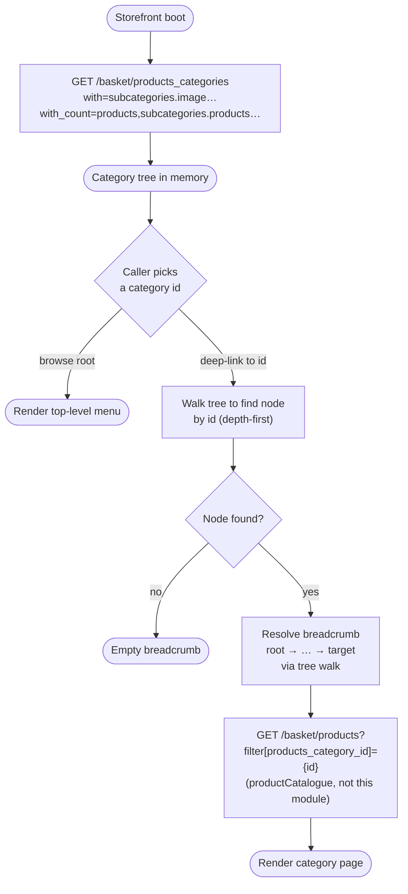

# Module: productCategories

## What it is

Product categories is the storefront's catalogue taxonomy: the tree of buckets that products live in, the breadcrumb chain a configurator surface displays when one product is selected, and the lookup surface that resolves a category id to its identity assets (name, description, badge, image, product counts). The whole tree is loaded once as a single nested response — every top-level category carries its `subcategories` inline up to five levels deep, each with its own product count and (where the level has its own image relation requested) its own image url. Categories themselves do not carry the products that sit inside them; this module owns the tree shape and per-category identity, not the catalogue listing.

Category-scoped product listing (the grid of products inside a category) lives in `productCatalogue`; the per-product embedded `category` snapshot returned on a basket-product or a configurator-product read lives in `product`. productCategories picks up where those two stop — it answers "what categories exist", "what's the path from the root to this category", and "what badge / image / description does this category carry".

> _Any `meta` field returned by Upmind endpoints (e.g. `meta.uischema`, `meta.@data.categoryBadge` on a category) is UI-specific to our own client — ignore for spec purposes._

## Core concepts

- **Category tree** — a forest of top-level categories, each carrying nested `subcategories` inline. The tree is materialised in a single response; the depth of nesting is bound by the `with` expand-list parameter, not by the platform.
- **Tree walker** — the traversal primitive over the nested response. A single record carries its immediate `parent_id` but not its ancestors, and `subcategories` is materialised inline rather than fetched per node. Consumer surfaces that need path-from-root (breadcrumbs), descendant-count rollups, or sibling enumeration implement a walker over the loaded tree — the walker is the architectural primitive; specific applications are consumer-side derivations of it.
- **Category type** — the `category_type` discriminator that splits one shape into three semantically distinct populations: storefront-navigation buckets (`1`), configurable-option groupings (`2`), and configurable-attribute groupings (`3`). Only type `1` is rendered in catalogue navigation.
- **Translated vs untranslated identity** — every name / description / short-description carries both an untranslated reporting form and a `*_translated` display form. The translated form falls back silently to the untranslated value when no translation exists for the active locale.
- **Module-targeted category** — categories that route customers into a provisioning-module-specific configurator declare a `module_code` (e.g. `web_hosting`) and optional `module_sub_id` (e.g. `domains`). The pair is the stable hook for module-aware routing; identity assets (name, `external_id`) are not.

## Operations

| #   | Capability                      | Inputs | Outputs                                                                                                                                                                                                                                                                                                                                                                                                                                                                                                                     |
| --- | ------------------------------- | ------ | --------------------------------------------------------------------------------------------------------------------------------------------------------------------------------------------------------------------------------------------------------------------------------------------------------------------------------------------------------------------------------------------------------------------------------------------------------------------------------------------------------------------------- |
| 1   | **Read the full category tree** | —      | Array of top-level categories, each carrying nested `subcategories` to a depth controlled by the `with` expand list (the typical request asks for `subcategories.image` repeated up to four times to materialise five levels). Every node carries its own identity (name, description, short description, image url where the image relation was requested), its `products_count` for that level, and the hierarchy linkage (`parent_id`, `level`). One BE call returns the entire tree; there is no paginated alternative. |

### Derived from a loaded tree

The following are in-memory reads off the tree already retrieved via capability 1. They are not back-end calls — an architect rebuilding the platform plans for them as client-side derivations.

| #   | Capability                                | Inputs                                                                                   | Outputs                                                                                                                                                                                                    |
| --- | ----------------------------------------- | ---------------------------------------------------------------------------------------- | ---------------------------------------------------------------------------------------------------------------------------------------------------------------------------------------------------------- |
| 2   | **Look up a category by id**              | category id                                                                              | The matching category node (with its own subcategories still inline) or undefined when no node carries that id. The walk descends the tree depth-first; lookup cost scales with tree size, not with depth. |
| 3   | **Find a category by free-text**          | a substring to match against title, description, or short description (case-insensitive) | The first category whose identity assets contain the substring, or undefined. Used by surfaces that resolve a slug-like or partial name into a node.                                                       |
| 4   | **Filter categories by name**             | optional substring, optional parent id                                                   | Categories whose title contains the substring (case-insensitive); scoped to the children of `parent` when supplied, otherwise the full flattened tree.                                                     |
| 5   | **Walk the path from a node to the root** | category id                                                                              | Ordered list of category nodes from root to the target. One application is breadcrumb rendering; other consumers use it to compute ancestor-aware summaries. Empty when the id is not in the tree.         |
| 6   | **Read a category's direct children**     | parent id, optional flag to flatten descendants                                          | The categories whose `parent_id` matches — either as direct children only, or as the full flattened subtree below the parent.                                                                              |
| 7   | **Read a category's parent id**           | category id                                                                              | The `parent_id` carried by the matching node, or undefined. Single-step ancestor lookup.                                                                                                                   |
| 8   | **Read the flattened tree**               | a loaded tree                                                                            | Every category in the tree as a flat array, parents preceding their children. Used by surfaces that don't care about hierarchy (search, picker components, count summaries).                               |

## Data shape

### Category tree — returned by `GET /basket/products_categories`

The endpoint returns an array of top-level categories. Subcategories are nested inline on the `subcategories` field; the platform expands them to whatever depth the `with` parameter requested (the typical request asks for four levels of `subcategories.image` inlining, which materialises the tree up to five levels including the root).

```ts
type ProductCategoryRecord = {
  id: string;                                   // category UUID
  parent_id: string | null;                     // null at the root
  level: number;                                // 1-indexed depth; root = 1
  brand_id: string;
  org_id: string;
  user_id: string | null;
  reseller_account_id: number | null;

  name: string;                                 // untranslated reporting name
  name_translated: string;                      // localised name for display
  description: string;                          // long-form, HTML allowed
  description_translated: string;
  short_description: string;                    // excerpt for cards
  short_description_translated: string;

  external_id: string | null;                   // import_id passthrough (e.g. "hosting", "design_services")
  import_id: string | null;
  staged_import: boolean;

  module_code: string | null;                   // e.g. "web_hosting" — marks categories that target a specific provisioning module
  module_sub_id: string | null;                 // e.g. "domains"

  category_type: 1 | 2 | 3;                     // 1 = PRODUCT, 2 = PRODUCT_OPTION, 3 = PRODUCT_ATTRIBUTE — only category_type=1 appears in catalogue navigation
  multiple: boolean;                            // option/attribute semantics: can the customer pick more than one value (only meaningful for option/attribute categories)
  required: boolean;                            // option/attribute semantics: must the customer pick a value (only meaningful for option/attribute categories)
  price_override: boolean;                      // option-category flag: a selection inside replaces (not adds to) the parent price
  provision_setup_field_defer_mode: "none" | "after_order" | "before_completion" | "hidden";

  order: number;                                // display order within the parent
  hidden: boolean;                              // hide from catalogue rendering
  ui_settings: Record<string, unknown> | null;

  // --- aggregate counts populated by the with_count query parameter
  products_count: number;                       // products directly in this category (not descendants)
  sub_products_count: number;                   // products under subcategories of this category
  subcategories_count: number;                  // direct children count
  sub_subcategories_count: number;              // grandchild count

  // --- relations populated by the with= query
  subcategories: ProductCategoryRecord[];       // nested children, populated up to the requested depth
  image: { image_url: string; … } | null;       // primary category image (populated when subcategories.image is requested at this level)
  translations: Translation[];

  // --- timestamps
  created_at: string;
  updated_at: string;
  deleted_at: string | null;
};
```

Cross-reference: canonical type is `IProductCategory` in `packages/types/src/models/products.ts`; `category_type` values come from `ProductCategoryTypes` in `packages/types/src/data/enums/products.ts` (`PRODUCT = 1`, `PRODUCT_OPTION = 2`, `PRODUCT_ATTRIBUTE = 3`); `provision_setup_field_defer_mode` values come from `DeferModes` in `packages/types/src/data/enums/provisioning.ts`.

## Dependencies

### Dependants — modules that read from this one

No other headless module imports from productCategories. The category surface exists for the presentation layer; downstream domain modules that need a category reference (basket lines, configurator products) carry their own embedded `category` snapshot supplied by the product or basket endpoint, rather than walking this module's tree.

| Module             | Weight | Reads                                                                                                                                  | Why                                                                                                                                                                                       |
| ------------------ | ------ | -------------------------------------------------------------------------------------------------------------------------------------- | ----------------------------------------------------------------------------------------------------------------------------------------------------------------------------------------- |
| Presentation layer | —      | category title, description, excerpt, badge, image url, product count (own and descendant), parent / children linkage, breadcrumb path | Category landing pages, navigation menus, breadcrumb chrome, category pickers, search-by-category surfaces, "explore the catalogue" hubs render against the tree returned by this module. |

> `query` (the HTTP transport layer) is excluded — it is a foundational concern, not a domain consumer of category state. The `productCatalogue` module also references categories conceptually (its grid is scoped by a category id) but does so by filtering the catalogue endpoint with `category_id`, not by reading from this module.

### This module's own dependencies

- **HTTP transport layer** — bearer-token attachment, language negotiation for translated fields, response shape normalisation, query-key caching.
- **Shared types / enums** — `IProductCategory` from `packages/types/src/models/products.ts`, `ProductCategoryTypes` from `packages/types/src/data/enums/products.ts`, `DeferModes` from `packages/types/src/data/enums/provisioning.ts`.

## API endpoints

### `GET /basket/products_categories`

Load the full category tree in one round-trip. The `with` query parameter selects which relations to inline at each nesting depth — the typical request asks for `subcategories.image` repeated four times to flatten image relations across five levels. The `with_count` query parameter mirrors the same depth pattern to populate `products_count` at every level. `limit=0` requests all top-level categories (no pagination); `lang` selects the locale that drives the `*_translated` fields.

```bash
curl -s "$API/basket/products_categories?\
with=subcategories.image,\
subcategories.subcategories.image,\
subcategories.subcategories.subcategories.image,\
subcategories.subcategories.subcategories.subcategories.image&\
with_count=products,\
subcategories.products,\
subcategories.subcategories.products,\
subcategories.subcategories.subcategories.products,\
subcategories.subcategories.subcategories.subcategories.products&\
limit=0&offset=0&lang=en-US" \
  -H "Authorization: Bearer $ACCESS_TOKEN"
```

```json
{
  "status": "ok",
  "data": [
    {
      "id": "825d96e7-63ed-0913-86f4-174825283406",
      "external_id": null,
      "name": "Consulting",
      "name_translated": "Consulting",
      "description": "Expert guidance to help you plan, optimize, and scale your digital projects. From strategy to implementation, we align tech solutions with your business goals.",
      "description_translated": "Expert guidance to help you plan, optimize, and scale your digital projects. From strategy to implementation, we align tech solutions with your business goals.",
      "short_description": "Expert guidance to help you plan, optimize, and scale your digital projects.",
      "short_description_translated": "Expert guidance to help you plan, optimize, and scale your digital projects.",
      "parent_id": null,
      "level": 1,
      "brand_id": "47d73824-8507-9315-e54f-81e642d59e06",
      "org_id": "5952098d-3de4-0917-e38a-31578626e347",
      "user_id": "320e4357-95e7-8d18-68f3-1643202d9860",
      "reseller_account_id": null,
      "module_code": null,
      "module_sub_id": null,
      "order": 2,
      "category_type": 1,
      "multiple": false,
      "required": false,
      "price_override": false,
      "provision_setup_field_defer_mode": "none",
      "ui_settings": null,
      "hidden": false,
      "subcategories_count": 0,
      "sub_subcategories_count": 0,
      "products_count": 3,
      "sub_products_count": 0,
      "translations": [],
      "subcategories": [],
      "created_at": "2023-09-11 12:03:48",
      "updated_at": "2026-01-27 12:19:40",
      "deleted_at": null
    },
    {
      "id": "5d085e69-d562-3719-34b2-18e940d42370",
      "external_id": null,
      "name": "Development",
      "name_translated": "Development",
      "description": "Custom software, websites, and apps built to perform and scale. We turn your ideas into secure, efficient, and future-ready digital solutions.",
      "description_translated": "Custom software, websites, and apps built to perform and scale. We turn your ideas into secure, efficient, and future-ready digital solutions.",
      "short_description": "Support after completion is included within the price.",
      "short_description_translated": "Support after completion is included within the price.",
      "parent_id": null,
      "level": 1,
      "category_type": 1,
      "products_count": 3,
      "sub_products_count": 1,
      "subcategories_count": 1,
      "sub_subcategories_count": 1,
      "subcategories": [
        {
          "id": "78985742-6489-7012-0d4a-21e325d0ed36",
          "name": "Website",
          "name_translated": "Website",
          "parent_id": "5d085e69-d562-3719-34b2-18e940d42370",
          "level": 2,
          "category_type": 1,
          "products_count": 0,
          "sub_products_count": 1,
          "subcategories_count": 1,
          "subcategories": [
            {
              "id": "320e4357-95e7-8d18-43eb-31643202d986",
              "name": "Frontend",
              "name_translated": "Frontend",
              "parent_id": "78985742-6489-7012-0d4a-21e325d0ed36",
              "level": 3,
              "category_type": 1,
              "products_count": 1,
              "subcategories": []
            }
          ]
        }
      ]
    }
  ],
  "total": 8
}
```

> Sample trimmed for readability — additional categories ("Domain Names", "Web Hosting", "Design Services", "Frankfurt, Germany", "Managed Hosting for Wordpress", "Variants") and the full per-node administrative fields (timestamps, `import_id`, `staged_import`, `ui_settings`, `translations`) are preserved in the captured fixture at [`tests/__fixtures__/recordings/get-basket-products_categories-f13c8b36.json`](../../../../../../tests/__fixtures__/recordings/get-basket-products_categories-f13c8b36.json). The `meta` field present on every node in the capture has been stripped per the top-of-doc note.

## Flows

### Browse the catalogue taxonomy

Resolve a category from a tree the storefront has already loaded, render its breadcrumb, then hand the category id to the catalogue listing endpoint for the product grid.



Guarantees the platform holds:

- One BE call returns the full tree across every depth requested by the `with` expand list.
- Every node carries its own `products_count`, `parent_id`, and `level`; descendant counts surface as `sub_products_count` and `subcategories_count`.
- `name_translated` / `description_translated` are populated from the `lang` query parameter; when no translation exists they silently fall back to the untranslated value.

Constraints the caller has to plan around:

- The depth of nesting is bound by the `with` expand list — a request that asks for one level returns one level even if the platform has grandchildren. There is no auto-recurse.
- `limit=0` is the only request shape — no pagination is offered. Deep taxonomies pay the full response-size cost on every load.
- A breadcrumb is not derivable from a single node — only the immediate `parent_id` is on the record. Resolving the ancestor chain requires walking the tree the caller already holds.
- `category_type` mixes three populations in one shape; surfaces that render storefront navigation must filter to `category_type = 1` to avoid surfacing option / attribute categories as buckets.
- The category record carries identity, not inventory. The grid of products inside a category is a separate read against the catalogue endpoint filtered by `category_id`; it is not joined from this response.

## Lessons (hard-won)

- **The whole tree comes back in one request, and pagination is not a way out.** `limit=0` is the request shape — the platform returns every top-level category and (where the `with` parameter asks for them) every nested subcategory in a single response. There is no paginated alternative for browsing the taxonomy. Brands with deep taxonomies pay the response-size cost on every load; brands with flat ones get a small payload but the same single-shot contract.

- **`subcategories` depth is bounded by the `with` expand list, not by the platform.** The endpoint does not auto-recurse: a request that asks for `subcategories.image` once returns one level of children with their images, a request that repeats `subcategories.subcategories.image` four times returns five levels. A consumer that under-asks gets `subcategories: []` at the cut-off level even when grandchildren exist server-side; a consumer that over-asks pays for relation expansion that the response cannot populate.

- **The same tree shape carries three different category semantics.** `category_type=1` are catalogue navigation buckets (the ones a storefront renders in menus and grids); `category_type=2` are configurable-option categories (the parent of an option's selectable values, with `required` / `multiple` / `price_override` carrying option-grid semantics); `category_type=3` are configurable-attribute categories (same structural role on the attributes side). A consumer that renders the tree without filtering by `category_type` surfaces option / attribute categories as if they were storefront navigation, and inversely a consumer that drops the non-`1` rows loses the typed semantics other surfaces depend on.

- **`products_count` at a node does not include descendants.** Each level carries its _own_ count; the sum-of-descendants is `sub_products_count` (one level deep) and the broader rollup is computed client-side by walking subcategories. A consumer that renders "X products in this category" off `products_count` under-counts every category that has children; one that renders off a naive sum without de-duplicating risks double-counting if the same product surfaces in multiple subcategories.

- **Translated and untranslated names diverge.** Each category carries both `name` (the brand's untranslated reporting label) and `name_translated` (the locale-resolved display label). Same for `description` / `description_translated` and `short_description` / `short_description_translated`. A storefront that picks the wrong one shows the reporting label to customers (or shows English to non-English locales when the translation hasn't been authored — the `*_translated` field falls back to the untranslated value when no translation exists, so the storefront cannot detect the fallback from the field alone).

- **The tree is identity, not inventory.** A category record carries `products_count` but does not carry the products themselves. A consumer that wants to render a category's grid issues a separate catalogue read filtered by `category_id` against the product-listing endpoint; treating the category tree as if it embedded products forces either an unexpand-it-yourself walk through every product the storefront knows about, or a redundant per-category fetch that the platform never offers as a single call.

- **Category ids identify a category but not a path.** Two children in different subtrees can sit at the same `level` and share no ancestor below the root. Resolving a breadcrumb requires a tree walk from root to target — the `parent_id` chain works one ancestor at a time. A storefront that caches "this category id" without also caching the path it was reached through has to re-walk the tree every time it renders breadcrumbs.

- **`module_code` and `module_sub_id` mark provisioning-targeted categories.** Some top-level categories declare a backing provisioning module (e.g. `module_code: "web_hosting"`, `module_sub_id: "domains"` for the Domain Names category). Storefront surfaces that route customers into module-specific configurator flows (TLD picker for domains, plan picker for hosting) key off these fields rather than off the category name. A consumer that filters or routes off `name` / `external_id` is brittle to brand-side renames; the typed module identifier is the stable hook.
