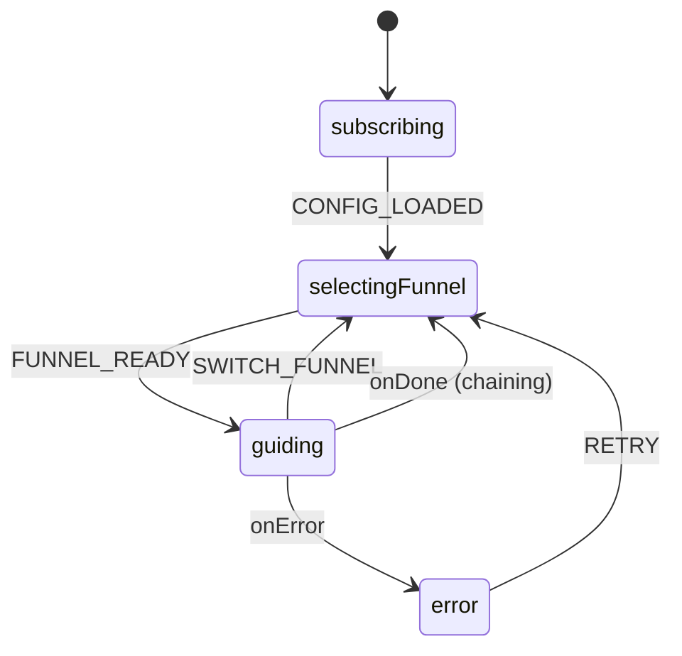
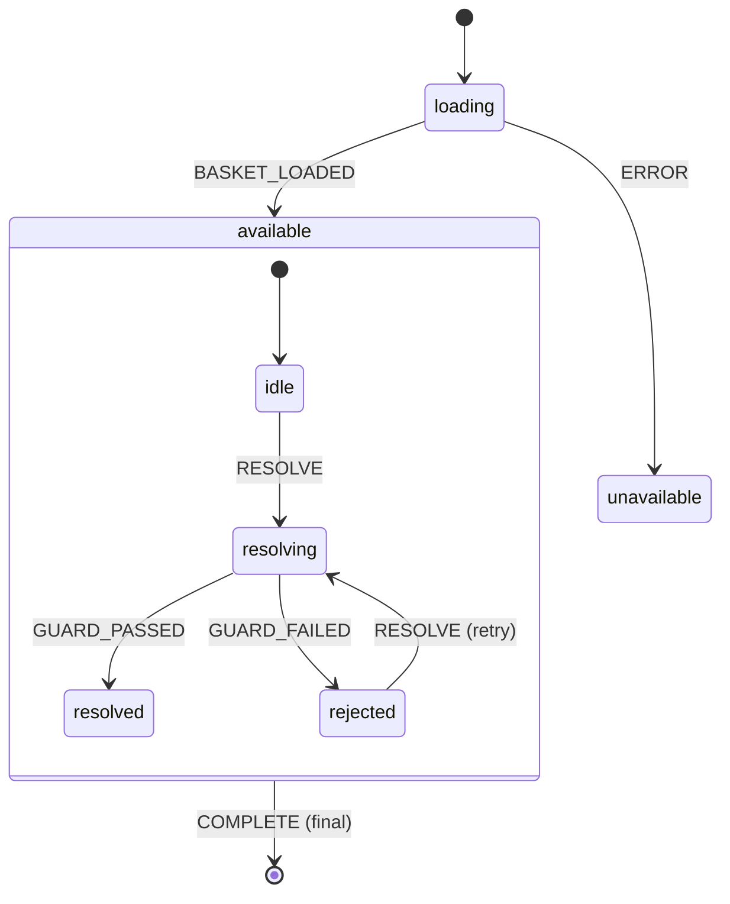
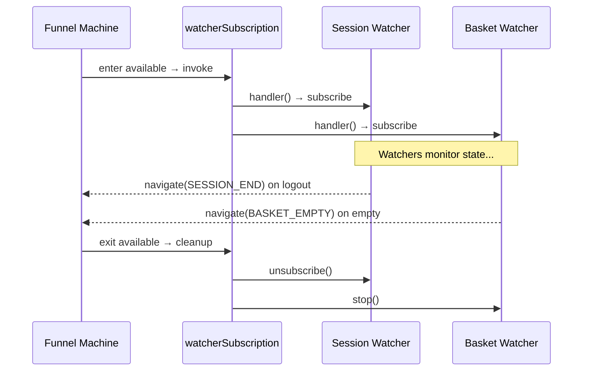
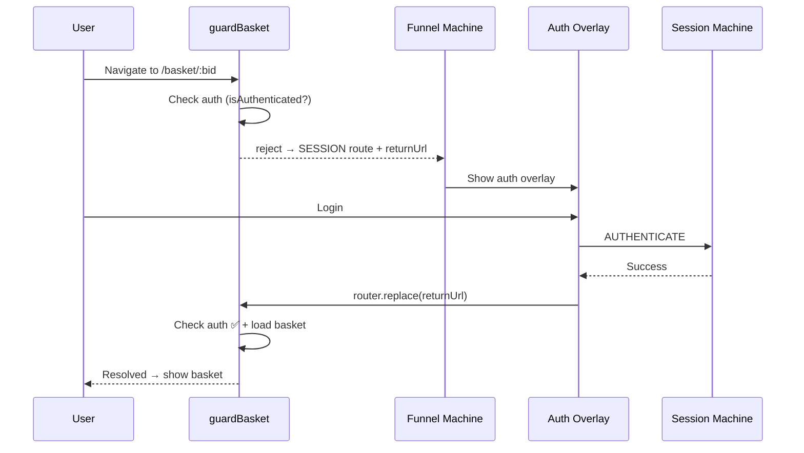

# Architecture — Routing Module

## Overview

The routing module consists of two XState machines working in tandem:

1. **Routing Engine** (`routingEngine.machine.ts`) — The broker that selects and invokes funnels
2. **Funnel Machine** (`funnel.machine.ts`) — The factory-built machine that runs a specific customer journey

## State Machine: Routing Engine

### States

| State             | Purpose                                           |
| ----------------- | ------------------------------------------------- |
| `subscribing`     | Initial setup, loads config and default funnel ID |
| `selectingFunnel` | Picks the funnel machine config, runs factory     |
| `guiding`         | Invokes the active funnel sub-machine             |
| `error`           | Error state with retry capability                 |

## State Machine: Funnel (Factory-Built)

### Key Design: Watcher Subscriptions

Watchers are **invoked callbacks** within the `available` state. They start when the funnel enters `available` and stop when it exits.

## Data Flow: Auth Redirect

When a user hits a BID-gated route without authentication:

## Design Decisions (ADRs)

Architectural decisions for the routing module are documented in the centralized [`docs/adr/`](../../../../../docs/adr/) folder:

| ADR                                                                                                       | Decision                                                                    | Status   |
| --------------------------------------------------------------------------------------------------------- | --------------------------------------------------------------------------- | -------- |
| [018 — Funnel Reactive Watchers](../../../../../docs/adr/018-funnel-reactive-watchers.md)                 | Watcher subscription mechanism, subscribe vs watch, state tracking patterns | Accepted |
| [017 — Funnel Navigation via State Meta](../../../../../docs/adr/017-funnel-navigation-via-state-meta.md) | Declarative meta-driven navigation                                          | Accepted |

## Integration Points

| Component          | Role                    | File                                         |
| ------------------ | ----------------------- | -------------------------------------------- |
| `useRoutingEngine` | Composable API for apps | `useRoutingEngine.ts`                        |
| `useRouting`       | Router integration      | `useRouting.ts`                              |
| `useOverlayRoute`  | Overlay close/dismiss   | `packages/client-vue/.../useOverlayRoute.ts` |
| `useQueryParams`   | Type-safe query access  | `useQueryParams.ts`                          |
| Funnel watchers    | Reactive navigation     | `apps/cart/src/router/funnels/watchers.ts`   |
