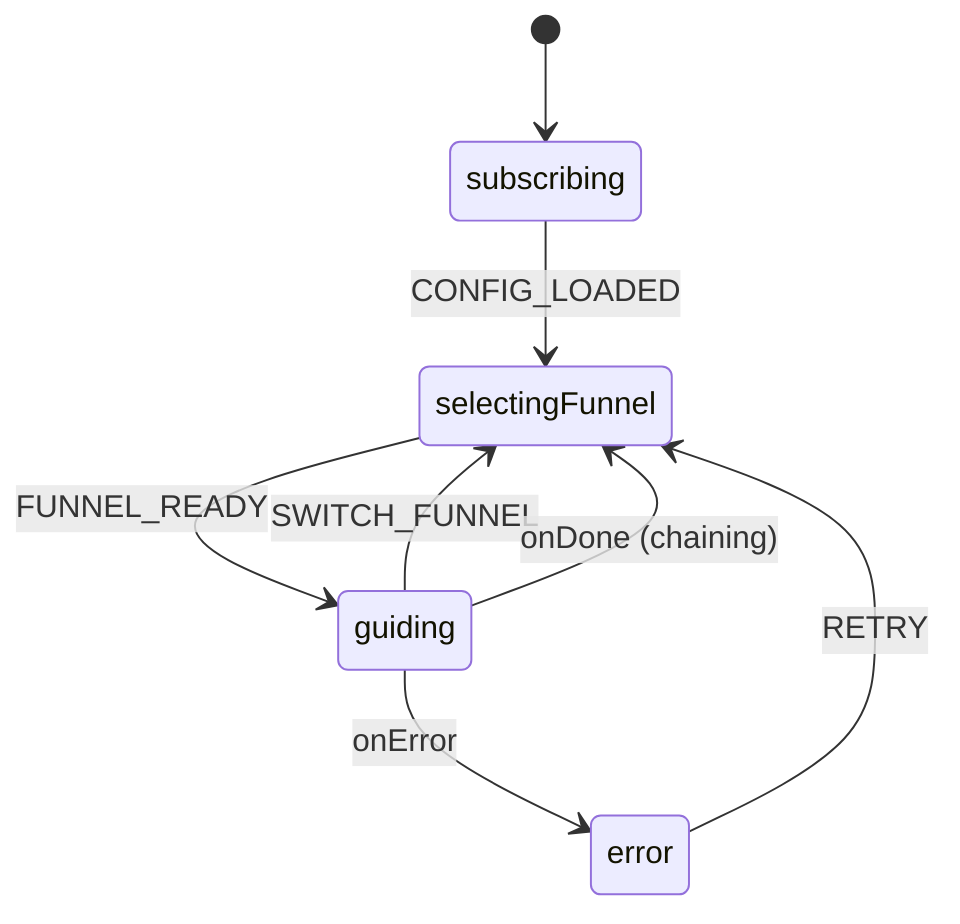
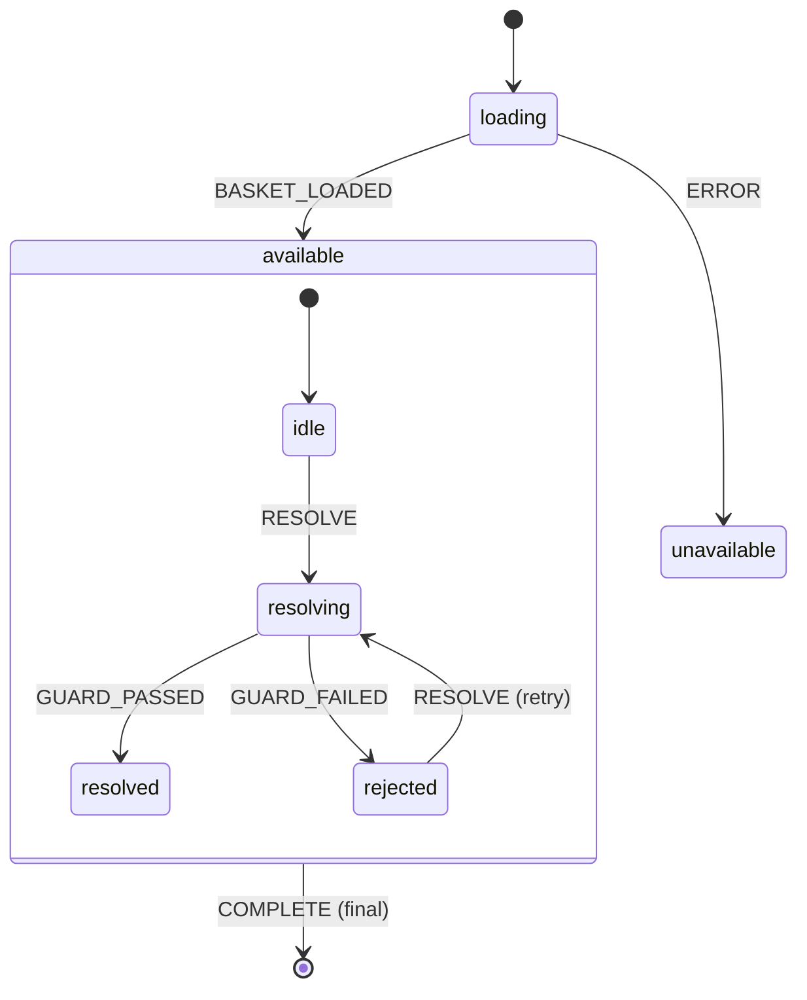
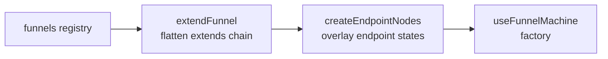
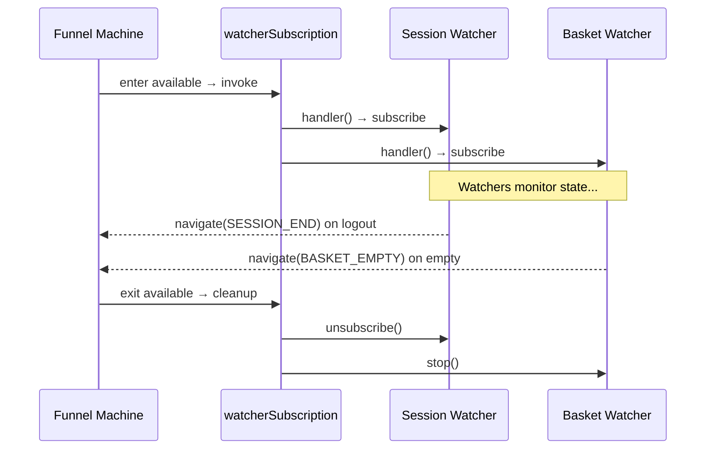
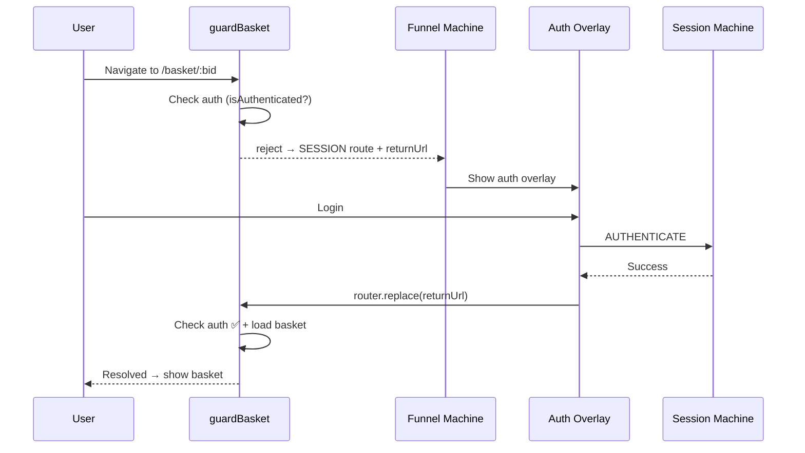

# Architecture — Routing Module

## Overview

The routing module consists of two XState machines working in tandem:

1. **Routing Engine** (`routingEngine.machine.ts`) — The broker that selects and invokes funnels
2. **Funnel Machine** (`funnel.machine.ts`) — The factory-built machine that runs a specific customer journey

## State Machine: Routing Engine



### States

| State             | Purpose                                           |
| ----------------- | ------------------------------------------------- |
| `subscribing`     | Initial setup, loads config and default funnel ID |
| `selectingFunnel` | Picks the funnel machine config, runs factory     |
| `guiding`         | Invokes the active funnel sub-machine             |
| `error`           | Error state with retry capability                 |

## State Machine: Funnel (Factory-Built)



## Key Design: Funnel Composition

### The problem

A funnel is a whole customer journey, and the engine loads exactly one at a time. That is correct when journeys are genuinely disjoint — the domain funnel owns two transitional states and hands back — but it breaks down for a **variant**: a journey that is the standard one except for how a handful of routes behave.

One-page checkout is the archetype. It differs from the stepped cart flow in a single respect — billing and product setup render inline instead of on standalone pages — yet as a peer funnel it would have to restate catalogue, product, basket, session and order to be usable. Left out, those routes fall to the `idle` catch-all, `isUnsupportedRoute` fires, the funnel completes, and the engine reloads the default. The variant is evicted on the first route it does not own.

### The mechanism

A funnel declares `extends: '<funnelId>'`. `extendFunnel()` walks that chain to its root and rebuilds the config base-first, so the variant carries only what it adds or diverges on:



Composition happens entirely in `prepare()` — the funnel machine, the routing engine and the registry are untouched. Order matters: `extendFunnel` runs **first** so `createEndpointNodes` sees the full inherited state set when deciding overlay eligibility, and endpoint states spread **after** the funnel's own so RESOLVE evaluates app guards before endpoint guards.

### Merge semantics

`states` merges **per key, wholesale**. A key the variant declares replaces the base's node entirely; a key it omits is inherited untouched. `guards`, `services`, `actions` and `context` merge per key, variant winning on collision.

Wholesale replacement is deliberate. A state node's transition lists are ordered decision ladders — `invoke.onError` is "first matching `cond` wins" — so a deep merge would re-append the base's trailing entries and silently restore the very transitions the variant exists to remove. The cost is that an override is all-or-nothing: declare a state key and you own its `meta`, `entry`, `invoke` and `on` in full. The benefit is that a node's behaviour is readable from one file.

### Chains and failure modes

Chains nest to any depth (`express` → `one-page` → `cart`), resolving deepest-layer-wins. `extendFunnel` is pure: it never mutates a registry entry and returns a fresh object per call, so repeated `prepare()` runs are identical. An unregistered base id or a circular chain throws a `DetailedError`, which surfaces through `prepare`'s `onError` and lands the engine in `idle` with the error set — never a blown stack on boot.

### When not to use it

Inheritance is for variants, not for sequencing. A funnel that owns a genuinely separate leg of the journey and then hands control back — the domain funnel — should stay a peer and complete normally. Reach for `extends` only when the variant would otherwise be forced to restate states it does not care about.

## Key Design: Where the Starting Funnel Is Chosen

There is exactly one selection point: **`defaultFunnel`, at registration.**

`initRouter()` runs after `useBrand()`, `useSystem()` and `useSession()` have all resolved, so brand config is fully available when the app's `registerFunnels()` executes. A brand-conditional starting funnel is therefore a plain read at that moment:

```typescript
export const registerFunnels = () => ({
  defaultFunnel: getDefaultFunnel(), // reads brand config — already loaded
  funnels: { cart, "one-page": onePage, domains },
  overlays: CART_OVERLAYS,
  watchers
});
```

Three alternatives were considered and rejected:

| Alternative                               | Why not                                                                                 |
| :---------------------------------------- | :-------------------------------------------------------------------------------------- |
| Branch inside the loader state            | Fires on one route only, and re-derives per navigation what is decided once per session |
| Hand over from `CHECKOUT_FLOW` on startup | Late — the variant is absent for every route before checkout                            |
| Persist `?funnel=` across navigations     | Invents storage to compensate for a modelling gap; `extends` removes the need entirely  |

`?funnel=` remains the **runtime override** — a deliberate switch away from the brand's default — not the mechanism by which the default is chosen. It works without persistence because the engine holds `currentFunnel` across navigations and an inheriting variant no longer evicts itself.

### Key Design: Watcher Subscriptions

Watchers are **invoked callbacks** within the `available` state. They start when the funnel enters `available` and stop when it exits.



## Data Flow: Auth Redirect

When a user hits a BID-gated route without authentication:



## Design Decisions (ADRs)

Architectural decisions for the routing module are documented in the centralized [`docs/adr/`](../../../../../docs/adr/) folder:

| ADR                                                                                                       | Decision                                                                    | Status   |
| --------------------------------------------------------------------------------------------------------- | --------------------------------------------------------------------------- | -------- |
| [023 — Funnel Inheritance via `extends`](../../../../../docs/adr/023-funnel-inheritance.md)               | Variant funnels flatten a base config instead of restating or replacing it  | Accepted |
| [019 — Shell State Architecture](../../../../../docs/adr/019-shell-state-architecture.md)                 | Shell component tracking to prevent cross-page layout bleed                 | Accepted |
| [018 — Funnel Reactive Watchers](../../../../../docs/adr/018-funnel-reactive-watchers.md)                 | Watcher subscription mechanism, subscribe vs watch, state tracking patterns | Accepted |
| [017 — Funnel Navigation via State Meta](../../../../../docs/adr/017-funnel-navigation-via-state-meta.md) | Declarative meta-driven navigation                                          | Accepted |

## Lifecycle Callbacks

The routing engine exposes lifecycle hooks for coordinating UI effects with navigation:

| Hook            | Fires When                             | Use Case                          |
| --------------- | -------------------------------------- | --------------------------------- |
| `onBeforeLeave` | Navigation starts (before RESOLVE)     | Reset shell tracking, show loader |
| `onResolving`   | Funnel transitions to unresolved       | Start loading indicator           |
| `onResolved`    | Funnel finishes resolving              | Hide loading indicator            |
| `onAfterEnter`  | Page component mounts (`mount()` call) | Scroll restoration, analytics     |

```typescript
const { onBeforeLeave, onAfterEnter } = useRoutingEngine();

onBeforeLeave(() => useShell().reset());
onAfterEnter(() => scrollToTop());
```

## Integration Points

| Component          | Role                     | File                                         |
| ------------------ | ------------------------ | -------------------------------------------- |
| `useRoutingEngine` | Composable API for apps  | `useRoutingEngine.ts`                        |
| `useRouting`       | Router integration       | `useRouting.ts`                              |
| `useOverlayRoute`  | Overlay close/dismiss    | `packages/client-vue/.../useOverlayRoute.ts` |
| `useQueryParams`   | Type-safe query access   | `useQueryParams.ts`                          |
| `useShell`         | Shell component tracking | `packages/client-vue/.../useShell.ts`        |
| Funnel watchers    | Reactive navigation      | `apps/cart/src/router/funnels/watchers.ts`   |
