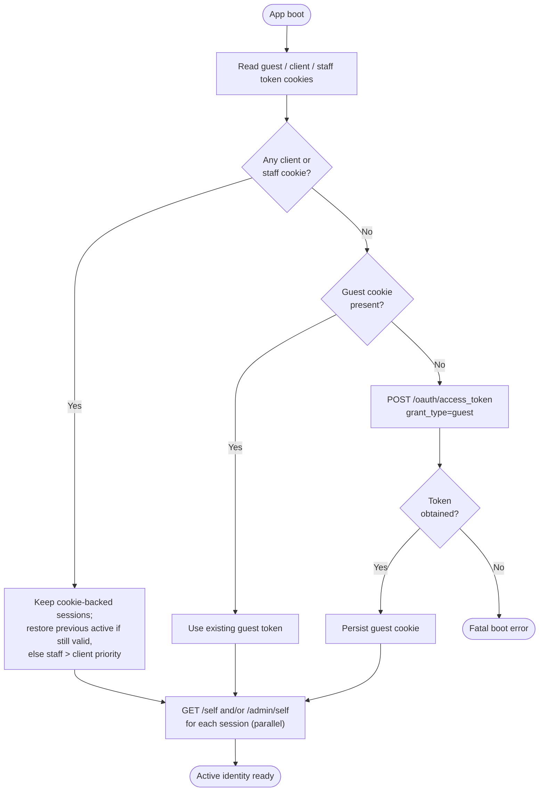
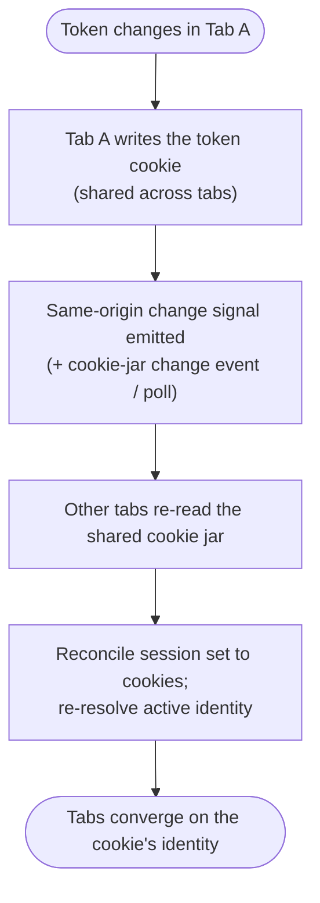
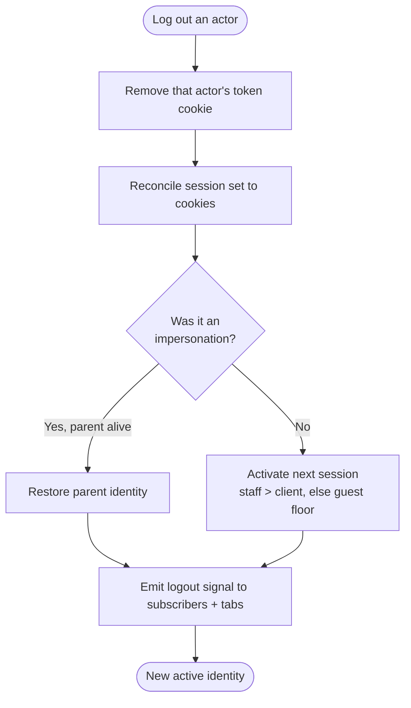

# Module: session-store

## What it is

`session-store` is the platform's **identity and token layer**. It answers one question for the rest of the application at all times: _who is the caller, and what token authorises their requests?_ It holds every live session (an anonymous guest, one or more signed-in clients, one or more staff), tracks which of them is currently **active**, persists the token-of-record to cookies so a reload or a second tab resolves the same identity, and guarantees that an active identity always exists — if nothing else is present at boot, it obtains an anonymous guest token so requests can still be authorised.

**What it holds vs. what it exposes on the wire:** at most three cookies exist at any moment — one per scope (guest, client, staff) — and each carries only that scope's currently-**active** session's token. The store itself is not capped at three: it can hold any number of client sessions and any number of staff sessions concurrently (plus the one guest), cached for the length of the browsing session. Activating a session (scope + id) moves that scope's active pointer and **regenerates the scope's cookie from the stored session** — the cookie is a downstream projection of the store, not the other way around. Switching back to an already-held session is instant and needs no server round trip, because the token was already in the store.

It owns identity, tokens, and actor surfaces only. **The full customer profile record and its sub-records (addresses, emails, phones, companies, accounts) live in `client`; session-store picks up the identity token plus a minimal display user, and forwards the full profile read to `client`.** Credential and grant flows — password login, registration, two-factor, password reset, impersonation grants — live in `auth`; session-store issues exactly one grant itself (the anonymous guest mint at boot) and otherwise only persists and reads the tokens `auth` produces.

_Any `meta` field returned by Upmind endpoints is UI-specific to our own client — ignore for spec purposes._

## Core concepts

- **Actor** — the kind of identity a token authorises: `guest` (anonymous, no account), `client` (a customer), or `staff` (an employee). The active actor determines which endpoints and data the caller can reach.
- **Session** — a token paired with the minimal display identity it resolves to. Guests have at most one; clients and staff can each hold several, keyed by their actor id.
- **Active session** — the single session whose token authorises requests right now. Exactly one is active at any moment; there is never _no_ active identity.
- **Guest floor** — the fallback identity. When no client or staff session is available, the active actor falls back to guest, minting a fresh guest token if none exists.
- **Impersonation** — one actor (typically staff) operating under another actor's identity. The originating ("parent") identity is remembered so it can be restored when impersonation ends.

## Operations

The module makes only three back-end calls (one grant, two profile reads). Everything else is identity bookkeeping over the cookie-persisted token set — capabilities an equivalent must provide even though they are not HTTP calls. The `BE?` column marks which rows are network operations.

| #   | Capability                          | BE? | Inputs                                                                        | Outputs                                                                                                                                                                       |
| --- | ----------------------------------- | --- | ----------------------------------------------------------------------------- | ----------------------------------------------------------------------------------------------------------------------------------------------------------------------------- |
| 1   | **Mint an anonymous guest token**   | ✅  | — (triggered at boot when no session exists)                                  | A guest token, persisted to the guest cookie                                                                                                                                  |
| 2   | **Read the active client identity** | ✅  | client access token                                                           | Identity profile: actor, verification state, guest flag, accounts, analytics                                                                                                  |
| 3   | **Read the active staff identity**  | ✅  | staff access token                                                            | Staff identity profile: actor, brands, functionalities                                                                                                                        |
| 4   | **Establish a session**             | —   | a token (actor type + actor id embedded)                                      | Session stored under its actor; optionally made active; guest sessions replace the single guest slot                                                                          |
| 5   | **Switch the active session**       | —   | actor type + optional actor id                                                | Active pointer moves to the named session and that scope's cookie is regenerated from the stored session (ignored if that actor scope is disallowed or the session is absent) |
| 6   | **End a session**                   | —   | actor type (defaults to active)                                               | Token cookie removed, session dropped, active pointer falls to the next available session or the guest floor                                                                  |
| 7   | **Impersonate another actor**       | —   | impersonated actor id (link registered before the new session is established) | Active identity swaps to the impersonated actor; parent link retained for restoration                                                                                         |
| 8   | **Observe identity changes**        | —   | a logout callback                                                             | Callback fired with the actor type on every logout (any cause); returns an unsubscribe handle                                                                                 |
| 9   | **Derive token lifecycle state**    | —   | the active token                                                              | Expiry timestamp, expired / about-to-expire flags, refresh-eligibility — all computed from the token, no call                                                                 |

Additional always-on behaviours:

- **Boot resolution** — read the cookie jar, reconcile the in-memory session set to it, restore the previously-active session if still cookie-backed, otherwise fall through staff → client → guest.
- **Cross-tab convergence** — a same-origin change signal (or a cookie-jar change) prompts the store to re-read the shared cookies and re-resolve the active identity, so tabs stay aligned.
- **Readiness** — a signal that resolves once boot resolution (cookie read, guest mint if needed, profile loads) has completed.

## Data shape

Types in TypeScript-ish notation. `meta` is stripped throughout per the note above.

### Guest grant token response

Source: `POST /oauth/access_token`, `{ grant_type: "guest" }`.

```ts
type GuestGrantResponse = {
  access_token: string;
  refresh_token: string;
  expires_in: number; // access-token lifetime, seconds (e.g. 3600)
  refresh_expires_in: number; // refresh-token lifetime, seconds (e.g. 36000)
  actor_type: "guest";
  actor_id: ""; // empty for an anonymous guest
  second_factor_required: boolean;
  password_change_required: boolean;
  twofa_provider: string | null;
  token_type: string; // e.g. "Bearer"
};
```

### The persisted token (cookie-of-record)

The token an equivalent persists per actor type (one cookie each: guest / client / staff). Signed-in grants add the fields a guest token omits.

```ts
type Token = {
  access_token: string | null;
  refresh_token: string | null;
  expires_in: number | null; // seconds until access token expires
  refresh_expires_in: number | null; // seconds until refresh token expires
  created_at?: number | null; // epoch ms; absent → treated as already expired
  second_factor_required: boolean | null;
  actor_type: "guest" | "client" | "user"; // "user" is the wire value for staff
  actor_id?: string | null; // the session key for client/staff; empty for guest
  guest_token?: string | null; // present when a signed-in session retains its guest lineage
  redirect?: string | null; // post-auth redirect origin, when supplied
};
```

> `actor_type` for staff is the string `"user"` on the wire (the staff cookie is therefore `upm_user_session`). Guest, client, and staff are the only actor types this module represents.

### Active identity profile (`/self`)

The identity-relevant subset of the `/self` response. The full customer profile (all `actor.*` sub-records, `accounts[]` detail, `enabled_modules`) is `client`'s scope — documented there. session-store reads only what identity and gating need:

```ts
type SelfIdentity = {
  role: "client" | "user"; // active actor role
  actor_id: string;
  org_id: string;
  brand_id: string;
  account_id: string;
  impersonator_role: string | null; // set when this identity is being impersonated
  impersonator_id: string | null;
  actor: {
    id: string;
    firstname: string;
    lastname: string;
    public_name: string;
    email: string;
    username: string;
    is_guest: boolean; // a "guest customer" — a client-scoped session that has not fully registered
    verified: boolean;
    enabled_2fa: boolean;
    interface_language_id: string;
    interface_language_code: string; // e.g. "en"
    image_url: string;
    default_email: {
      // primary email + its verification state
      id: string;
      email: string;
      verified: boolean;
    };
    // ...full profile continues in `client`
  };
  analytics: {
    // backs the actor cookie + login/sign_up/logout events
    environment: string;
    version: string;
    language: string;
    clean_email: string;
    sha_user_id: string;
    salted_sha_user_id: string;
    logged_in: boolean;
    customer_type: string; // e.g. "client_active"
  };
};
```

### The identity model an equivalent maintains

Framework-neutral shape of the state the store holds across the token set:

```ts
type IdentityModel = {
  guestSession?: Token; // at most one anonymous guest
  clientSessions: Record<string, Token>; // keyed by actor_id
  staffSessions: Record<string, Token>; // keyed by actor_id
  activeActor: "guest" | "client" | "user";
  activeSessionId?: string; // actor_id of the active session; absent for guest
  impersonatedSessions: Record<string, string>; // impersonated actor_id → parent (impersonator) actor_id
};
```

Config: an equivalent may restrict which actor scopes an app instance permits (e.g. a storefront allows guest + client only; an admin console allows staff only). Disallowed scopes are never activated even if a token for them exists.

## Dependencies

### Dependants — modules that read from this one

File-count weights are cross-module import edges into the `session-store` barrel. `query` is excluded as the HTTP transport layer, not a domain consumer.

| Module                                                                     | Weight      | Reads                                                            | Why                                                                                                                    |
| -------------------------------------------------------------------------- | ----------- | ---------------------------------------------------------------- | ---------------------------------------------------------------------------------------------------------------------- |
| `auth`                                                                     | 6           | active token, logout signal, token-persist path                  | Writes minted tokens back after login/register; reads session to check for an existing one; drives the boot guest mint |
| `client` (personal-details, phone, email, company, address, email-history) | 4+3+3+3+3+2 | active actor, active identity, active token                      | Every profile sub-record is scoped to the active identity                                                              |
| `orders`                                                                   | 3           | active actor, active token, is-authenticated                     | Order lists and lifecycle are per-identity                                                                             |
| `domain`                                                                   | 3           | active token, active actor                                       | Domain operations are per-identity                                                                                     |
| `basket`                                                                   | 3           | active actor, logout signal, is-authenticated                    | Basket is cleared / reloaded on identity change                                                                        |
| `account`                                                                  | 3           | active identity (guest flag, email-verification state)           | Post-auth standing arc reads identity produced by the profile mapper                                                   |
| `payment-details`, `payment`, `payment-gateways`                           | 2+1+1       | active token, active identity, accounts                          | Payment methods are per-identity; currency falls back to the identity's account                                        |
| `invoices`                                                                 | 2           | active actor, active token                                       | Invoice list/view is per-identity                                                                                      |
| `basket-currency`, `basket-billing`                                        | 2+2         | active actor, active identity                                    | Currency + billing derived from the active identity's account                                                          |
| `session-transfer`                                                         | 1           | token persistence (cookie-of-record write path)                  | Transfers an authenticated session between origins/apps; persists the received token                                   |
| Presentation layer                                                         | —           | active identity, is-authenticated, display user, is-impersonated | Header/account chrome, session switcher, impersonation banner, auth-gated routes                                       |

Direction note: `scope` and `system-localisation` appear in a naive grep but the edge runs the other way (session-store imports them) — they are dependencies, not dependants.

### This module's own dependencies

- **HTTP transport layer** — attaches the active access token as the `Authorization` header, normalises error shapes, injects locale (the profile reads opt out of locale injection).
- **Shared types / enums** — the actor-role enum and the token interface (type-level only).
- **Credential module (`auth`)** — a **lazy, load-time-deferred** dependency used for exactly one thing: minting the boot guest token. `auth` statically depends on session-store (to persist tokens it mints), so session-store must not statically import `auth` in return — it defers the import until the guest mint actually runs, breaking the cycle at load time. This is intentional and the only path from session-store into `auth`.
- **Brand context** — read to decide whether email verification is enforced (gates the "unverified" identity signal).
- **Localisation + analytics** — error strings for token-persistence failures; the analytics envelope that backs the actor cookie and the login/sign_up/logout events.

## API endpoints

### POST /oauth/access_token — anonymous guest grant

**Role:** Obtain an anonymous guest token at boot when no client or staff session exists, so requests can be authorised before anyone logs in. Issued through the credential module's guest grant; the HTTP contract below is what an equivalent calls.

Request body (form-urlencoded):

```ts
type GuestGrantBody = {
  grant_type: "guest"; // the only field; no credentials
};
```

```bash
curl -X POST "$API/oauth/access_token" \
  -H "Accept: application/json" \
  -H "Content-Type: application/x-www-form-urlencoded" \
  -d "grant_type=guest"
```

Sample response (200):

```json
{
  "second_factor_required": false,
  "password_change_required": false,
  "refresh_expires_in": 36000,
  "actor_id": "",
  "actor_type": "guest",
  "twofa_provider": null,
  "token_type": "mock-token_type",
  "expires_in": 3600,
  "access_token": "mock-access_token",
  "refresh_token": "mock-refresh_token"
}
```

Fixture: `__tests__/fixtures/post-oauth-access-token-guest.json`

### GET /self — active client identity

**Role:** Load the signed-in client's identity profile. Called once per client session during boot resolution (and re-fetched after an identity-changing event). Response feeds the display user, the guest-customer flag, email-verification state, and the analytics envelope.

```bash
curl "$API/self?with_count=actor.child_client_configs&with=actor,actor.account,actor.brand,actor.image,actor.parent_client_config.parent_client,actor.parent_client_config.parent_client.image,accounts,delegated_ids,enabled_modules" \
  -H "Accept: application/json" \
  -H "Authorization: Bearer $ACCESS_TOKEN"
```

Sample response (200, identity subset — full profile is `client`'s scope, `meta` stripped):

```json
{
  "status": "ok",
  "data": {
    "role": "client",
    "actor_id": "mock-uuid-1",
    "org_id": "mock-uuid-2",
    "brand_id": "mock-uuid-3",
    "account_id": "mock-uuid-4",
    "impersonator_role": null,
    "impersonator_id": null,
    "actor": {
      "id": "mock-uuid-1",
      "firstname": "Checkout",
      "lastname": "Test",
      "public_name": "Checkout T.",
      "email": "mock-email-1@example.com",
      "username": "mock-email-1@example.com",
      "verified": true,
      "enabled_2fa": false,
      "is_guest": false,
      "interface_language_code": "en",
      "image_url": "https://www.gravatar.com/avatar/b1669c49335e93cf10e18f3e6d448714?d=blank&s=200",
      "default_email": {
        "id": "mock-uuid-8",
        "email": "mock-email-1@example.com",
        "verified": true
      }
    },
    "analytics": {
      "environment": "staging",
      "language": "en",
      "clean_email": "mock-email-1@example.com",
      "sha_user_id": "b959c3efa8b581beae13fc4035938654ec2099e6f10484609255ad9c3240d437",
      "logged_in": true,
      "customer_type": "client_active"
    }
  },
  "related": null,
  "total": null,
  "error": null,
  "messages": []
}
```

Fixture: `__tests__/fixtures/get-self.json`

Failure (401 — invalid / malformed token):

```json
{
  "status": "error",
  "data": null,
  "error": {
    "id": "4adeb88ac7d036daa703d275a33e1f2ba8556076",
    "type": 9,
    "code": 401,
    "message": "The resource owner or authorization server denied the request.",
    "data": null
  },
  "messages": { "hint": "The JWT string must have two dots" }
}
```

Fixture: `__tests__/fixtures/get-self-case-invalid-token.json`

### GET /admin/self — active staff identity

**Role:** Load the signed-in staff member's identity profile. Called once per staff session during boot resolution. Returns the staff actor plus their brands and functionalities.

```bash
curl "$API/admin/self?with=actor,actor.image,brands,brands.image,brands.icon,functionalities,user_flow_secrets,upmind_contract_product" \
  -H "Accept: application/json" \
  -H "Authorization: Bearer $ACCESS_TOKEN"
```

Failure (403 — wrong actor: a client/guest token calling the staff endpoint):

```json
{
  "status": "error",
  "data": null,
  "error": {
    "id": "feef15e5df637f450d588a13606d7cde5d72b619",
    "type": 0,
    "code": 403,
    "message": "Access forbidden for customers",
    "data": null
  },
  "messages": null
}
```

Fixture: `__tests__/fixtures/get-admin-self-case-wrong-actor.json`

> A staff-token 200 capture for `/admin/self` is intentionally omitted — staff credentials are rejected on the staging environment used to record these fixtures. The success shape mirrors `/self` (actor identity) with staff-scoped `brands` / `functionalities` in place of `accounts`.

## Failure modes

The profile reads are GETs, so the failure surface is the token itself; the guest mint is the one boot-critical operation.

| Trigger                                          | Response                                                                       | Recovery                                                                                                                                                                               |
| ------------------------------------------------ | ------------------------------------------------------------------------------ | -------------------------------------------------------------------------------------------------------------------------------------------------------------------------------------- |
| Client token invalid / expired / malformed       | `401` on `/self`                                                               | The session is not backed by a live token; drop it and fall through to the next session or the guest floor. Re-authenticate to restore.                                                |
| Client or guest token calls `/admin/self`        | `403` "Access forbidden for customers"                                         | The token's actor cannot reach the staff endpoint. Route the profile read by actor type — never call the staff endpoint with a client/guest token.                                     |
| Guest mint fails every retry at boot             | The mint throws after its retry budget                                         | **Fatal boot condition.** There is no safe identity floor to fall back to, so boot resolves into an error state the app must surface — not a state to silently proceed guestless from. |
| One session's `/self` fails while others succeed | The failing session is loaded without its display user; siblings load normally | Soft degradation — the session is still usable for requests; only the display identity is missing. Retry the profile read to populate it.                                              |

## Flows

### Boot resolution

Purpose: establish exactly one active identity from persisted cookies, minting a guest token only if nothing else is present.



Guarantees the platform holds:

- An active identity always exists once boot resolves successfully — client, staff, or guest.
- The cookie is the token-of-record; the in-memory session set is reconciled to it, so an active session always has a live backing cookie.
- Guest minting happens only during boot resolution, never during cross-tab or cookie-change re-reads.

Constraints the caller has to plan around:

- The guest mint is boot-critical — its failure is fatal, not degradable.
- A per-session profile-read failure does not fail boot; that session simply has no display user.
- Only one token per actor type is cookie-backed, so a reload cannot restore secondary same-actor sessions from cookies alone.

### Cross-tab convergence

Purpose: keep multiple tabs on the same identity as tokens change (login, logout, refresh) in any one of them.



Guarantees the platform holds:

- Cookies are shared across same-origin tabs, so they are the reliable convergence channel.
- A tab with no signal support still converges via a periodic cookie-jar poll.

Constraints the caller has to plan around:

- The change signal is same-origin and unauthenticated — any same-origin script can post to it, so its payload is not trustworthy token material.
- Convergence has latency (event-driven where supported, up to a couple of seconds under the polling fallback).

### Logout

Purpose: end a session and fall the active identity to the next available one or the guest floor.



Guarantees the platform holds:

- The token cookie is removed before state is reconciled, so no consumer sees a live cookie for a logged-out session.
- Ending an impersonated session restores the parent identity when it is still present.
- The logout signal fires for any cause a session empties — explicit logout, cookie loss, cross-tab removal, or expiry.

Constraints the caller has to plan around:

- Logging out the active identity always yields a _new_ active identity (never none) — consumers must react to the swap.
- Impersonation links are memory-only; a reload before logout drops the parent link, so the parent cannot be auto-restored after a refresh.

## Lessons (hard-won)

- **The store is the source of truth for which sessions exist; the active scope's cookie is a downstream projection.** Activating a session regenerates that scope's cookie from the store, not the reverse. External cookie edits, a token refresh, or another tab can still change the active scope's cookie behind the store's back (a fresher token, an expired one, a clear), so the store has to fold an externally-changed cookie back into its own record for that scope — without discarding every other session the cookie doesn't back. An "active session with no backing cookie token for its own scope" is a state the system must never represent. _Current source caveat: the write-time reconciliation that folds the cookie back in currently collapses every non-cookie-backed session instead of preserving them, so a held second session does not survive the next write — a known implementation defect against this model, not a documented limit (see [Gotchas §6](./gotchas.md#6-only-one-token-per-actor-type-survives-a-reload))._
- **The multi-session cache requires token secrets in per-tab storage, not just the active cookie.** A session that isn't the scope's current cookie-backed one still needs a usable token so switching back to it is instant with zero server round trips — so the identity model (access, refresh, and guest tokens for every held session) persists to per-tab session storage alongside display metadata. This is required by the multi-session/instant-switch capability, not an unintended leak. The accepted tradeoff: anything that can read that storage (e.g. an XSS payload) can read every held session's tokens, not only the active one.
- **Cross-tab identity signals are same-origin, unauthenticated, and today fire on more than login/logout.** A receiver that copies a signal's payload straight into its identity state trusts a channel any same-origin script can post to. Separately, the platform's cross-tab contract only requires login and logout to propagate, applied like-for-like (a login upgrades guest tabs; a logout ends the session in every tab currently showing that user) — switching between already-held sessions in one tab is tab-local and must never broadcast. The current signal broadcasts on every session add, which is wider than the contract requires.
- **A guest identity is required at boot, and its absence has no safe floor.** When the guest grant cannot be obtained, there is no lower identity to fall back to, so it is a fatal boot condition rather than something the store quietly recovers from.
- **The boot guest mint sits on a mutual dependency with the credential layer.** The credential module depends on the token store to persist what it mints; the token store depends on the credential module to mint the boot guest token. One direction has to be deferred to load-time to avoid an import cycle.
- **Intended: a session not backed by the active cookie still survives a reload via the sessionStorage cache.** Cookies only ever carry one token per scope, so only one client (and one staff) session is wire-visible after a reload — but the store is meant to rehydrate every other held session's token from the sessionStorage cache too, not just its display metadata, so an instant switch back after reload still needs no server round trip. _Current source caveat: the write-time cookie reconciliation drops non-cookie-backed sessions on every write, so today a second session's token does not survive even a same-tab `add()`, reload or not — see [Gotchas §6](./gotchas.md#6-only-one-token-per-actor-type-survives-a-reload)._
- **The identity profile is cached, so it goes stale after identity-changing events.** After a login or an email verification, the previously-cached profile read no longer reflects server truth; the cache has to be busted explicitly or the display identity and verification gating lag reality.
- **Verification, guest-customer, and 2FA state come from the profile read, not the token.** Any signal derived from identity — "must verify email", "is a guest customer" — is undefined until the profile fetch for that session has completed, so consumers can observe a session before its identity attributes resolve.
- **Impersonation is memory-only.** The parent-to-impersonated link is never persisted, so a reload during impersonation strands the caller in the impersonated identity with no automatic path back to the parent.
- **Expiry is derived from the token's own timestamps.** The expiry calculation reads `created_at + expires_in`; a token that arrives without `created_at` is treated as already expired, so a mint or refresh that drops the timestamp reads as an immediately-dead session.
