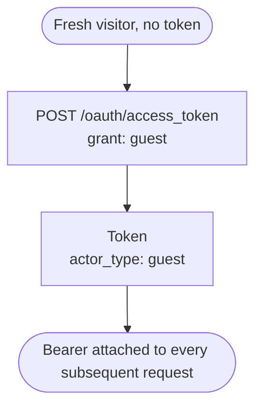
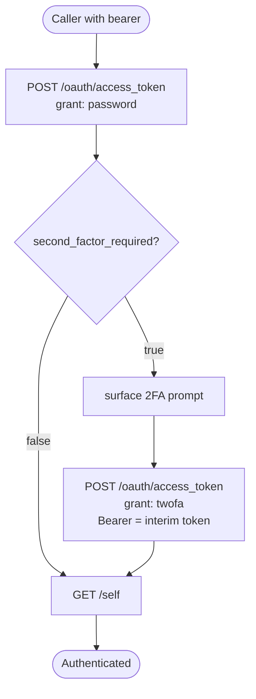
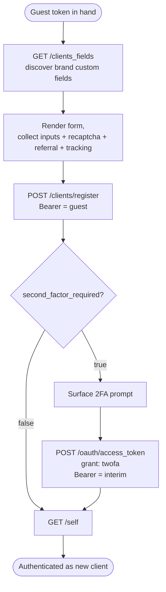
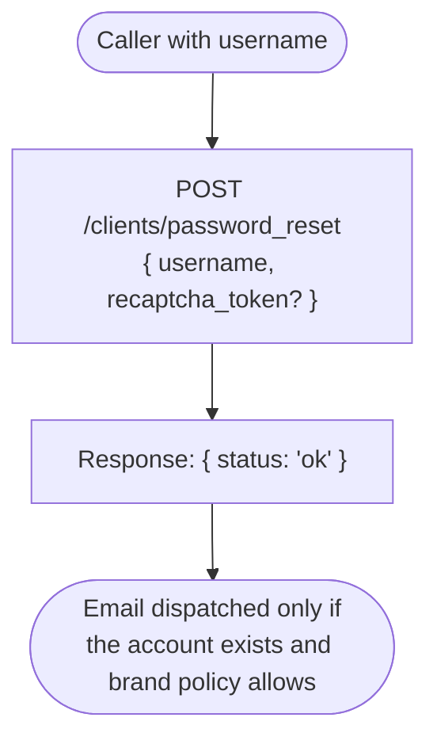
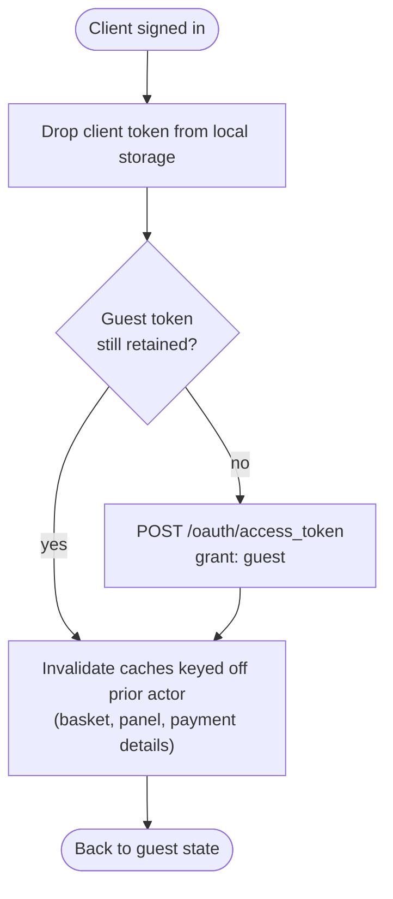
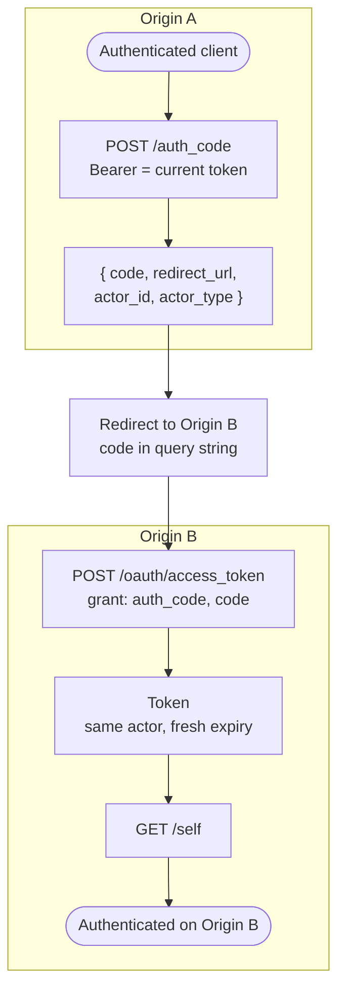

# Module: session

## What it is

Session owns the identity that every authenticated request to the platform depends on. It resolves the _actor_ speaking to the API (anonymous-but-tokened guest, logged-in client, staff user, or impersonating reseller), holds the access token used to sign requests, and exposes the surfaces that move between those states: password login, two-factor challenge, registration, password recovery, sign-out, and short-lived auth-code transfers between origins. A storefront cannot meaningfully fetch a basket, a price, or a saved card until session has resolved — every other module that asks "who is this?" asks session.

_Scope note: Staff (`admin` grant, `actor_type: "user"`) is out of scope for this doc. The grant exists on the same endpoint and the staff flow has its own 2FA variant (`twofa-admin`), but the architectural shape mirrors the client flow with a different grant discriminator. A storefront / customer-portal rebuild only needs the client surface described below._

## Core concepts

- **Actor** — the kind of caller a token represents: `guest`, `client`, `user` (staff), `reseller`. Some endpoints are addressable only by certain actors; others change shape depending on the actor.
- **Token** — opaque access token paired with a refresh token and an actor type. Carries `actor_id`, `expires_in`, `refresh_expires_in`, a `second_factor_required` flag, and (when 2FA is in play) a `twofa_provider`.
- **Self** — the identity payload returned for the currently-authenticated actor: profile fields, language, image, and the list of accounts (currency / pricelist / wallet) the actor owns. Same endpoint, different content per actor.
- **Grant type** — the OAuth-style discriminator on the token-issuance endpoint. Different grants encode different transitions (issue a guest token, exchange username+password, redeem a 2FA code, redeem a transfer code, complete a guest→client upgrade, refresh).
- **2FA challenge** — interim state between presenting credentials and being authenticated. The first token response carries `second_factor_required: true` and a `twofa_provider`; a second call to the same endpoint with the 2FA grant exchanges the interim token for a full one.
- **Transfer** — single-use, short-lived auth code issued by one origin and redeemed by another. Used to hand a logged-in session between two storefronts (e.g. cart subdomain to client area subdomain) without re-prompting for credentials.

## Operations

| #   | Capability                          | Inputs                                                                                                                          | Outputs                                                                                                                                                                                                                                                                                                                |
| --- | ----------------------------------- | ------------------------------------------------------------------------------------------------------------------------------- | ---------------------------------------------------------------------------------------------------------------------------------------------------------------------------------------------------------------------------------------------------------------------------------------------------------------------- |
| 1   | **Issue guest token**               | —                                                                                                                               | Fresh guest-grant token. Every visitor needs one before any other request, because every other endpoint requires a bearer header.                                                                                                                                                                                      |
| 2   | **Read authenticated identity**     | —                                                                                                                               | Client identity (id, email, names, language, locale, avatar, custom-field values, accounts with currency / pricelist / wallet flags). Empty / unauthorised when the bearer is a guest token.                                                                                                                           |
| 3   | **Authenticate with credentials**   | `{ username, password }`                                                                                                        | Either a full client token, or an interim token with `second_factor_required: true` and a `twofa_provider`. The two outcomes are not distinguishable without inspecting the response.                                                                                                                                  |
| 4   | **Verify 2FA challenge**            | `{ twofa_code }`, signed by the interim token                                                                                   | Full client token. Failure leaves the interim token consumable for further retries until it expires.                                                                                                                                                                                                                   |
| 5   | **Register a new client**           | `{ email, password, firstname, lastname, phone?, custom_fields?, recaptcha_token?, tracking?, referral_cookie?, currency_id? }` | Minimal client record (id, public_name, org_id, image_url). The response is NOT a token — a follow-up credentials exchange acquires the client token, which may itself surface a 2FA challenge per the brand's policy. Custom-field shape is brand-driven; `recaptcha_token` is required when brand policy demands it. |
| 6   | **Request password recovery**       | `{ username, recaptcha_token? }`                                                                                                | Acknowledgement. The platform decides whether a recovery email is dispatched; the response never reveals account existence.                                                                                                                                                                                            |
| 7   | **Read registration custom fields** | —                                                                                                                               | List of brand-configured client-profile fields flagged "show on order form". Used to extend the registration model with brand-specific inputs.                                                                                                                                                                         |
| 8   | **Refresh access token**            | `{ refresh_token }`                                                                                                             | New access token paired with a new refresh token. Used to extend a session that's still within the refresh window.                                                                                                                                                                                                     |
| 9   | **Generate transfer code**          | —                                                                                                                               | One-time `auth_code` plus a `redirect_url`. Bound to the issuing actor, short-lived (~minutes), redeemable from any origin.                                                                                                                                                                                            |
| 10  | **Redeem transfer code**            | `{ code, redirect? }`                                                                                                           | New active token derived from the transfer. The previous token, if any, is superseded; redemption is non-reversible.                                                                                                                                                                                                   |
| 11  | **Signal token rejection**          | —                                                                                                                               | Mark the current bearer as invalid (used when a downstream call observes a 401 on a token the caller believed valid). Triggers re-evaluation of the actor; in practice the caller drops the bearer and either re-mints a guest or returns the user to credentials.                                                     |
| 12  | **Observe identity changes**        | —                                                                                                                               | Subscribe downstream consumers (basket, payment, panel) to actor transitions, so per-actor caches can be invalidated without polling. The mechanism is the caller's choice (callbacks, signals, polling); the _capability_ is "tell me when the active actor changes".                                                 |

## Data shape

```ts
// Token issued by POST /oauth/access_token for any grant type.
type Token = {
  access_token: string; // bearer token sent on Authorization
  refresh_token: string; // used to acquire a fresh access token
  token_type: string; // typically "Bearer"
  expires_in: number; // seconds until access token expires
  refresh_expires_in: number; // seconds until refresh token expires
  second_factor_required: boolean; // true when the token is interim and a 2FA exchange is required
  actor_id: string; // resolved actor id, empty string for fresh guest grants
  actor_type: ActorType; // guest | client | reseller | user | "twofa" (interim) | "twofa-admin" (interim)
  twofa_provider: TwofaProvider | null; // set on the interim token when a 2FA exchange is required
  created_at?: number; // unix seconds — populated client-side at receive time
  redirect?: string; // post-auth redirect origin, set by transfer flows
};

// "user" is the wire value for a staff actor.
// "twofa" and "twofa-admin" only appear on interim tokens during a 2FA challenge.
type ActorType =
  | "guest"
  | "client"
  | "reseller"
  | "user"
  | "twofa"
  | "twofa-admin";
type TwofaProvider = "Email" | "TOTP";

// Grant types accepted by POST /oauth/access_token.
// Each grant expects a different body shape (see API endpoints below).
type GrantType =
  | "guest" // mint an anonymous-but-tokened guest
  | "password" // exchange username+password (client login)
  | "admin" // exchange username+password (staff login)
  | "twofa" // redeem 2FA code, exchanging an interim token
  | "twofa-admin" // redeem 2FA code, staff variant
  | "auth_code" // redeem a transfer auth-code
  | "refresh_token" // exchange a refresh token for a new access token
  | "guest_customer" // exchange a guest-customer token (one-time order link)
  | "password_reset" // recovery flow
  | "admin_password_reset"
  | "complete_registration" // upgrade a guest_customer to a full client
  | "complete_user_registration"
  | "complete_org_registration";

// Identity payload — returned by GET /self?with=actor,accounts.
type Self = {
  role: ActorType; // mirrors token actor_type
  actor_id: string;
  org_id: string;
  brand_id: string;
  account_id: string; // default account for the actor
  impersonator_role: ActorType | null; // populated during staff-as-client impersonation
  impersonator_id: string | null;
  actor: Actor; // the human-facing record
  accounts: Account[]; // accounts the actor owns or can act on
  brand_code: string; // short opaque slug for the resolving brand
  replace_branding: boolean; // brand has overridden default Upmind branding
  branding: BrandingOverride | null; // populated when replace_branding is true
  analytics: {
    // analytics envelope ready to push to dataLayer
    environment: string;
    version: string;
    language: string;
    clean_email: string;
    sha_user_id: string;
    salted_sha_user_id: string;
    logged_in: boolean;
    customer_type: string; // e.g. "client_active"
  };
};

// The "actor" record inside /self — shape is the IClient model.
// Listed fields are the ones a storefront commonly reads. The full
// /self response carries every IClient field, including admin-adjacent
// columns (fraud, tax exemption, support pin, package limits).
type Actor = {
  id: string;
  email: string;
  username: string; // login identifier — typically the email
  firstname: string;
  lastname: string;
  fullname: string; // server-computed "firstname lastname"
  public_name: string; // privacy-safe display variant
  image_url: string | null; // avatar — gravatar URL when no upload
  interface_language_id: string; // preferred UI language
  interface_language_code: string; // BCP-47 — e.g. "en-US"
  document_language_id: string; // preferred document language
  document_language_code: string;
  custom_fields: CustomFieldValue[]; // brand-defined extension fields
  verified: boolean; // email / account verified
  is_guest: boolean; // true while the actor is a guest_customer
  enabled_2fa: boolean;
  provider_2fa_id: string; // selected 2FA provider for this actor
  status_id: string; // lifecycle status (pending, active, suspended)
  location_country_code: string | null; // derived from default address
  location_town: string | null;
  default_email: {
    id: string;
    email: string;
    verified: boolean;
    bounced: boolean;
  } | null;
  has_login: boolean;
  has_legacy_invoices: boolean;
  topup_enabled: boolean | null; // wallet top-up allowed for this actor
  created_at: string;
  updated_at: string;
  last_login: string | null;
};

// One account row inside /self.accounts — what the actor can transact against.
// Trimmed view: customer-facing fields only. The captured fixture also carries
// affiliate / payout / wallet-statement / negative-allowance variants that an
// admin surface uses; these are intentionally omitted from this type.
type Account = {
  id: string;
  brand_id: string;
  name: string;
  currency_id: string;
  currency: Currency; // populated by the expand
  pricelist_id: string;
  pricelist?: Pricelist;
  status_id: string;
  status: { id: string; status: string }; // e.g. "Pending" | "Active" | "Suspended"
  account_type_id: string;
  reseller_account_id: string | null; // non-null when account belongs to a reseller's downstream
  multi_currency_balance: number;
  topup_enabled: boolean; // can this account top up its wallet
  preferred_payment_currency_id: string | null;
  enable_negative_wallet_balance: boolean;
  negative_wallet_allowance: number;
  negative_wallet_allowance_formatted: string;
  is_reseller: boolean;
  brand: BrandSummary; // brand identity for cross-brand accounts
  affiliate_tier_id: string | null;
  affiliate_referral_pricelist_id: string | null;
  affiliate_payout_destination_id: string | null;
  invoice_consolidation_enabled: number;
  auto_consume_on_due_date: number;
};

// Brand-defined extension fields collected at registration.
// Returned by GET /clients_fields?filter[show_on_order_form]=true.
type CustomField = {
  id: string;
  code: string; // stable machine identifier
  name: string; // display label
  type: string; // input type (text, select, checkbox, …)
  required: boolean;
  show_on_order_form: boolean;
  options?: Array<{ id: string; value: string }>; // populated for select-style fields
};

type CustomFieldValue = { id: string; value: unknown };

// Auth-code transfer payload.
// Issued by POST /auth_code, redeemed via POST /oauth/access_token with the auth_code grant.
type AuthTransfer = {
  client_id: string;
  code: string; // single-use, short-lived
  actor_type: ActorType;
  actor_id: string;
  redirect_url: string; // origin to land on after redemption
};

// Body shapes for POST /oauth/access_token — discriminated by grant_type.
type AccessTokenBody =
  | { grant_type: "guest" }
  | {
      grant_type: "password";
      username: string;
      password: string;
      currency_id?: string;
    }
  | { grant_type: "admin"; username: string; password: string }
  | { grant_type: "twofa"; twofa_code: string; twofa_provider?: TwofaProvider }
  | { grant_type: "twofa-admin"; twofa_code: string }
  | { grant_type: "auth_code"; code: string; lang?: string }
  | { grant_type: "refresh_token"; refresh_token: string }
  | { grant_type: "guest_customer"; token: string }
  | { grant_type: "complete_registration"; password: string };

// Registration body — POST /clients/register.
type RegisterBody = {
  email: string;
  username: string;
  password: string;
  firstname?: string;
  lastname?: string;
  phone?: string;
  phone_code?: string;
  phone_country_code?: string;
  custom_fields?: CustomFieldValue[];
  currency_id?: string; // carries the basket currency through registration
  recaptcha_token?: string; // required when brand policy enables recaptcha
  referral_cookie?: string; // opaque affiliate cookie, do not decode
  tracking?: Record<string, unknown>; // analytics envelope
};

// Password-recovery body — POST /clients/password_reset.
type RecoverBody = {
  username: string;
  recaptcha_token?: string;
};
```

## Dependencies

### Dependants — modules that read from this one

| Module                 | Weight | Reads                                                                          | Why                                                                                                                                                                    |
| ---------------------- | ------ | ------------------------------------------------------------------------------ | ---------------------------------------------------------------------------------------------------------------------------------------------------------------------- |
| `client`               | 12     | authenticated identity, client id, accounts                                    | Every customer-area surface (addresses, phones, emails, companies, custom fields) keys off the active client id.                                                       |
| `basket`               | 7      | actor type, actor id, account currency                                         | Basket creation / claim happens on the active actor; the basket inherits the client's account currency on login; logout drops the basket from the authenticated cache. |
| `invoices`             | 4      | client id                                                                      | The customer panel's invoice list/view is scoped to the active client.                                                                                                 |
| `paymentDetails`       | 4      | client id, actor type, account currency                                        | Stored cards and gateway interactions are scoped to the authenticated actor and the active account's currency.                                                         |
| `orders`               | 3      | client id                                                                      | The customer panel's order / subscription list keys off the active client id.                                                                                          |
| `domain`               | 2      | client id                                                                      | Domain configuration (DAC, registration) is scoped to the active client.                                                                                               |
| `payment`              | 1      | client id, actor type                                                          | Payment intents are bound to the authenticated actor.                                                                                                                  |
| `system`               | 1      | client locale                                                                  | Locale negotiation follows the client's preferred language.                                                                                                            |
| `billing` (client-vue) | 1      | client id                                                                      | Customer-panel billing surfaces (subscription lifecycle, recurring-payment UI) key off the active client id.                                                           |
| `order` (client-vue)   | 1      | client id                                                                      | Customer-panel order-detail UI keys off the active client id. The headless equivalent is `orders` (plural) above.                                                      |
| Presentation layer     | —      | actor type, authenticated identity, avatar, locale, sign-in / sign-out actions | Header avatar, account menu, route guards, redirect-after-login behaviour, and language-switch synchronisation.                                                        |

> `query` (the HTTP transport layer) imports `session` 5× to attach the bearer header. It's listed as an own-dependency below — `query` is a foundational HTTP layer, not a peer module.

### This module's own dependencies

- **HTTP transport layer** — bearer-token attachment from persistent storage, locale-bypass for non-localised endpoints (the auth-code grant is requested without a locale to avoid initialising i18n), error shape normalisation. The bearer header is read out of the same persisted token this module owns, so the transport layer has no independent view of who the caller is.
- **Browser persistence** — cookie storage for tokens (per-actor entries) and the analytics actor envelope. `localStorage` is read once at boot to migrate any legacy entries.
- **Shared types / enums** — `IToken` from `packages/types/src/models/token.ts`; `IClient`, `IAccount` (with their related `ICurrency`, `IPricelist`, `IBrand`) from `packages/types/src/models/`; `GrantTypes`, `TwofaProviders` from `packages/types/src/data/enums/tokens.ts`; `Contexts` (actor type slugs) from `packages/types/src/models/contexts.ts`; `AccessRoleTypes` from `packages/types/src/data/enums.ts`.

## API endpoints

### `POST /oauth/access_token`

Single endpoint, multiple flows. The `grant_type` body discriminator decides which transition the call represents (mint guest, exchange credentials, redeem 2FA, redeem transfer code, refresh, complete registration). The response shape is the same `Token` for every grant.

#### `grant_type: "guest"` — mint an anonymous token

```bash
curl -s "$API/oauth/access_token?lang=en" \
  -H "Content-Type: application/json" \
  --data '{"grant_type":"guest"}'
```

```json
{
  "second_factor_required": false,
  "refresh_expires_in": 36000,
  "actor_id": "",
  "actor_type": "guest",
  "twofa_provider": null,
  "token_type": "mock-token_type",
  "expires_in": 3600,
  "access_token": "mock-access_token",
  "refresh_token": "mock-refresh_token"
}
```

#### `grant_type: "password"` — client login

```bash
curl -s "$API/oauth/access_token?lang=en" \
  -H "Content-Type: application/json" \
  --data '{
    "grant_type":"password",
    "username":"client@example.com",
    "password":"hunter2",
    "currency_id":"e47d7382-4850-7931-56c8-1e642d59e063"
  }'
```

```json
{
  "second_factor_required": false,
  "refresh_expires_in": 36000,
  "actor_id": "20403869-6e54-721d-359f-518d9305e7d2",
  "actor_type": "client",
  "twofa_provider": "Email",
  "token_type": "mock-token_type",
  "expires_in": 3600,
  "access_token": "mock-access_token",
  "refresh_token": "mock-refresh_token"
}
```

> `twofa_provider` reflects the **actor's enrolled 2FA method**, not the state of a challenge in flight. A user with Email 2FA carries `"Email"` on every token they receive (interim and full); a user with TOTP carries `"TOTP"`; a user with no 2FA carries `null`. Only treat it as actionable when `second_factor_required: true` — otherwise it is identity metadata (useful for surfacing "your account uses Email 2FA" in account settings, not for challenge handling).

#### `grant_type: "password"` — interim token (2FA required)

When the client has 2FA enabled, the response carries an _interim_ token. `actor_type` is `"twofa"`, `second_factor_required` is `true`, and `twofa_provider` indicates how the code reaches the user (`"Email"` triggers a platform-side dispatch; `"TOTP"` means the user reads it off their authenticator app). The interim token signs the 2FA exchange call only. The interim response has **no `refresh_token`** and `refresh_expires_in: null` — the interim token is single-use within `expires_in` (~5 minutes in the captured fixture).

```json
{
  "second_factor_required": true,
  "refresh_expires_in": null,
  "actor_id": "20403869-6e54-721d-359f-518d9305e7d2",
  "actor_type": "twofa",
  "twofa_provider": "Email",
  "token_type": "mock-token_type",
  "expires_in": 299,
  "access_token": "mock-access_token"
}
```

#### `grant_type: "twofa"` — redeem the 2FA code

The interim token is sent as the bearer; the body carries the user-supplied code. On success the response is the same full-client `Token` shape as a non-2FA password grant (see the first sample above) — `actor_type: "client"`, `second_factor_required: false`, with a real `refresh_token`.

```bash
curl -s "$API/oauth/access_token?lang=en" \
  -H "Authorization: Bearer $INTERIM_ACCESS_TOKEN" \
  -H "Content-Type: application/json" \
  --data '{"grant_type":"twofa","twofa_code":"123456"}'
```

On a wrong code or an expired interim token, the response is a 401 with the common error envelope (see _Error responses_ below). The interim token remains consumable for further retries until `expires_in` lapses; once it lapses the caller has to restart from the credentials exchange.

#### `grant_type: "refresh_token"` — exchange a refresh token

Trades a valid refresh token for a fresh access token _and a fresh refresh token_ (refresh-token rotation). The actor is preserved (`actor_id`, `actor_type`, `twofa_provider` carry through unchanged); only the bearer strings rotate.

```bash
curl -s "$API/oauth/access_token?lang=en" \
  -H "Content-Type: application/json" \
  --data '{"grant_type":"refresh_token","refresh_token":"<previous-refresh-token>"}'
```

```json
{
  "second_factor_required": false,
  "refresh_expires_in": 35999,
  "actor_id": "20403869-6e54-721d-359f-518d9305e7d2",
  "actor_type": "client",
  "twofa_provider": "Email",
  "token_type": "Bearer",
  "expires_in": 3599,
  "access_token": "mock-access_token",
  "refresh_token": "mock-refresh_token"
}
```

> Refresh **rotates** the refresh token — the prior refresh token is invalidated by a successful exchange. A caller that holds two refresh tokens (e.g. a tab opened before the exchange and a tab opened after) will see the older one start failing once the newer one redeems. A failed refresh is a hard sign-out signal — the caller drops the bearer and re-prompts for credentials.

#### `grant_type: "auth_code"` — redeem a transfer

```bash
curl -s "$API/oauth/access_token" \
  -H "Content-Type: application/json" \
  --data '{"grant_type":"auth_code","code":"single-use-code","lang":"en"}'
```

Response is a full `Token` for the actor the code was issued for.

#### Error responses (common envelope)

All grants share the same error envelope. The discriminators are HTTP status and the inner `error.type` enum.

**401 — Invalid credentials** (`grant_type: "password"`, wrong username/password). No-enumeration by design: the same response covers "wrong password" and "no such account".

```json
{
  "status": "error",
  "data": null,
  "related": null,
  "total": null,
  "error": {
    "id": "4186cba53c0f819d55c65b949bf33771e53737f2",
    "type": 6,
    "code": 401,
    "message": "The user credentials were incorrect.",
    "data": null
  },
  "messages": null
}
```

**401 — Invalid or expired 2FA code** (`grant_type: "twofa"`, wrong code or interim-token expired). Same status as invalid credentials but with `error.type: 0` and a different message.

```json
{
  "status": "error",
  "data": null,
  "related": null,
  "total": null,
  "error": {
    "id": "00620fc70a4474178df3f19fa7f83489dbac7dee",
    "type": 0,
    "code": 401,
    "message": "Invalid or expired two-factor auth code",
    "data": null
  },
  "messages": null
}
```

**429 — Too many login attempts** (rate-limit on repeated failures of either credentials or 2FA exchange). `error.id` is `null` on this variant; the platform does not always attach a correlation id to rate-limit responses.

```json
{
  "status": "error",
  "data": null,
  "related": null,
  "total": null,
  "error": {
    "id": null,
    "type": 0,
    "code": 429,
    "message": "Too many login attempts",
    "data": null
  },
  "messages": null
}
```

### `GET /self?with=actor,accounts`

The identity payload for the current bearer. Response shape is the `Self` type above. The `with` expand list determines which related records are populated inline (here: the actor's profile fields and their owning accounts).

```bash
curl -s "$API/self?with=actor,accounts&lang=en" \
  -H "Authorization: Bearer $ACCESS_TOKEN"
```

```json
{
  "status": "ok",
  "data": {
    "role": "client",
    "actor_id": "8d632507-9806-5d1e-48dc-8174e234e98d",
    "org_id": "5952098d-3de4-0917-e38a-31578626e347",
    "brand_id": "47d73824-8507-9315-e54f-81e642d59e06",
    "account_id": "320e4357-95e7-8d18-699a-31643202d986",
    "impersonator_role": null,
    "impersonator_id": null,
    "actor": {
      "id": "8d632507-9806-5d1e-48dc-8174e234e98d",
      "email": "dom.dacosta@gmail.com",
      "username": "dom.dacosta@gmail.com",
      "firstname": "Dom",
      "lastname": "Da Costa",
      "fullname": "Dom Da Costa",
      "public_name": "Dom D.",
      "image_url": "https://www.gravatar.com/avatar/4289a4e6163b9adc987168444774435b?d=blank&s=200",
      "interface_language_id": "5d085e69-d562-3719-4eb2-18e940d42370",
      "interface_language_code": "en-US",
      "document_language_id": "5d085e69-d562-3719-4eb2-18e940d42370",
      "document_language_code": "en-US",
      "verified": true,
      "is_guest": false,
      "enabled_2fa": false,
      "provider_2fa_id": "85d085e6-9d56-2371-9ea2-18e940d42370",
      "status_id": "825d96e7-63ed-0913-0dc4-174825283406",
      "location_country_code": "US",
      "location_town": "Milpitas",
      "has_login": true,
      "has_legacy_invoices": false,
      "topup_enabled": null,
      "last_login": "2026-05-15 11:46:56",
      "default_email": {
        "id": "78985742-6489-7012-959c-21e325d0ed36",
        "email": "dom.dacosta@gmail.com",
        "verified": true,
        "bounced": false
      }
    },
    "brand_code": "q5emenbm0y1p",
    "accounts": [
      {
        "id": "320e4357-95e7-8d18-699a-31643202d986",
        "brand_id": "47d73824-8507-9315-e54f-81e642d59e06",
        "name": "Default",
        "currency_id": "e47d7382-4850-7931-56c8-1e642d59e063",
        "pricelist_id": "5952098d-3de4-0917-86a3-1578626e347e",
        "status_id": "85d085e6-9d56-2371-9ea2-18e940d42370",
        "account_type_id": "3825d96e-763e-d091-3dc4-174825283406",
        "reseller_account_id": null,
        "multi_currency_balance": 0,
        "topup_enabled": true,
        "preferred_payment_currency_id": null,
        "enable_negative_wallet_balance": true,
        "negative_wallet_allowance": 50,
        "negative_wallet_allowance_formatted": "$50.00",
        "is_reseller": false,
        "auto_consume_on_due_date": 2,
        "invoice_consolidation_enabled": 2,
        "currency": {
          "id": "e47d7382-4850-7931-56c8-1e642d59e063",
          "code": "USD",
          "name": "US Dollar",
          "prefix": "$",
          "suffix": "",
          "base": true,
          "decimals": true,
          "manual": 0
        },
        "status": {
          "id": "85d085e6-9d56-2371-9ea2-18e940d42370",
          "status": "Pending"
        },
        "brand": {
          "id": "47d73824-8507-9315-e54f-81e642d59e06",
          "code": "q5emenbm0y1p",
          "name": "Collab Studio",
          "currency_id": "e47d7382-4850-7931-56c8-1e642d59e063",
          "pricelist_id": "5952098d-3de4-0917-86a3-1578626e347e",
          "country_id": "320e4357-95e7-8d18-484f-31643202d986",
          "tax_type": 2,
          "domain": "q5emenbm0y1p.staging.upmind.dev"
        }
      }
    ],
    "replace_branding": false,
    "branding": null,
    "analytics": {
      "environment": "staging",
      "version": "staging-0.169.128",
      "language": "en",
      "clean_email": "dom.dacosta@gmail.com",
      "sha_user_id": "ce2f3ea0a5c0c6e4db9567804211d566f62af89f69e1ac33069242eda423e2fe",
      "salted_sha_user_id": "ce2f3ea0a5c0c6e4db9567804211d566f62af89f69e1ac33069242eda423e2fe",
      "logged_in": true,
      "customer_type": "client_active"
    }
  }
}
```

> Sample trimmed — additional admin-adjacent fields on `actor` (fraud, tax exemption, package limits, support pin) and additional per-account fields (affiliate, wallet statement day, negative-allowance variants) are preserved in the captured fixture.

### `POST /clients/register`

Creates a new client. The body carries the registration model plus brand-required side data (recaptcha token, referral cookie, tracking envelope, basket currency). The custom-fields shape is brand-driven and discovered via `GET /clients_fields`. **The response is a minimal client record, not a token** — the caller follows with a fresh credentials exchange (`POST /oauth/access_token` with `grant_type: "password"`) to acquire a client token, then `/self` to load identity. The guest bearer used on this request remains valid for the credentials exchange that follows.

```bash
curl -s "$API/clients/register?lang=en-US" \
  -H "Authorization: Bearer $GUEST_ACCESS_TOKEN" \
  -H "Content-Type: application/json" \
  --data '{
    "email":"new@example.com",
    "username":"new@example.com",
    "password":"hunter2",
    "firstname":"Pat",
    "lastname":"Doe",
    "phone":"5551234567",
    "phone_code":"1",
    "phone_country_code":"US",
    "custom_fields":[],
    "currency_id":"e47d7382-4850-7931-56c8-1e642d59e063",
    "recaptcha_token":"…",
    "referral_cookie":"upm_aff_value",
    "tracking":{}
  }'
```

```json
{
  "status": "ok",
  "data": {
    "id": "085e69d5-6237-1977-69ef-218e940d4237",
    "public_name": "Ignacio K.",
    "org_id": "5952098d-3de4-0917-e38a-31578626e347",
    "image_url": null
  },
  "related": null,
  "total": null,
  "error": null,
  "messages": []
}
```

### `POST /clients/password_reset`

Triggers a password-recovery email for the supplied username. The endpoint deliberately never reveals whether the account exists; the response is an acknowledgement regardless. Same 200 ack whether the username matched, whether email dispatch was rate-limited, and whether the brand has recovery enabled — the only out-of-band signal is whether an email actually arrives.

```bash
curl -s "$API/clients/password_reset?lang=en-US" \
  -H "Content-Type: application/json" \
  --data '{"username":"someone@example.com","recaptcha_token":"…"}'
```

```json
{
  "status": "ok",
  "data": null,
  "related": null,
  "total": null,
  "error": null,
  "messages": []
}
```

### `GET /clients_fields?filter[show_on_order_form]=true`

The brand-configured client-profile fields that participate in the registration form. Used to extend the registration model with brand-specific inputs (e.g. company VAT number, marketing opt-in, custom dropdowns, numeric ranges). The `type` field is a numeric enum; `type_code` and `display_type` carry the human-readable equivalents. `values` carries field-type-specific configuration (min/max/step for numeric, options for select, etc.) and `validation_rules` carries any custom validators.

```bash
curl -s "$API/clients_fields?filter[show_on_order_form]=true&lang=en-US" \
  -H "Authorization: Bearer $GUEST_ACCESS_TOKEN"
```

```json
{
  "status": "ok",
  "data": [
    {
      "id": "78985742-6489-7012-25b2-1e325d0ed369",
      "code": "age",
      "name": "Age",
      "name_translated": "Age",
      "short_description": null,
      "description": null,
      "object_type": "client",
      "type": 7,
      "type_code": "number",
      "display_type": "Number",
      "group": 0,
      "order": 3,
      "hidden": false,
      "required": false,
      "client_readonly": false,
      "user_only": false,
      "show_on_order_form": true,
      "show_on_invoice": false,
      "values": {
        "min": { "label": "", "value": "" },
        "max": { "label": "", "value": "" },
        "step": { "label": "", "value": "" }
      },
      "validation_rules": [],
      "org_id": "5952098d-3de4-0917-e38a-31578626e347",
      "brand_id": "47d73824-8507-9315-e54f-81e642d59e06"
    }
  ],
  "total": 1
}
```

### `POST /auth_code`

Mints a single-use auth-code from the current authenticated session. The code is short-lived and bound to the issuing actor; redemption happens via `POST /oauth/access_token` with `grant_type: "auth_code"`. Used to hand a session between origins (e.g. cart subdomain → client area subdomain) without re-prompting.

```bash
curl -s "$API/auth_code" \
  -X POST \
  -H "Authorization: Bearer $ACCESS_TOKEN"
```

```json
// stubbed — real capture replaces this
{
  "status": "ok",
  "data": {
    "client_id": "8d632507-9806-5d1e-48dc-8174e234e98d",
    "actor_id": "8d632507-9806-5d1e-48dc-8174e234e98d",
    "actor_type": "client",
    "code": "single-use-code",
    "redirect_url": "https://portal.example.com/"
  }
}
```

## Flows

The platform exposes the identity flows below. Each describes the calls between the caller and the platform — the _what_ and the _order_, not how to drive it. Each flow ends with two prose lists: **Guarantees the platform holds** (what the platform commits to across the sequence) and **Constraints the caller has to plan around** (what the platform won't paper over).

### Anonymous bootstrap

Every visitor needs a token before any meaningful request can go out. The platform has no useful unauthenticated mode.



Guarantees the platform holds:

- A guest grant succeeds with no credentials and no prior session.
- The returned token's `actor_type` is `"guest"`, `actor_id` is an empty string, `second_factor_required` is `false`.
- The token is sufficient to read brand, products, and to create / claim a basket.

Constraints the caller has to plan around:

- A guest bearer does not authorise `/self` for a real identity — the endpoint returns an unauthorised response against a guest token.
- The platform does not remember a returning visitor. Every guest mint is fresh and produces a new `actor_id`.

### Password login

Credentials are exchanged at the token endpoint. The response either is a full client token, or signals that a second-factor exchange is required.



Guarantees the platform holds:

- Same endpoint, same response shape for every step. The discriminator is `second_factor_required` on the returned token; an interim token also carries `actor_type: "twofa"` and a `twofa_provider`.
- A `currency_id` carried on the credentials call is honoured if the brand supports it — the post-login basket inherits it.
- The interim token signs only the 2FA exchange. After the exchange the full token replaces it.
- `twofa_provider` tells the caller how the code reaches the user: `"Email"` triggers a platform-side dispatch; `"TOTP"` means the user reads it off their authenticator app.

Constraints the caller has to plan around:

- The token response carries no profile fields. Identity lives at `/self` and is fetched separately after every grant.
- A failed login does not distinguish "wrong password" from "no such account" — both surface as the same auth error by design (no account enumeration).
- The interim 2FA token's expiry is much shorter than a normal token's (minutes, not hours). An idle user who walks away returns to an opaque auth failure rather than a distinct "code expired" signal.
- The interim token authorises only the 2FA exchange call. `/self` and every business endpoint reject it.

### Registration

Creates a new client account from a guest session and authenticates them.

The form schema is brand-driven, the registration response is a client record (not a token), and the follow-up credentials exchange may itself surface a 2FA challenge.



Guarantees the platform holds:

- The form schema is brand-driven and discovered fresh per registration — the same code can run against brands with different field requirements.
- The basket survives the upgrade if the registration body carries the basket's `currency_id` and the request signs with the guest token that owned the basket.
- A successful registration may itself surface a 2FA challenge if the brand enables enrolment at sign-up — the response shape is identical to the login-with-2FA interim token.

Constraints the caller has to plan around:

- The platform validates the registration body only server-side. An in-browser duplicate of the custom-fields schema is a UX speed gain, not a correctness substitute — the server is the only authority.
- A second registration with the same email surfaces an explicit auth error. No silent dedup, no idempotency on email collision.

### Password recovery

Requests a password-reset email for a username.

The response is identical regardless of account existence, dispatch policy, or rate-limit state — out-of-band signals (email arrival) are the only confirmation.



Guarantees the platform holds:

- A successful response regardless of whether the username matches an account. Account enumeration is prevented by design.
- The recovery email itself (when dispatched) carries the link the user follows — the caller's role ends at the request.

Constraints the caller has to plan around:

- The platform does not signal whether an email was actually dispatched. The 200 response is uniform regardless of account existence, dispatch policy, or rate-limit state.
- A rate-limit ceiling does not surface a distinct response code on this endpoint — the caller sees the same acknowledgement whether the request was processed or quietly dropped.

### Sign-out

Sign-out is a caller-side state change. The platform has no sign-out endpoint — the chart below describes the caller's transition back to a guest state, including the conditional guest re-mint when the prior guest token wasn't retained. The re-mint is preparation for the next request, not the sign-out itself.



Guarantees the platform holds:

- No server-side sign-out endpoint. Authentication is bearer-presented per request; signing out is a caller-side decision to stop presenting the bearer.
- The previous client token remains valid until its natural expiry if the caller forgets to drop it. Possession of the bearer is access.

Constraints the caller has to plan around:

- The platform does not invalidate per-actor caches on the caller's behalf. Basket, payment details, and panel data caches live in the caller's stack and remain populated against the prior actor until the caller explicitly drops them.
- The platform does not support "log out everywhere". Each issued token expires independently; revoking access on one device leaves bearers on other devices valid until their own `expires_in`.

### Auth-code transfer (cross-origin)

Used when an authenticated session on origin A needs to land on origin B without re-prompting (e.g. cart subdomain → portal subdomain). Useful only when the two origins can't share cookies.



Guarantees the platform holds:

- The code is single-use and short-lived (minutes). After redemption it's burnt.
- The redeemed token represents the same actor as the issuing token, with a fresh `expires_in`.
- The code-redemption call succeeds even before i18n / locale negotiation is set up on origin B — the call deliberately accepts no `lang`.

Constraints the caller has to plan around:

- The code does not survive a back-button or any intermediary that touches the URL. Once observed by anything other than origin B's redemption call, the code is burnt.
- The prior token on origin A is not revoked by the transfer. The transfer is an additional issuance, not a hand-off — both tokens are independently usable until their own expiries.
- The platform does not honour a `redirect_url` that doesn't match an origin the brand has registered. Unknown targets are rejected.

## Lessons (hard-won)

- **Every visitor needs a token before any other request goes out.** Endpoints that read brand, products, or basket state expect a bearer header even for anonymous browsing; the platform has no useful unauthenticated mode for the customer-facing surfaces. A storefront that defers token issuance until login produces 401s on every pre-login request.

- **A guest token and a client token coexist in storage at the same time.** The guest token persists across login so the basket can be claimed back if the client signs out mid-session; logout reinstates the same guest identity rather than minting a new one. A storefront that overwrites a single "current token" slot loses the ability to reconcile pre-login basket state with the logged-in client.

- **Login is not a single round-trip.** When 2FA is enabled the credentials exchange returns an interim token (`actor_type: "twofa"`, `second_factor_required: true`) and the active token only materialises after a second exchange with the 2FA grant. Treating login as one call leaves users stuck on the credentials screen with a token that's accepted by no endpoint other than the 2FA exchange.

- **The interim 2FA token has a much shorter expiry than a normal token.** The captured fixture's `expires_in` is 299 seconds — five minutes. If the user reads the email, walks away, and submits the code minutes later, the 2FA exchange fails with the same opaque auth error as a wrong code. The response does not distinguish "code wrong" from "interim token expired"; both surface as 401 with `error.message: "Invalid or expired two-factor auth code"`.

- **Same endpoint, different grants — discriminating only by URL hides the variation.** Six of the eight session-changing operations all hit `POST /oauth/access_token` with different bodies. A transport layer that caches or dedupes by URL+method alone will collide a guest mint with a credentials exchange. The cache key has to include the grant type, and observability needs to surface the grant rather than the endpoint.

- **The `/self` response shape is wider than any single consumer needs.** Admin-adjacent fields (fraud policy, tax exemption, package limits, support pin), reseller affiliate fields, and per-account wallet variants are all on the same payload. A consumer that types only the customer-facing subset will silently drop those columns and discover them missing the first time an admin-facing surface or a reseller flow is built.

- **`actor_type` lives in two places that can disagree.** The token has an `actor_type` set at issuance; `/self` returns a `role` re-derived per request. Impersonation, fraud holds, and admin-as-client flows can make those values diverge mid-session. A storefront that gates UI off only the token's actor will let an impersonator into screens the back end then 403s.

- **Locale belongs to the client, not to the page.** When `/self` resolves, the client's `interface_language_code` overrides the URL-driven or browser-driven locale. A page that locks locale to the URL will render in the wrong language for clients whose profile says otherwise.

- **i18n initialisation depends on identity, but the transfer redemption can't depend on i18n.** Every regular endpoint accepts a `lang` query parameter so the platform can localise error messages. The auth-code redemption deliberately does not — the redeemed token is what tells the storefront the client's preferred language, and i18n is initialised off that. A storefront on origin B that gates the redemption call behind locale resolution deadlocks itself on cold start.

- **Registration is a four-call dance, not one.** The form is built from `GET /clients_fields`; submission posts to `/clients/register` (which returns a client record, not a token); a follow-up credentials exchange at `/oauth/access_token` acquires the client token; identity is loaded via `/self`. The registration body is the single carrier for several side-channel inputs — basket currency, recaptcha token, affiliate referral cookie, analytics tracking envelope — and each affects a different downstream surface (billing basis, fraud check, attribution, analytics). A registration that omits any of them creates a client where the corresponding surface is silently degraded.

- **Cookies are the only durable persistence and they have origin rules.** Tokens are stored per-actor in cookies on the top-level domain so cart and portal subdomains can share them. A deployment that lands cart and portal on unrelated origins (different eTLD+1) loses the shared session entirely and has to use the auth-code transfer to bridge. A deployment that misconfigures the cookie domain ships tokens that the bearer-attaching transport layer can't read back.

- **Local-only sign-out leaves downstream caches keyed to the prior actor.** Clearing the persisted token is necessary but not sufficient — basket, payment, panel, and analytics consumers all hold their own caches keyed off the prior actor. Without a signal downstream consumers can observe, a fresh guest session shows the previous client's data until each cache happens to invalidate on its own schedule.

- **The transfer auth-code is single-use and short-lived, and redemption replaces the active token.** A redirect-driven transfer can be invalidated by a refresh, a back-button, or an intermediary touching the URL. A failed redemption that has already discarded the prior token leaves the user signed out of both origins — the platform won't restore either.

- **Token expiry can land mid-call.** Long-running requests started just before expiry will fail mid-flight even though both client and server believed the session was valid at request time. Without a refresh-and-replay strategy at the transport layer, the user sees random 401s on operations that "worked the moment before."

- **Guest → client is a token swap, not a new session.** When a guest registers or logs in, the guest token is replaced by a client token but the basket, browsing history, and any pre-login interactions stay attached because the back end carries them forward against the previously-known guest actor. A storefront that wipes local state on auth events loses everything the visitor did before signing in.
