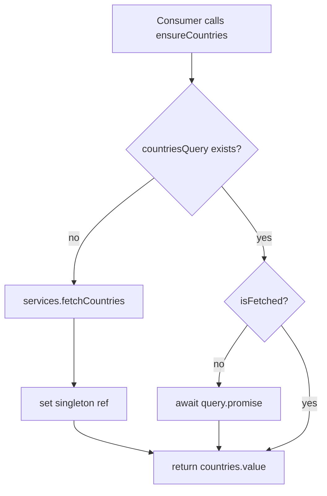
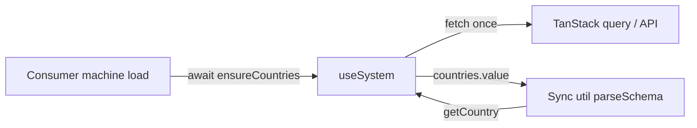
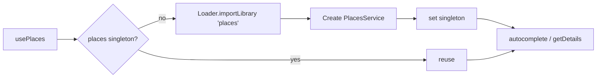

# System Architecture

## Overview

The system module is **not** a single state machine. It's a collection of composables, each with the simplest fitting state model:

| Concern                    | Pattern                                   | Why                                                 |
| -------------------------- | ----------------------------------------- | --------------------------------------------------- |
| Countries / billing cycles | Singleton TanStack queries                | Static-ish reference data, fetched once per session |
| Regions                    | TanStack Store keyed by country code      | Fetched on-demand per country                       |
| Localisation               | Reactive refs around `vue-i18n`           | Driven by user/brand locale                         |
| Places                     | Singleton Google `PlacesService` instance | Third-party SDK, idempotent loader                  |
| Recaptcha                  | XState machine                            | Script load + token request lifecycle               |
| Upload                     | XState machine                            | Multi-step progress + cancel                        |
| Analytics                  | Stateless utility composables             | Push-only side effects                              |

## `useSystem` — Lazy Reference Data

### Why singletons, not a machine

- Reference data has **no transitions** — only "absent" → "loaded".
- Multiple consumers can request the same data; the singleton ref guarantees a single network call.
- TanStack handles caching, errors, and refetch.

### Lazy loading (FE-1698)

Before FE-1698, `useSystem` eagerly called `fetchCountries()` and `fetchBillingCycles()` on every instantiation. After FE-1698:

- Queries are created **only** when the matching `ensure*()` is invoked.
- `isReady()` returns `true` immediately if no queries have been activated.
- `refresh()` only refetches activated queries.

This means flows that never need countries (e.g. a checkout that lands directly into payment) skip the request entirely.

## Data Flow

The contract: **`load` services ensure, sync utils get.**

## Submodule Architectures

### Localisation

`useLocalisation(instance, glob)` initialises a `vue-i18n` instance and exposes `useI18n` + `useLocale` for the rest of the app. Locale changes propagate via reactive refs; locale messages are loaded lazily via the dynamic `glob` map.

### Places

The `Loader` from `@googlemaps/js-api-loader` is idempotent — only the **first** call triggers script injection.

### Recaptcha

XState machine: `idle → loading → ready → generating → ready` (or `error`). The machine guards against duplicate script loads and serialises token requests per action name.

### Upload

XState machine: `idle → preparing → uploading → done | error`. Emits progress events, supports cancel.

### Analytics

`useTracking` + `useDataLayer` are stateless. They push events to `window.dataLayer` (GTM) and respect cookie-consent gating via `useCookies`.

## Integration Points

| Integration     | Surface                                           | Used by                         |
| --------------- | ------------------------------------------------- | ------------------------------- |
| Brand module    | `useBrand().countryId`, `useBrand().ensureConfig` | Default country, feature flags  |
| Query module    | `useQuery`, `invalidateQueryByKey`                | All HTTP and cache operations   |
| TanStack Vue    | `Store`, `useQuery`                               | Regions store, query singletons |
| Google Maps SDK | `@googlemaps/js-api-loader`                       | Places autocomplete             |
| vue-i18n        | `useI18n`, `i18n.global.setLocale`                | Localisation                    |

## Design Decisions

- **No machine for `useSystem`** — reference data is binary (loaded / not), a machine adds ceremony with no benefit.
- **Module-scoped singletons over composable-scoped refs** — every call to `useSystem()` should see the same data; module scope guarantees this.
- **Sync getters return `undefined` rather than throwing** — UI code generally falls back to "no default" gracefully; throwing would force every caller to wrap in try/catch.
- **`fetchCountries` kept as a deprecated alias** to `ensureCountries` — gives downstream packages a soft-migration window.
