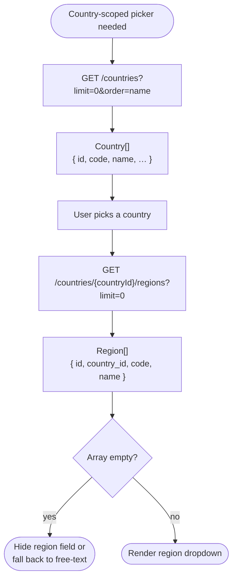

# Module: system

## What it is

`system` is the platform's **reference-data contract** — the slow-moving canonical lists every cart, portal, and admin surface needs to read: countries, regions, billing cycles, languages, currencies, statuses, ticket departments, and tax business types. The BE exposes these so that downstream UI doesn't have to hard-code them and so that ids that appear on records (a country id on an address, a billing-cycle id on a cart line, an `object_type` on a status) can be paired with a human-readable name and code.

How the data is retrieved, cached, coordinated, or refreshed is a build choice — different stacks will use very different mechanics. The contract this doc describes is what's on the wire and what the data means.

> **Out of scope for this doc.** The folder also contains modules for i18n, analytics, address autocomplete, captcha, and file upload. Those are cross-cutting client concerns that an equivalent build can — and likely will — handle very differently (different translation library, different analytics vendor, different address provider, different bot-protection service). They share a folder with the reference-data substrate but are not part of the platform contract.

## Core concepts

- **Status discriminator** — every status carries an `object_type` field identifying which domain entity the status applies to (subscription, invoice, order, …). The same `name`/`code` may appear under multiple `object_type`s.
- **Region tree** — regions are keyed per country. There is no global region endpoint; each country's regions are fetched against its own id.
- **Zero-decimal currency** — currencies carry a `decimals` boolean. When false (JPY, KRW, …), amounts are integers and any `÷100` formatting assumption breaks.

## Operations

Each reference data set is an independent endpoint. Consumers fetch the ones they need.

| #   | Capability                              | Inputs     | Outputs                                                                 |
| --- | --------------------------------------- | ---------- | ----------------------------------------------------------------------- |
| 1   | **Retrieve the country list**           | —          | All countries, `name` server-localised by `Accept-Language`             |
| 2   | **Retrieve regions for a country**      | country id | The region list for that country                                        |
| 3   | **Retrieve the billing cycle list**     | —          | All billing cycles, including the `months: 0` one-off                   |
| 4   | **Retrieve the language list**          | —          | Languages the platform supports                                         |
| 5   | **Retrieve the currency list**          | —          | All currencies, with `base` + `decimals` flags                          |
| 6   | **Retrieve the status list**            | —          | All statuses across every `object_type`, including soft-deleted entries |
| 7   | **Retrieve the ticket department list** | —          | Departments scoped to the active brand                                  |
| 8   | **Retrieve the tax business type list** | —          | Business types used by tax templates                                    |

How the lists are kept fresh, persisted between sessions, or invalidated is up to the consumer.

## Data shape

```ts
type Country = {
  id: string;
  name: string; // localised by Accept-Language
  code: string; // ISO 3166-1 alpha-2 ("GB", "US")
  code3: string; // ISO 3166-1 alpha-3, often empty
  vat: string; // decimal as string ("0.00")
  eea: 0 | 1; // European Economic Area flag
  phone_code: string; // dial prefix ("+44")
  post_code_regex: string;
  created_at: string;
  updated_at: string;
};

type Region = {
  id: string;
  country_id: Country["id"];
  code: string; // sub-national code
  name: string;
  created_at: string;
  updated_at: string;
};

type BillingCycle = {
  id: string;
  name: string; // "Monthly", "Annually"
  recurring: 0 | 1;
  months: number; // 0 (one-off), 1, 3, 6, 12, 24, 36, 48, 60, 72, 84, 96, 108, 120
};

type Language = {
  id: string;
  code: string; // BCP 47 ("en", "en-US", "es-419")
  language: string; // display name
  created_at: string;
  updated_at: string;
};

type Currency = {
  id: string;
  code: ISO_4217_Code; // "GBP", "USD", "EUR"
  name: string;
  prefix: string; // "£"
  suffix: string; // "" or " EUR"
  base: boolean; // platform base currency
  decimals: boolean; // false for zero-decimal currencies (JPY, KRW)
  manual: number;
  created_at: string;
  updated_at: string;
};

type Status = {
  id: string;
  code: string;
  name: string;
  object_type: UpmindObjectType; // which domain entity this status applies to
  created_at: string;
  updated_at: string;
  deleted_at: string | null;
};

type TicketDepartment = {
  id: string;
  code: string;
  name: string;
  name_translated?: string;
  default: boolean;
  is_public: boolean;
  brand_id: string; // owning brand
  username: string | null;
};

type TaxBusinessType = {
  id: string;
  code: string;
  name: string;
  org_id: string;
  user_id: string;
  created_at: string;
  [extra: string]: unknown;
};
```

## Dependencies

### Dependants — modules that read from this one

Every cart/portal module that displays a currency, a country, a billing term, or a status reads from system. Weights are file-count edges from the dependency graph against the whole `system/*` source folder — they aggregate reads against the BE-contract surface and the out-of-scope cross-cutters together, so a high number does not necessarily mean a high read against the reference-data contract specifically. The "Reads" column names the in-scope data each consumer pulls.

| Module             | Weight | Reads                                 | Why                                                                                            |
| ------------------ | ------ | ------------------------------------- | ---------------------------------------------------------------------------------------------- |
| `basket`           | 13     | countries, billing cycles, currencies | Currency display on totals, term selection on items, country selector on the billing address   |
| `basketProduct`    | 7      | billing cycles, currencies            | Term + price formatting on cart lines                                                          |
| `session`          | 7      | languages, currencies, countries      | Locale negotiation, currency on the active account, country defaults during registration       |
| `paymentDetails`   | 5      | countries, regions                    | Billing address forms                                                                          |
| `routing`          | 5      | languages, countries                  | Locale-prefixed routes, country-aware redirects                                                |
| `domain`           | 4      | countries, currencies                 | Country selector on registrant contacts, currency formatting on registration / renewal pricing |
| `client`           | 4      | countries, regions, languages         | Address forms on the client profile, preferred-language selector                               |
| `product`          | 3      | currencies, billing cycles            | Catalogue display, term-based price calculation                                                |
| `config`           | 1      | statuses                              | Status lookups for config-driven UI metadata                                                   |
| `payment`          | 1      | currencies                            | Localised amount rendering on gateway errors                                                   |
| `lookup`           | 1      | countries                             | Country name resolution for free-text search and disambiguation                                |
| `feedback`         | 1      | ticket departments                    | Department selector on contact / support forms                                                 |
| `recommendations`  | 1      | currencies                            | Price rendering on recommended product cards                                                   |
| Presentation layer | —      | active currency, countries            | Currency switcher, country / region dropdowns wherever they appear                             |

> `query` (the HTTP transport layer) imports `system` 6× for `Accept-Language` injection and shared error handling. It's listed as an own-dependency below rather than a dependant, per the workshop scope decision that `query` is a foundational layer rather than a peer module.

### This module's own dependencies

- **HTTP transport layer** — auth header attachment (where the endpoint requires it), `Accept-Language` injection on requests so server-side localisation kicks in, error shape normalisation
- **Shared types** — `ICountry`, `IRegion`, `IBillingCycle`, `ILanguage`, `ICurrency`, `IStatus`, `ITicketDepartment`, `ITaxBusinessType` from `packages/types/src/models/constants.ts`, `statuses.ts`, `tax.ts`, `tickets.ts`. `UpmindObjectTypes` from `packages/types/src/data/enums/objects.ts`. `ISO_4217_CURRENCY_CODE` from `packages/types/src/data/iso4217.ts`.

## API endpoints

### `GET /api/countries`

Country list, server-localised by `Accept-Language`. No auth required.

```bash
curl -s -X GET "$API/countries?limit=0&order=name" \
  -H "Accept: application/json"
```

```json
{
  "status": "ok",
  "data": [
    {
      "id": "3825d96e-763e-d091-3dc4-174825283406",
      "name": "Afghanistan",
      "code": "AF",
      "code3": "",
      "created_at": "2017-10-18 14:16:21",
      "updated_at": "2024-08-22 00:51:23",
      "vat": "0.00",
      "eea": 0,
      "phone_code": "+93",
      "post_code_regex": "^\\d{4}$"
    },
    {
      "id": "24d03679-424d-0e71-04b3-153698d582e8",
      "name": "Albania",
      "code": "AL",
      "code3": "",
      "created_at": "2017-10-18 14:16:21",
      "updated_at": "2024-08-22 00:51:23",
      "vat": "0.00",
      "eea": 0,
      "phone_code": "+355",
      "post_code_regex": "^\\d{4}$"
    }
  ]
}
```

### `GET /api/countries/{countryId}/regions`

Region list for a single country. No auth required.

```bash
curl -s -X GET "$API/countries/$COUNTRY_ID/regions?limit=0" \
  -H "Accept: application/json"
```

```json
{
  "status": "ok",
  "data": [
    {
      "id": "de78642d-e539-7146-2e6b-21208469530d",
      "country_id": "320e4357-95e7-8d18-484f-31643202d986",
      "code": "ABD",
      "name": "Aberdeenshire",
      "created_at": "2019-10-31 17:51:32",
      "updated_at": "2019-10-31 17:51:32"
    },
    {
      "id": "20e43579-5e78-d187-96df-31643202d986",
      "country_id": "320e4357-95e7-8d18-484f-31643202d986",
      "code": "AGB",
      "name": "Argyll",
      "created_at": "2019-10-31 17:51:32",
      "updated_at": "2019-10-31 17:51:32"
    },
    {
      "id": "04038696-e547-21d6-3e5a-518d9305e7d2",
      "country_id": "320e4357-95e7-8d18-484f-31643202d986",
      "code": "AN",
      "name": "Aberdeen, City of",
      "created_at": "2019-10-31 17:51:32",
      "updated_at": "2019-10-31 17:51:32"
    }
  ]
}
```

### `GET /api/billing_cycles`

Available billing terms.

```bash
curl -s -X GET "$API/billing_cycles?limit=0" \
  -H "Accept: application/json"
```

```json
{
  "status": "ok",
  "data": [
    {
      "id": "3825d96e-763e-d091-3dc4-174825283406",
      "name": "One Time",
      "recurring": 0,
      "months": 0
    },
    {
      "id": "85d085e6-9d56-2371-9ea2-18e940d42370",
      "name": "Monthly",
      "recurring": 1,
      "months": 1
    },
    {
      "id": "24d03679-424d-0e71-04b3-153698d582e8",
      "name": "Quarterly",
      "recurring": 1,
      "months": 3
    },
    {
      "id": "68d63250-7980-65d1-e6f8-174e234e98d2",
      "name": "Semiannually",
      "recurring": 1,
      "months": 6
    },
    {
      "id": "e47d7382-4850-7931-56c8-1e642d59e063",
      "name": "Annually",
      "recurring": 1,
      "months": 12
    },
    {
      "id": "45952098-d3de-4091-76a3-1578626e347e",
      "name": "Biennially",
      "recurring": 1,
      "months": 24
    },
    {
      "id": "72040386-96e5-4721-d9b5-18d9305e7d23",
      "name": "Triennially",
      "recurring": 1,
      "months": 36
    },
    {
      "id": "73de7864-2de5-3971-4ef2-1208469530d0",
      "name": "Every 4 Years",
      "recurring": 1,
      "months": 48
    },
    {
      "id": "57898574-2648-9701-25c2-1e325d0ed369",
      "name": "Every 5 Years",
      "recurring": 1,
      "months": 60
    },
    {
      "id": "9320e435-795e-78d1-88a3-1643202d9860",
      "name": "Every 6 Years",
      "recurring": 1,
      "months": 72
    },
    {
      "id": "2785d26e-9678-3d16-70b3-14502e70439d",
      "name": "Every 7 Years",
      "recurring": 1,
      "months": 84
    },
    {
      "id": "825d96e7-63ed-0913-ddf4-174825283406",
      "name": "Every 8 Years",
      "recurring": 1,
      "months": 96
    },
    {
      "id": "5d085e69-d562-3719-7ec2-18e940d42370",
      "name": "Every 9 Years",
      "recurring": 1,
      "months": 108
    },
    {
      "id": "4d036794-24d0-e710-94a3-153698d582e8",
      "name": "Every 10 Years",
      "recurring": 1,
      "months": 120
    }
  ]
}
```

### `GET /api/languages`

Languages the platform knows about. Authenticated (sends an access token if available).

```bash
curl -s -X GET "$API/languages?limit=0" \
  -H "Accept: application/json" \
  -H "Authorization: Bearer $ACCESS_TOKEN"
```

```json
// stubbed — replace with real capture
{
  "status": "ok",
  "data": [
    {
      "id": "…",
      "code": "en",
      "language": "English",
      "created_at": "…",
      "updated_at": "…"
    },
    {
      "id": "…",
      "code": "es",
      "language": "Spanish",
      "created_at": "…",
      "updated_at": "…"
    },
    {
      "id": "…",
      "code": "pt-BR",
      "language": "Portuguese (Brazil)",
      "created_at": "…",
      "updated_at": "…"
    }
  ]
}
```

### `GET /api/currencies`

Available currencies, including base flag and zero-decimal flag.

```bash
curl -s -X GET "$API/currencies?limit=0" \
  -H "Accept: application/json"
```

```json
// stubbed — replace with real capture
{
  "status": "ok",
  "data": [
    {
      "id": "…",
      "code": "GBP",
      "name": "Pound Sterling",
      "prefix": "£",
      "suffix": "",
      "base": true,
      "decimals": true,
      "manual": 0,
      "created_at": "…",
      "updated_at": "…"
    }
  ]
}
```

### `GET /api/statuses`

Status records, keyed by `object_type` (the domain entity each status applies to).

```bash
curl -s -X GET "$API/statuses?limit=0" \
  -H "Accept: application/json"
```

```json
// stubbed — replace with real capture
{
  "status": "ok",
  "data": [
    {
      "id": "…",
      "code": "active",
      "name": "Active",
      "object_type": "subscription",
      "created_at": "…",
      "updated_at": "…",
      "deleted_at": null
    }
  ]
}
```

### `GET /api/tickets/departments`

Ticket departments for the active brand.

```bash
curl -s -X GET "$API/tickets/departments?limit=0" \
  -H "Accept: application/json" \
  -H "Authorization: Bearer $ACCESS_TOKEN"
```

```json
// stubbed — replace with real capture
{
  "status": "ok",
  "data": [
    {
      "id": "…",
      "code": "sales",
      "name": "Sales",
      "default": true,
      "is_public": true,
      "brand_id": "…",
      "username": null
    }
  ]
}
```

## Flows

Most reference-data lookups are single calls — issue a request, render the response. The country / region pair is the one place the module exposes a multi-step interaction the caller has to plan around: the region list is not addressable globally, so a country has to be picked before its regions can be fetched.

### Country → regions cascade

A billing-address form (or any country-scoped picker) reads the country list first, lets the user pick one, then fetches the regions for that country's id.



Guarantees the platform holds:

- The country `id` returned by the first call is the same `id` the second call expects on its path.
- Each region carries its `country_id` back, so a stale response that arrives after the user has switched country can be filtered client-side.
- `Country.name` is server-localised by `Accept-Language`; `Region.name` is returned in the platform's canonical language, regardless of request locale.

Constraints the caller has to plan around:

- A region list for every country. Many countries return an empty array; the form has to degrade to a free-text region field (or hide the field) when that happens.
- A combined "countries with their regions" endpoint. Each country's regions cost one round-trip; a flow that touches many countries grows the request count linearly.
- The platform to remember the previously-selected country across an `Accept-Language` change. The country `id` is stable; only the `name` re-renders — callers that key UI off `name` will lose the selection on a locale switch.

## Lessons (hard-won)

- **Statuses are discriminated by `object_type`.** The same `name`/`code` recurs across domains (an "active" status exists for subscriptions, invoices, orders, …). Resolving a status id without the `object_type` discriminator returns the wrong record when the list is naively keyed by code.
- **Region tree is per-country, not global.** Each country's regions arrive against a country-scoped endpoint. A user that touches many countries grows the region cache without bound; there is no aggregate region endpoint to pre-warm.
- **Country list is server-localised by `Accept-Language`.** Country `name` values change with the request locale; ids stay stable. Caching the list cross-locale produces wrong display names. Ids on records remain valid regardless.
- **Currencies carry a `decimals` flag.** Zero-decimal currencies (JPY, KRW, …) return integer amounts; any `÷100` or two-decimal-format assumption silently truncates them. The flag is the only safe way to know how to format an amount in a given currency.
- **Billing cycle 0 means one-off.** The cycle list includes a `months: 0`, `recurring: 0` record for non-recurring products. Treating cycles as strictly positive integers drops the one-off case.
- **Ticket departments are brand-scoped.** Each record carries a `brand_id` and the list returned reflects the active brand. Multi-brand admin contexts need to refetch when the active brand changes.
- **Status `deleted_at` is non-null for soft-deleted entries.** The status endpoint returns soft-deleted records alongside live ones, distinguishable only by the `deleted_at` timestamp. Naive name resolution can land on a deleted status if filtering is omitted.
