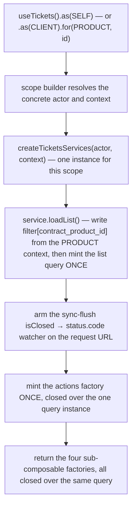
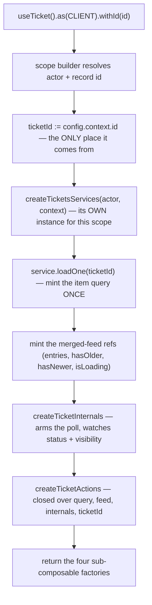
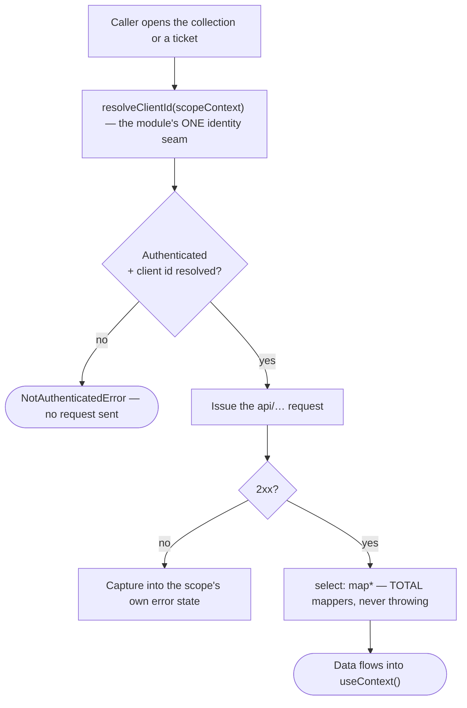
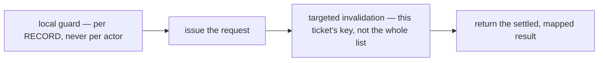
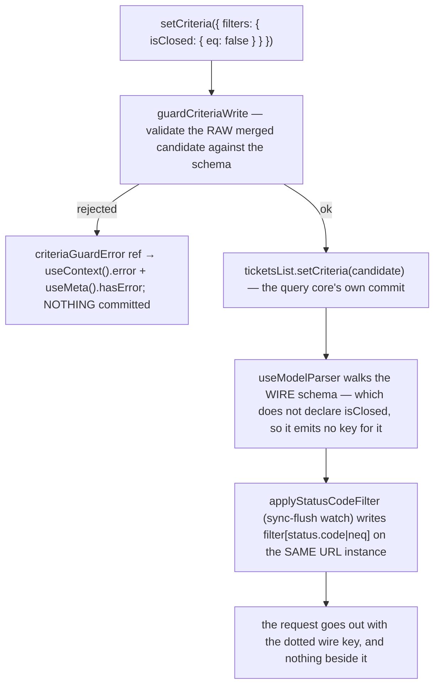
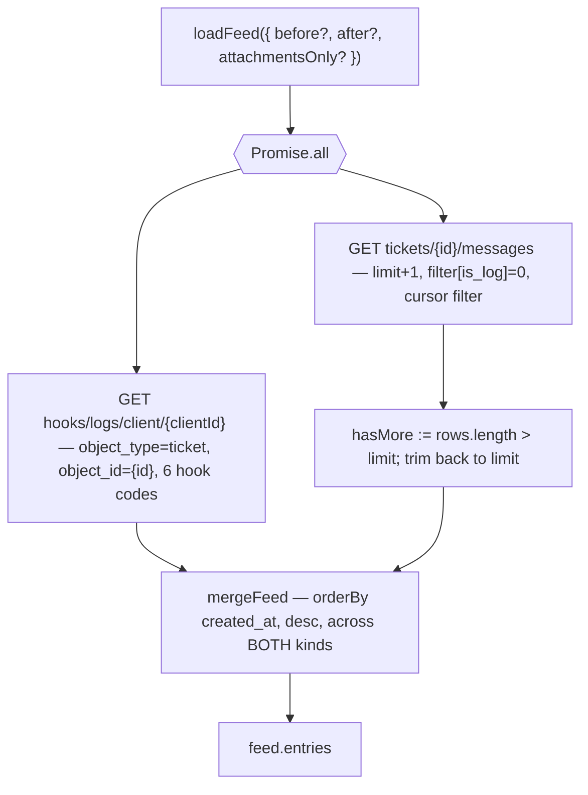

# tickets — Architecture

## Overview

The module ships **two** scoped composables over **one** shared data layer:

- **`useTickets`** — the collection. Query-backed, no state machine. One TanStack list query is minted per resolved scope, at construction, so it survives component lifecycles.
- **`useTicket`** — the per-ticket manager. Query-backed, one item query per resolved scope, plus a module-owned merged feed and a lifecycle poll.

Both are registered under the **same module name** (`"tickets"`); the composable name and the scope key carry the differentiation. Both build their services instance from **one factory** (`createTicketsServices`), so the two halves share one identity seam, one base cache key, and one addressability predicate.

The single most important property of this module is that **every request resolves its target client from the scope the caller opened, never from a direct session read inside a request-issuing function.** `resolveClientId(scopeContext)` in the services layer is the only place that decision is made, and both `loadList` and `loadOne` go through it.

**Path law.** Every request this module issues is `api/…`. There is no `api/admin/…` anywhere, no `.as('staff')`, and no `.for('client', id)` — the only context the module declares is `ticket`. A guard spec asserts this by scanning observed requests, so a reintroduced admin path goes red rather than shipping quietly.

The module has **no state machine**. It is the `query` variant throughout: the collection's request state lives on the query platform's own criteria handle, the manager's writes are plain imperative calls with local guards, and the only stateful thing the module owns outright is the merged feed and its poll.

## Data Flow

### Instantiation — the collection

`config.context` is either absent or `TicketsContextTypes.CONTRACT_PRODUCT` — `TICKETS_SCOPE_MATRIX` declares that one member on the `client` row and leaves every other actor `null as never`. Neither shape names a client, so the collection always resolves the active session's own client; the context names the **product the list is about**.

A product context is a **relationship** made first-class, which is why it is not a filter column. It reaches the wire as `filter[contract_product_id]=<id>`, written straight onto the request url by `applyProductScopeFilter` — the same module-owned edge `applyStatusCodeFilter` writes the status narrowing at, and for the same reason: the query core only ever emits keys a SCHEMA declared, spelt with the branch's own name.

### Instantiation — the manager

The instance is keyed by the scope key, which is itself keyed by the ticket id — two different ticket ids resolve to two different instances, each with its own feed and its own poll.

### Read flow (either surface)

`isAddressable` is the **same predicate** `isAvailable` exposes on both surfaces — one function, read by meta, by the actions layer, and by every query's `guard` and `enabled`. A consumer cannot render "available" while the wire refuses the call, or vice versa.

### The mutation idiom

Every write on the manager follows one shape:

The guard reads the **loaded record** (`ticket.settings.lock`, the message's `can_manage`) and throws a `DetailedError` before anything reaches the network. `reply()` is the one variation: on success it refreshes the ticket *and* reloads the feed, because a reply can move the ticket's status server-side.

### The criteria-key translation — the module's one deliberate divergence

The collection's status filter is the one place where **the schema and the wire deliberately disagree**, and the mechanism is worth understanding before touching either.

Two separate defences are in play here and they solve different problems:

**1. `guardCriteriaWrite` — why the candidate is validated twice.** The query core's `commit()` validates the candidate only *after* `useModelParser` reshapes it, and the parser **builds** its output by walking `schema.properties`. A key the schema never declared is therefore never visited, is silently absent from what AJV sees, and the write commits as if valid — `criteria.error` never fires and the caller has no way to know its write was ignored. Validating the **raw merged candidate** against the schema at the module's own edge catches exactly that additional-property class, without touching the core's parse/commit pipeline.

**2. `applyStatusCodeFilter` + `useWireQuerySchema` — why the module spells this filter itself.** Two constraints meet on one leaf. First, the column is dotted, and `useModelParser` writes each declared property through a plain lodash `set(result, key, value)`, which reads a literal `"status.code"` key as the **path** `status` → `code` and corrupts every commit. Second, the two positions need two DIFFERENT operators on that one column, which no single schema leaf can declare. So the criteria carries one tri-state boolean (`isClosed.eq`), and the service edge writes the operator the position calls for directly onto the request's own mutable `URL`.

`useWireQuerySchema()` then hands `list()` the query schema **minus that branch**. `translateQuery` emits one wire key per branch it can see, spelt with the branch's own property name, so a visible branch would add `filter[isClosed|eq]=0` beside the real key — a column this API does not have, and measured against staging 2026-09-17 as a `500` when it rides beside the dotted one. Withholding the branch from the translator (and only from it) is the one place a module can stop the key being minted; every consumer still reads the FULL schema, which is what `useTickets`'s context publishes.

The re-spell runs via a `flush: "sync"` watcher inside `loadList`, **not** via `list()`'s own `guard` hook. That is not a style choice: the query core's `hasGuard = isPromise(guard)` tests the *guard function itself* for thenability, which a plain function never satisfies, so `guard` never actually runs. That is a pre-existing defect in the shared query platform, and this module deliberately routes around it at its own edge instead of editing shared platform code.

The value and the decision of what is active still come from `setCriteria` and the schema channel. Only the **key spelling** is corrected. No hand-rolled filter ref, no `filter[…]` string built beside the channel.

### The merged feed

The conversation is assembled in the module from **two** endpoints, in parallel:

The `limit + 1` probe is how `hasOlder` / `hasNewer` are known without a count side-channel. `attachmentsOnly` short-circuits the log half entirely and adds `filter[files.id|gt]=0` to the message read — a **different request**, never a client-side filter over already-loaded rows.

`loadFeed` itself is internal. The public entry points are `loadOlder()`, `loadNewer()` and `loadAttachments()`; the first thread load is `loadOlder()` on an empty feed, whose cursor is `undefined`.

### The poll

`useTicket.internals` owns the ticket's automatic poll. This is a **deliberate deviation** from the generic `{ send, state, service }` internals shape — this module has no machine to expose there, so the poll lives in that layer instead.

- Armed automatically by a `watch` on the loaded ticket's `status.code`, `immediate: true` — including the moment a poll's own response closes the ticket.
- Fires every 60 seconds, skipping the tick when `document.hidden`.
- On a hidden tab the interval is **cleared outright**, not merely skipped. The legacy implementation returned early without clearing, leaking no-op fires; this one re-fires once on `visibilitychange` when the tab returns.
- The refetch is fire-and-forget with an explicit `.catch(() => undefined)` — a refetch cancelled mid-flight by a cache clear rejects with `CancelledError`, and left bare that surfaces as an unhandled promise rejection. Genuine fetch failures are still tracked reactively on `query.error`.

`destroy()` disarms the poll **first**, then stops the watcher, removes the visibility listener, and unregisters the scope.

## Sub-composables

| Sub-composable   | Collection                                                                                 | Manager                                                                                              |
| ---------------- | ------------------------------------------------------------------------------------------ | ---------------------------------------------------------------------------------------------------- |
| `useActions()`   | **15** — criteria write, page walk, create, upload, three lookups, prefs, lifecycle         | **19** — feed paging, reply/edit/withdraw, attachments, close/reopen/rename, product link, lifecycle  |
| `useContext()`   | **7** — list, error, two lookups, pagination, live criteria, the schema family              | **5** — ticket, department, related product, error, the merged feed                                  |
| `useMeta()`      | **7** flags — `hasError`, `isAvailable`, `isEmpty`, `isLoading`, `hasNextPage`, `hasPrevPage`, `hasPages` | **11** flags — the shared four plus `isClosed`, `isLocked`, `isScheduled`, `isStaged`, `isDelegated`, `isPollable`, `canReply`, `canReopen` |
| `useInternals()` | **2** — actor scope, raw list query                                                         | **5** — actor scope, raw item query, `armPoll`, `disarmPoll`, `teardown`                             |

Both halves return the identical four-layer shape; only the contents differ. Neither has any per-actor arm — there is no `.{actor}.ts` sibling anywhere in this module, because there is exactly one actor in scope and every gate is per-record.

## Services

One services file (`tickets.services.ts`) serves both halves. `config.context` enters the module there and nowhere else.

| Concern                   | Where it lives                                                                                          |
| ------------------------- | ------------------------------------------------------------------------------------------------------- |
| Target-client resolution  | `resolveClientId`, the module's one identity seam, consumed by `loadList`, `loadOne`, `loadStatusLogs`, `saveSupportPrefs` |
| Addressability predicate  | `isAddressable`, exposed reactively as `service.isAvailable`, shared by both surfaces' `enabled` / `guard` |
| Cache key                 | one base key `["client", "tickets"]`, partitioned by resolved client id, shared by both halves            |
| Wire ↔ view-model mapping | pure, **total** mappers in `tickets.mappers.ts`, consumed by both surfaces via the query's `select`       |
| Criteria validation       | `guardCriteriaWrite` — raw-candidate validation at the module edge (see above)                            |
| Wire-key translation      | `applyStatusCodeFilter` — undotted schema key → dotted wire column (see above)                            |
| Readiness                 | the same three-step shape on both actions layers — settle addressability, then wait on the fetch          |
| Schemas                   | `tickets.schemas.ts` — the query schema plus four exported form schemas (two of which are unpublished; see gotchas #15) |

### Cache keys

| Key                                                | Owner      | Invalidated by                                    |
| -------------------------------------------------- | ---------- | ------------------------------------------------- |
| `["client","tickets",{client}]`                    | collection | `create()`, `invalidate()`, `reset()`             |
| `["client","tickets","ticket",id,{client}]`        | manager    | every manager write, via `invalidateTicket()`     |
| `["client","tickets","messages",id,params]`        | thread     | not invalidated — `staleTime: IMMEDIATE`          |
| `["client","tickets","status-logs",id]`            | feed       | not invalidated — `staleTime: IMMEDIATE`          |
| `["client","tickets","brand-departments"\|"departments"\|"statuses"]` | lookups | not invalidated — `staleTime: DAY` |
| `["client","tickets","client-meta",clientId]`      | prefs      | not invalidated — `staleTime: IMMEDIATE`          |

A manager write invalidates only its own ticket's key, so an open **list** does not automatically refresh after a close. See [gotchas.md](./gotchas.md) #18.

### Two documented divergences from the shared request layer

Both are module-local, both avoid editing headless core, and both are deliberate:

- **Attachment download bypasses `useQuery()`.** The shared `doFetch` unconditionally calls `response.json()`, and a binary attachment is not JSON. `downloadFile` uses a plain `fetch()` with the same bearer-token seam and the same base URL, returning an `ArrayBuffer`. The alternative — adding a `responseType` branch to the shared request pipeline every module depends on — is out of scope and was not asked for by any requirement.
- **Support prefs are a read-modify-write.** `PUT api/clients/{id}` replaces the whole `meta` map, so a partial body deletes every key it does not name. `saveSupportPrefs` reads the current client record, merges the three prefs keys into its `meta`, and PUTs the whole map back — which is the only shape that preserves an untouched sibling key owned by a different feature (`ui/support/messageSignature`).

## Errors

Errors are **state**, not events. Nothing in this module raises a toast or notification.

| Failure                                       | Where it lands                                     |
| --------------------------------------------- | -------------------------------------------------- |
| List / ticket / thread read failed            | `useContext().error`, `useMeta().hasError`         |
| A `setCriteria` write was rejected            | the same two members, via `criteriaGuardError`     |
| A per-record refusal (locked / not mine / not closed) | **thrown** `DetailedError`                  |
| `refresh()` with no addressable client        | **thrown** `NotAuthenticatedError`                 |
| Attachment download failed                    | **thrown** `DetailedError` carrying the HTTP status |

Folding the criteria rejection into `hasError` is what makes an ignored write visible to a consumer watching meta — without it, `useContext().error` was populated while `hasError` still read `false`.

## Dependencies

### This module reads from

| Module              | Uses                                                                                             |
| ------------------- | ------------------------------------------------------------------------------------------------ |
| `session-store`     | the active client identity, whether the session is authenticated and whether it has settled; the access token for the download path; `activeUser.brandId` for the upload |
| `query`             | the shared request layer — list reads with criteria, item reads, `post`/`put`/`del`, URL building, cache invalidation |
| `scope`             | the actor-scoping accessor and its instance registry                                             |
| `brand`             | `brandId` on the services surface, and `ensureConfig(ALLOWED_UPLOAD_FILE_TYPES)` for the upload guard |
| `system-localisation` | the one translated message on the criteria-rejection error                                     |
| shared utilities    | `useCollection` lookups, `useValidation`, `useTime`, the typed error family                      |

### Modules that read from this one

None today. `useTickets` is consumed by the client-facing ticket views; no other headless module builds on top of it.

## Platform additions this build required

**None.** This module consumes the shared `query` module exactly as every other scoped composable does. Where the shared layer could not serve a need — a binary response body, a guard hook that never runs — the module routed around it locally rather than patching the core. `packages/headless/src/modules/query/**` is untouched.

The one platform change this build made is in `packages/types`: `ITicket` was extended **additively** with `contract_product_id` and `invoice` (it carries the id only, not the embedded `contract_product` relation), rather than this module re-declaring `ITicket`. The embedded `contract_product` relation lives on the module's `Ticket` view model as `ContractProductEmbedded`, mapped by the contract-product module's `mapContractProductEmbedded`.

## Module boundary

Two overlaps with other modules are deliberate and recorded, so a future reader does not consolidate in the wrong direction:

- **Attachment upload is tickets-local** (`POST api/ticket_messages/files`), not `system-upload`. `system-upload` switches on image object types and every branch emits a `.../images` path, so its surface cannot carry an arbitrary file. A later consolidation may absorb this overlap; until then, this is the record of what tickets actually needs from an upload surface.
- **The department and status lookups are owned here**, not by the shared `system` module, whose equivalents sit commented out at `useSystem.ts:37-38`. Because those shared services are commented out and not exposed, no live duplication exists.

`tickets.services.ts`, `tickets.schemas.ts` and `tickets.mappers.ts` are `@internal` — resolve them through `useTickets.ts` / `useTicket.ts` only (`@internal/no-cross-module-imports`). `index.ts` is curated named re-exports with **no `export *`** (Module Visibility Law).
