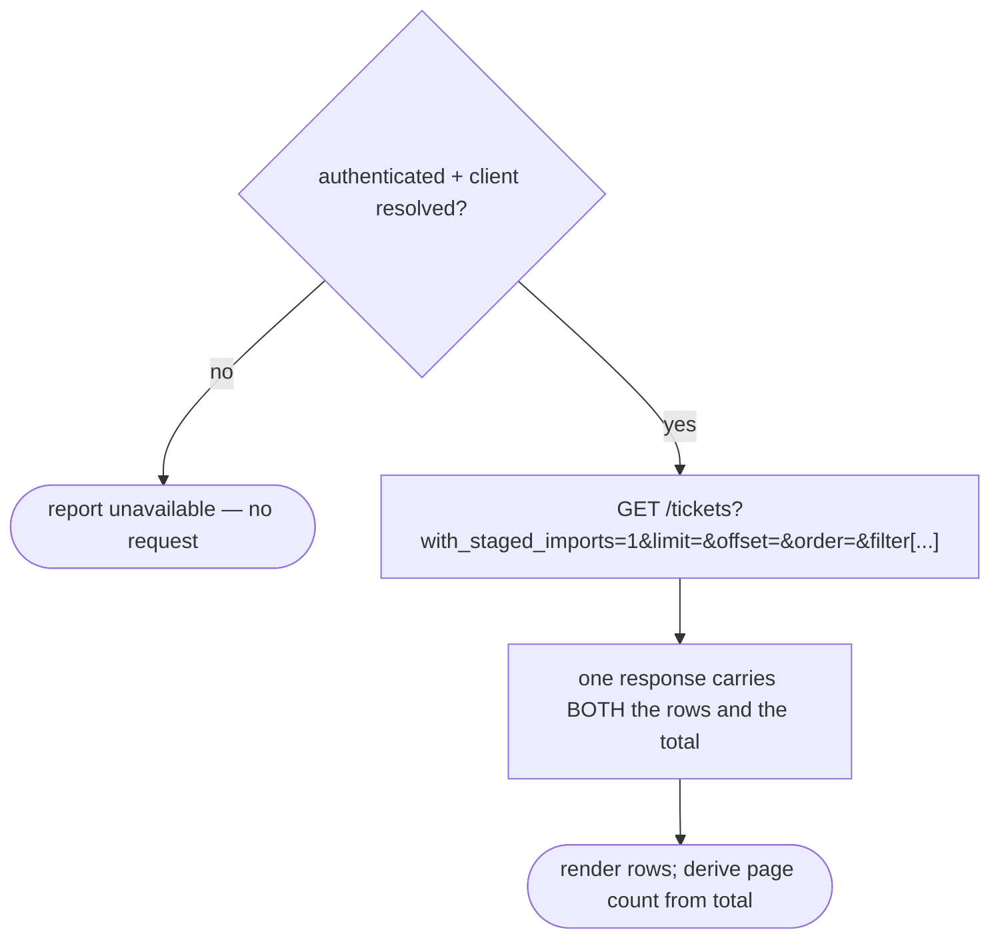
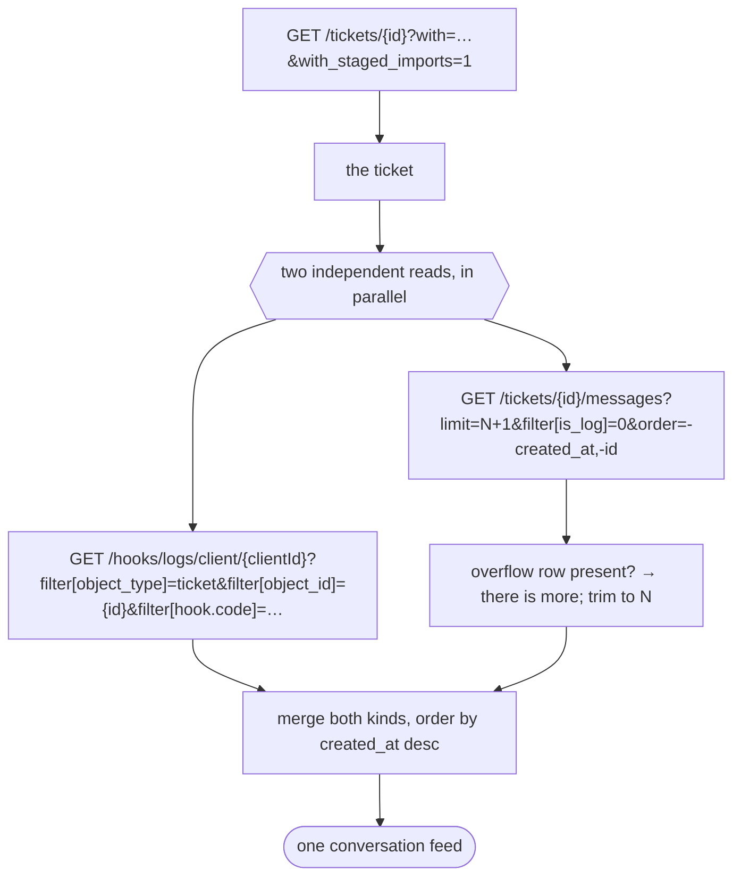
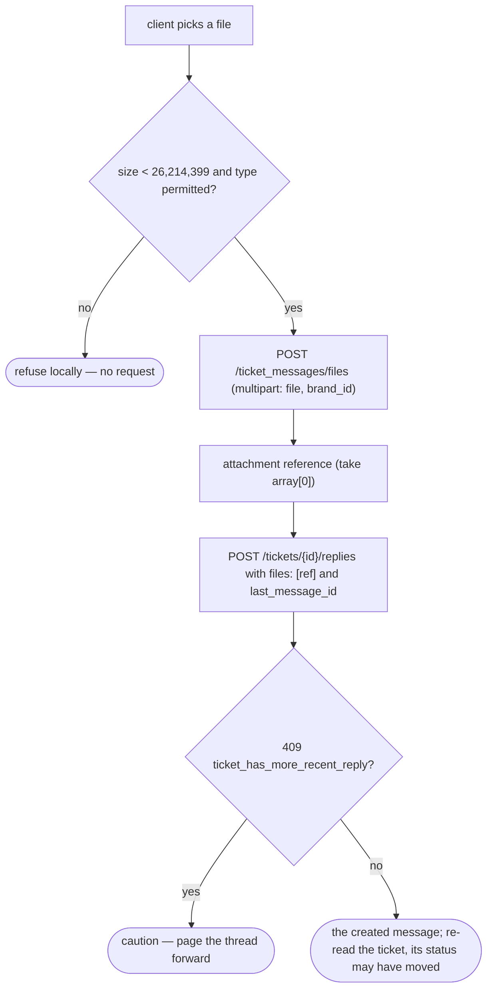
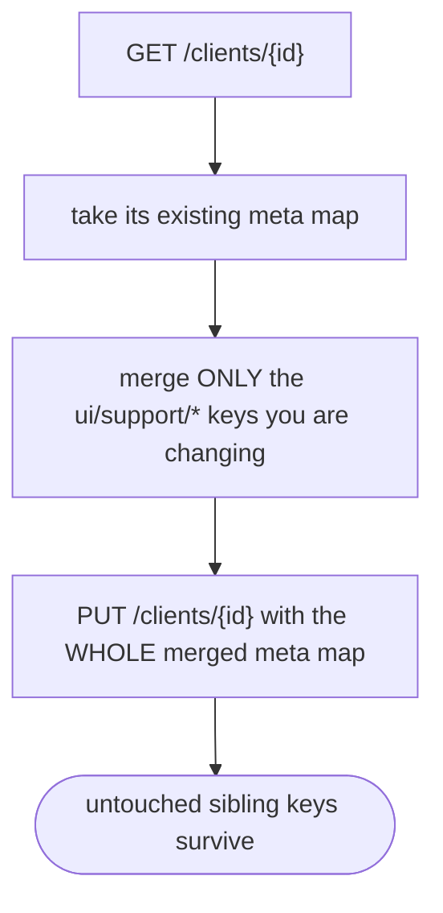

# Module: tickets

> **On `meta` fields.** Any `meta` bag returned by these endpoints is UI-specific to one client application — ignore it for specification purposes. The single exception documented below is the **client record's own `meta` map**, which is where this contract's support preferences are stored: that storage location is part of the contract (operation 23), even though the values held there are presentation state. Nothing else in this document depends on a `meta` bag.

> Framework-neutral specification. Everything below describes the **platform contract** a client-facing support desk is built on — endpoints, payloads, state, and failure modes — so the same capability can be rebuilt on any stack without reading this repo's source. Every shape shown is taken from a request/response pair recorded against a live environment, not from a type definition.

## What it is

The **tickets** module covers a client's own support conversations with the brand they buy from, read and written two ways: a **collection** covering every ticket the client can see — searched, filtered, sorted, and paged — and a **per-ticket manager** for living inside one conversation: reading its merged message and status-change feed, replying, correcting or withdrawing the client's own messages, handling attachments, closing, reopening, renaming, and linking the ticket to one of the client's own products.

Both surfaces act as the **authenticated client on their own account**. There is no staff capability here, no acting on behalf of another client, and no administrative path: every endpoint below is the client-facing one. Capabilities that exist in the product only behind an administrative control — rescheduling an already-created ticket, and moving a ticket to a different desk — are deliberately **not** part of this contract.

## Core concepts

- **Ticket** — one support conversation. Carries a human-readable `reference`, a `subject`, a status, a desk (`ticket_department_id`), the owning client, and optionally a linked contract product and invoice.
- **Desk / department** — the support queue a ticket is raised into. A brand publishes a subset of desks to clients; the default one is flagged.
- **Message** — one entry in a ticket's conversation. Carries a body, an author, attachments, a privacy flag, and — critically — a per-record `can_manage` flag stating whether *this* caller may edit or withdraw it.
- **Log row** — an agent-internal message, flagged `is_log`. Never shown to the client; excluded at the request.
- **Status-change entry** — a platform hook log recording a ticket-lifecycle transition (opened, closed, reopened, in progress, client replied, waiting response). These live on a **different endpoint** from messages and are merged client-side into one feed.
- **Delegated-in ticket** — a ticket belonging to another client who has delegated access to this one. It arrives **co-mingled** in the same list, flagged `is_delegated_object`.
- **Staged import** — a ticket that arrived via an import pipeline. Invisible unless the request opts in with `with_staged_imports=1`.
- **Attachment** — a file uploaded ahead of a create or a reply, then referenced by the write. Uploading and attaching are two separate steps.

## State model

A ticket's lifecycle is reported by its status code — set by the platform and by the two transitions a client may drive, never inferred client-side. The full vocabulary, as the platform publishes it:

| Status code               | Meaning                                    | Client may set? |
| ------------------------- | ------------------------------------------ | --------------- |
| `ticket_open`             | open, awaiting work                        | ✅ via reopen   |
| `ticket_in_progress`      | being worked                               | ❌              |
| `ticket_waiting_response` | waiting on the client                      | ❌              |
| `ticket_client_replied`   | the client has replied                     | ❌              |
| `ticket_closed`           | closed                                     | ✅ via close    |
| `ticket_scheduled`        | created with a send-later time, not yet live | ❌ (set at create) |

Two further per-ticket properties gate what a client may do, and both are reported by the platform rather than derived:

| Property                  | Effect                                                        |
| ------------------------- | ------------------------------------------------------------- |
| `settings.lock`           | the ticket is locked — close and rename must be refused       |
| `settings.scheduled_datetime` | the send-later time supplied at creation                  |

Per-message, one property gates message writes:

| Property     | Effect                                                            |
| ------------ | ----------------------------------------------------------------- |
| `can_manage` | whether this caller may edit or withdraw **this** message         |

**Every write gate is per record.** There is no "client may edit their own messages" rule to implement — the platform states it per message, and the client re-states it per message.

> ⚠️ **What the recorded responses actually carried.** On the environment these responses were captured from, the ticket list rows and the single-ticket read carried **`status_id` only — no expanded `status` relation — and no `settings` key at all**, even though the read requested both via `with=`. A rebuild must therefore treat `status` and `settings` as **optional relations** and derive every lifecycle flag defensively: an absent `settings` means "not locked, not scheduled", and an absent `status` means the status code is simply unknown rather than falsy. Do not assume the relation is always expanded. See "Failure modes" below.

## Operations

| #   | Capability                             | Inputs                                                             | Outputs                                                    |
| --- | -------------------------------------- | ------------------------------------------------------------------ | ---------------------------------------------------------- |
| 1   | List my tickets                        | optional free text, filters, sort, page                            | array of tickets + a total count                           |
| 2   | Narrow to active / closed              | a status-code filter with an equality or inequality operator       | re-issues the list, narrowed                               |
| 3   | Search                                 | free text, minimum 3 characters                                    | re-issues the list — matches **subject and reference only** |
| 4   | Filter by reference / subject / date / product | exact reference, exact subject, a created-date range, a product id | re-issues the list, narrowed                       |
| 5   | Sort                                   | one of reference / subject / created / updated, plus a direction   | re-issues the list, reordered                              |
| 6   | Page                                   | a limit and an offset                                              | re-issues the list at that page                            |
| 7   | Raise a ticket                         | subject, desk, message body and/or attachments, optional product, optional send-later time | the created ticket             |
| 8   | Open one ticket                        | ticket id                                                          | the full ticket with its relations                         |
| 9   | Read the conversation                  | ticket id, a page size, an optional cursor, a direction            | messages **and** status-change entries, newest first       |
| 10  | Read one message                       | ticket id, message id                                              | the single message with its files                          |
| 11  | Reply                                  | ticket id, body, optional attachments, optional privacy flag, the newest known message id | the created message, or a stale-reply caution |
| 12  | Correct my own message                 | ticket id, message id, new body                                    | the updated message                                        |
| 13  | Withdraw my own message                | ticket id, message id, a reason                                    | — (the message is replaced by a log row)                   |
| 14  | Upload an attachment                   | a file, the brand id                                               | an attachment reference for a later create or reply        |
| 15  | Download an attachment                 | file id                                                            | the file's raw bytes                                       |
| 16  | Remove an attachment                   | ticket id, message id, file id                                     | —                                                          |
| 17  | Close / reopen                         | ticket id, the target status code                                  | — (no ticket body is returned)                             |
| 18  | Rename                                 | ticket id, a new subject                                           | the updated ticket                                         |
| 19  | Link / change / unlink a product       | ticket id, a contract-product id **or an explicit null**           | the updated ticket                                         |
| 20  | List the brand's public desks          | —                                                                  | selectable desks, with the default flagged                 |
| 21  | List all desks                         | —                                                                  | every desk (a different record shape)                      |
| 22  | List ticket statuses                   | —                                                                  | the status vocabulary, code + display name                 |
| 23  | Read / write support preferences       | the client id, and the preference keys to change                   | the merged preference set                                  |

**Additional always-on behaviours:**

- Reporting whether the surface is addressable at all — that is, whether an authenticated client has been resolved.
- Reporting whether a read is loading, empty, or errored, and signalling readiness with a signal that always settles.
- Reporting how many pages the list spans and whether a next/previous page exists.
- Polling an open ticket for updates on a visible view only, and stopping when it closes or the view is torn down.

## Data shape

### The envelope

Every JSON response is wrapped identically:

```ts
type Envelope<T> = {
  status: "ok" | "error";
  data: T | null;
  related: unknown | null;
  total: number | null;   // the list's total row count, on the SAME response as the rows
  error: { code: number; message: string } | null;
  messages: unknown;
  meta: unknown;
};
```

### Ticket

Recorded from the single read. The list rows carry the **same** shape — a rebuild does not need a second request to draw a rich row.

```ts
type Ticket = {
  id: string;
  reference: string;              // human-readable, e.g. "LHG-275-42348"
  subject: string;
  client_id: string;
  brand_id: string;
  account_id: string;
  org_id: string;
  ticket_department_id: string;   // the desk
  status_id: string;              // NOTE: the expanded `status` relation may be absent
  priority_id: string | null;
  contract_product_id: string | null;
  contract_product: ContractProduct | null;   // present when linked
  invoice_id: string | null;
  department: Department | null;
  client: Client | null;
  created_at: string;             // "YYYY-MM-DD HH:mm:ss"
  updated_at: string;
  replied_at: string | null;
  calculated_close_date: string | null;
  calculated_notify_close_date: string | null;
  can_see_ticket_messages: boolean;
  is_delegated_object: boolean;   // true = belongs to a delegating client
  staged_import: unknown | null;  // present only with with_staged_imports=1
  spam: boolean;
  source_type: string | null;
  source_ip: string | null;
  external_id: string | null;
  import_id: string | null;
  email_file: unknown | null;
  object_type: string | null;
  object_id: string | null;
  lead_id: string | null;
  user_id: string | null;
  template_id: string | null;
  reseller_account_id: string | null;

  // Optional relations — requested via `with=`, NOT guaranteed present:
  status?: { code: string; name?: string };
  settings?: { lock?: boolean; scheduled_datetime?: string };
};
```

### Message

```ts
type TicketMessage = {
  id: string;
  ticket_id: string;
  body: string;
  created_at: string;
  updated_at: string;
  is_log: boolean;          // true = agent-internal, or a withdrawal marker
  is_private: boolean;
  is_author: boolean;
  can_manage: boolean;      // THE write gate — per record
  pinned: boolean;
  reason: string | null;    // populated on a withdrawal
  deleted_at: string | null; // NOTE: never populated in practice — see below
  files: AttachmentRef[];
  action: string | null;
  actor_name: string | null;
  actor_image_url: string | null;
  client_id: string | null;
  client_actor_id: string | null;
  client_name: string | null;
  client_image_url: string | null;
  user_id: string | null;
  user_actor_id: string | null;
  user_name: string | null;
  user_image_url: string | null;
  lead_id: string | null;
  lead_actor_id: string | null;
  original_ticket_message_id: string | null;
  template_id: string | null;
  source_type: string | null;
  external_id: string | null;
  import_id: string | null;
  email_file: unknown | null;
  staged_import: unknown | null;
  object_type: string | null;
  object_id: string | null;
  ticket: Ticket | null;
};
```

> **A withdrawal does not set `deleted_at`.** Confirmed against a recorded withdrawal: `deleted_at` stays `null`, and the withdrawn message is replaced in the thread by a **separate `is_log: true` row** carrying the reason. Derive "deleted" from `is_log`, not from `deleted_at`.

### Status-change entry (hook log)

A different endpoint and a different shape from a message. Merge the two client-side.

```ts
type HookLog = {
  id: string;
  hook_id: string;
  object_type: string;          // "ticket"
  object_id: string;            // the ticket id
  object_client_id: string;
  object_brand_id: string;
  object_account_id: string;
  object_reseller_account_id: string | null;
  object_user_id: string | null;
  actor: unknown | null;
  context_params: unknown | null;
  access_role: string | null;
  access_uid: string | null;
  access_user_id: string | null;
  created_at: string;
  updated_at: string;
};
```

### Attachment reference (upload response)

The upload returns an **array**; take the first row. Twenty-six fields, recorded verbatim:

```ts
type AttachmentRef = {
  id: string;
  hash: string;
  name: string;
  original_name: string;
  type: string;
  mime_type: string;
  size: number;
  size_formatted: string;
  url: string;
  print_url: string | null;
  object_type: string;
  object_class: string;
  object_id: string | null;     // null until the file is attached to a write
  brand_id: string;
  image_category_id: string | null;
  temp_token_id: string | null;
  default: boolean;
  system: boolean;
  resized: boolean;
  order: number | null;
  scan_status: string | null;
  scan_status_reason: string | null;
  failed_scanning_attempts: number;
  created_at: string;
  updated_at: string;
  deleted_at: string | null;
};
```

A consumer typically needs only `{ id, name, mime_type, object_type, object_class, object_id, type }` — narrowing to that subset is fine, but do **not** reduce the reference to `{ id, hash }` when echoing it back on a write: the recorded write payload carries the richer row.

### Brand desk (public)

```ts
type BrandDepartment = {
  id: string;                     // the JOIN record's id — NOT what a create wants
  ticket_department_id: string;   // ← the id a create's `ticket_department_id` takes
  brand_id: string;
  name: string;
  name_translated: string | null;
  translations: unknown;
  default: boolean;               // the brand's default desk
  is_public: boolean;
  limited: boolean;
  username: string | null;
  org_id: string;
  created_at: string;
  updated_at: string;
  deleted_at: string | null;
};
```

## Dependencies

### Dependants

None. This is the sole client-facing support-desk surface; no other collection builds on it.

### This module's own dependencies

- **Active client session** — supplies the acting client's identity (see the `actor_id` note under "Lessons"), the bearer token, and the acting user's brand id for uploads. There is no "which client" input anywhere in this contract.
- **Brand configuration** — supplies the allowed upload file types, when the brand publishes any.
- **HTTP transport** — bearer-token attachment, URL construction, response caching.
- **Client record** — support preferences live on the client's own `meta` map, not on a dedicated preferences resource.

## API endpoints

All paths are relative to the client-facing API root. Every request carries `Authorization: Bearer <access_token>` and `Accept: application/json`.

### GET /tickets

Lists the caller's own tickets, plus any delegated in. Always resolves to the authenticated caller — **there is no client-identifying parameter**; do not send `filter[client_id]`, or delegated-in tickets are filtered out of the very list they belong in.

Parameters:

| Parameter                          | Purpose                                                            |
| ---------------------------------- | ------------------------------------------------------------------ |
| `with_staged_imports=1`            | **required** — without it, imported tickets are invisible          |
| `with=`                            | relation expansion (client, department, status, settings, …)       |
| `limit` / `offset`                 | paging                                                             |
| `order`                            | sorting; a leading `-` means descending (default `-updated_at`)    |
| `query`                            | free text — matches **subject and reference**, minimum 3 characters |
| `filter[status.code]`              | narrow to one status (the "closed" tab)                            |
| `filter[status.code\|neq]`         | exclude one status (the "active" tab)                              |
| `filter[reference]`                | **exact** reference match — a bare equality leaf, not a contains   |
| `filter[subject]`                  | exact subject match                                                |
| `filter[contract_product_id]`      | narrow to one product's tickets                                    |
| `filter[created_at\|gte]` / `\|lte` | a created-date range                                              |

```bash
curl "$API/tickets?with_staged_imports=1&limit=10&order=-updated_at&filter[status.code|neq]=ticket_closed" \
  -H "Authorization: Bearer $ACCESS_TOKEN" -H "Accept: application/json"
```

Sample response (`200`, trimmed):

```json
{
  "status": "ok",
  "data": [
    {
      "id": "…",
      "reference": "LHG-275-42348",
      "subject": "Renewal question",
      "status_id": "…",
      "ticket_department_id": "…",
      "contract_product_id": null,
      "is_delegated_object": false,
      "created_at": "2026-09-02 11:14:07",
      "updated_at": "2026-09-12 08:41:22"
    }
  ],
  "total": 25,
  "error": null
}
```

> **The dotted filter column is real and is the only spelling the server accepts** — `filter[status.code|neq]`, not `filter[statusCode|neq]` and not `filter[status_code|neq]`. A rebuild whose form model happens to use a dotted key internally should check that its own model-writing layer does not read the dot as a nesting path; see "Lessons".

### GET /tickets/{ticketId}

The single ticket, with its relations. Same `with_staged_imports=1` requirement. Returns the shape under "Data shape" above.

### POST /tickets

Raises a ticket.

```json
{
  "subject": "Renewal question",
  "body": "When does this renew?",
  "ticket_department_id": "…",
  "contract_product_id": "…",
  "client_id": "…",
  "brand_id": "…",
  "files": [ { "…attachment reference…": "" } ],
  "settings": { "scheduled_datetime": "2026-10-01T09:00:00Z" }
}
```

- `subject` is **always** required.
- `body` is required **only when `files` is absent.** The server's own message is verbatim: *"The body field is required when files is not present."* A subject-plus-attachment create with no body is valid and is accepted.
- `settings.scheduled_datetime` is the **create-time** send-later. There is no client-reachable way to change it afterwards.
- Omit any key whose value is null rather than sending an explicit null.

Returns the created ticket.

### PUT /tickets/{ticketId}

Partial update. Two client-reachable fields:

```json
{ "subject": "A clearer subject" }
{ "contract_product_id": "…" }
{ "contract_product_id": null }
```

**Unlinking requires an explicit `null`.** An omitted key means "unchanged", not "clear". Linking and *changing* are the same call.

Returns the updated ticket.

### PUT /tickets/{ticketId}/status

```json
{ "status_code": "ticket_closed" }
```

> **This endpoint returns `{"status":"ok","data":null}` — no ticket body.** Do not read the transitioned ticket from the response; re-read the ticket (or invalidate its cache) instead.

### GET /tickets/{ticketId}/messages

The conversation, excluding agent-internal rows.

| Parameter                | Purpose                                                                 |
| ------------------------ | ----------------------------------------------------------------------- |
| `with=files`             | expand attachments                                                      |
| `limit`                  | **request one more than the page size** — the overflow is the has-more probe |
| `filter[is_log]=0`       | exclude agent-internal rows                                             |
| `filter[id\|lt]=<id>`    | page **older** — messages before this cursor                            |
| `filter[id\|gt]=<id>`    | page **newer** — messages after this cursor                             |
| `filter[files.id\|gt]=0` | the attachments-only view                                               |
| `order`                  | `-created_at`, then `-id` — newest first, id as the tiebreaker          |

There is **no total on this endpoint's paging contract that a cursor walk can use**; ask for `limit + 1`, treat an overflow row as "there is more", and trim it off before rendering.

### GET /tickets/{ticketId}/messages/{messageId}

One message, `with=files`. Used to refresh a single row in place after a write.

### POST /tickets/{ticketId}/replies

```json
{
  "body": "Thanks for the update",
  "is_private": false,
  "last_message_id": "…",
  "files": [ { "…attachment reference…": "" } ]
}
```

`last_message_id` is the newest message the caller currently holds. It is how the platform detects that support replied first.

| Outcome                              | Meaning                                                                     |
| ------------------------------------ | --------------------------------------------------------------------------- |
| `200` + the created message          | posted                                                                      |
| `409` code `ticket_has_more_recent_reply` | **a caution, not an error** — support replied first. Page the thread forward and let the caller decide; do not surface a failure. |

### PUT /tickets/{ticketId}/replies/{replyId}

```json
{ "body": "Corrected text", "is_private": false }
```

Permitted only where the message's own `can_manage` is true. Check the flag before issuing the request.

### DELETE /tickets/{ticketId}/messages/{messageId}

```json
{ "reason": "Posted in error" }
```

A reason is required and travels in the request **body**. Same `can_manage` gate. The message is not erased — it is replaced in the thread by an `is_log: true` row carrying the reason.

### DELETE /tickets/{ticketId}/messages/{messageId}/files/{fileId}

Removes one attachment from one message.

### POST /ticket_messages/files

The **ticket-local** upload. `multipart/form-data`:

| Part       | Value                          |
| ---------- | ------------------------------ |
| `file`     | the file itself                |
| `brand_id` | the acting user's brand id     |

Returns an **array** of attachment references; take the first. The reference is then echoed on a create's or a reply's `files` array.

> This is a different endpoint from the platform's general image-upload surface, which resolves every object type to an image path and therefore cannot carry an arbitrary file. Use this one for ticket attachments.

Client-side guards worth implementing before the request:

| Guard                          | Value                                                      |
| ------------------------------ | ---------------------------------------------------------- |
| Maximum size                   | **26,214,399 bytes** (25 MiB, exclusive)                   |
| Permitted file types           | the brand's allowed-upload-file-types configuration        |

**An absent or empty allowed-types list means UNRESTRICTED**, not "nothing permitted". On the environment these responses were recorded from, `GET /brand/settings` returns `200` with **no upload keys at all**, so the size ceiling is the only upload guard with a proof behind it. The type guard is specified here and is correct as specified; it has not been exercised against a brand that publishes a list.

### GET /ticket_messages/files/{fileId}/download

Returns the file's **raw bytes**, not JSON. A request layer that unconditionally parses responses as JSON cannot carry this call — issue it through a path that can return a binary body.

### GET /hooks/logs/client/{clientId}

The ticket's status-change entries — a separate resource from its messages.

| Parameter                | Value                                                                                 |
| ------------------------ | ------------------------------------------------------------------------------------- |
| `filter[object_type]`    | `ticket`                                                                              |
| `filter[object_id]`      | the ticket id                                                                         |
| `filter[hook.code]`      | a comma-joined list of the six ticket-lifecycle hook codes (opened, closed, reopened, in progress, client replied, waiting response) |
| `with`                   | `hook,object.status`                                                                  |
| `with_staged_imports`    | `1`                                                                                   |

### GET /brand/tickets/departments

`limit=0&with=department` — the brand's desks. Take `ticket_department_id` as the selectable value and `default` as the pre-selection.

### GET /tickets/departments

`limit=0&with=brand_ticket_departments` — every desk, in the raw department shape. A **different** record shape from the brand list above; do not treat the two as interchangeable.

### GET /statuses?filter[object_type]=ticket

The ticket status vocabulary — code plus display name. Recorded set: `ticket_open`, `ticket_in_progress`, `ticket_waiting_response`, `ticket_client_replied`, `ticket_closed`, `ticket_scheduled`.

### GET /clients/{clientId} · PUT /clients/{clientId}

Support preferences live on the client record's own `meta` map, under three keys:

| Key                            | Meaning                                    |
| ------------------------------ | ------------------------------------------ |
| `ui/support/submitWithShortcut` | submit the composer with a keyboard shortcut |
| `ui/support/newLine`           | which key inserts a newline                |
| `ui/support/limit`             | the client's chosen list page size         |

> **`PUT /clients/{id}` replaces the whole `meta` map.** A partial body deletes every key it does not name — including keys owned by entirely different features (`ui/support/messageSignature`, for example). **Read the record, merge your keys into its existing `meta`, and PUT the whole map back.** There is no partial-merge form of this write.

## Failure modes

### No addressable client → no request at all

Every read and write is gated on "authenticated **and** a client id resolved". When either limb is false, no request is issued — the surface reports itself unavailable rather than firing a call that would 401.

### Per-record refusals happen before the request

| Refusal                              | Condition                         | Correct behaviour            |
| ------------------------------------ | --------------------------------- | ---------------------------- |
| Close, rename                        | the ticket's `settings.lock`      | refuse locally, send nothing |
| Correct, withdraw a message          | the message's `can_manage`        | refuse locally, send nothing |
| Reopen                               | the ticket is not closed          | refuse locally, send nothing |

These are not server rejections to catch — implementing them as such means a locked ticket gets a close request the server then refuses, which is both slower and noisier.

### A stale reply is not a failure

`409 ticket_has_more_recent_reply` means support replied first. Resolve it as a caution: page the thread forward and let the caller re-read before re-submitting. Surfacing it as an error is a regression against the product's own behaviour.

### A create rejected for a missing body

`422` with *"The body field is required when files is not present."* — the client-side rule must match this **exactly**. A stricter unconditional `body` requirement rejects creates the server would accept.

### A filter that never reaches the wire

If a declared filter silently fails to appear in the outgoing query string — or the write is rejected as an unexpected property with no request sent — check whether your model layer is reading a dotted column name as a nesting path. See "Lessons".

### Relations requested but not returned

`with=status` and `with=settings` were requested and **not returned** on the recorded environment. A rebuild must not require them: derive lifecycle flags defensively, and treat the absence of `settings` as "unlocked, unscheduled" rather than as a malformed response.

### Not captured

- The allowed-file-**type** rejection path. The recorded brand publishes no allowed-types list, so the "wrong file type" refusal has never been exercised end to end. The size refusal has.
- A response carrying an expanded `status` relation. Every recorded ticket carried `status_id` only.

## Flows

### Reading the list with an accurate total



There is no count side-channel: the total arrives on the same response as the rows, so pagination never lags the list it describes.

### Opening a ticket and its conversation



The ticket read and the conversation read are **independent** — opening a ticket does not populate its conversation.

### Replying with an attachment



### Saving a support preference without destroying its siblings



## Lessons (hard-won)

**1. The session's own identity is not on `id`.** `GET /self` returns the acting client's id on **`actor_id`**; `id` is `undefined` on that payload. Code that reads `self.id` compares against `undefined` and silently concludes things are absent. This single mis-read once produced a written finding that the account held no contract products and only two tickets, when it held **993** and **25** — and nearly recorded three genuinely available capabilities as un-capturable. *A "checked absence" resting on an undefined comparand is not a checked absence.*

**2. A dotted column name is a filter key, not a path.** The wire column is literally `status.code`. Any model layer that writes declared properties through a generic deep-set helper will read that dot as a nesting instruction, emit `{ status: { code } }` where a flat key was declared, and then fail its own schema validation as an unexpected property — so the filter silently never reaches the wire, or the write is rejected with a `422` naming a property you did declare. Keep the model's key undotted and translate to the wire spelling at the edge that builds the request.

**3. Delegated-in tickets arrive in the same list, and a client-id filter destroys them.** The list endpoint resolves the caller automatically. Adding `filter[client_id]` to "be safe" narrows the list to the caller's *owned* tickets and silently drops every ticket another client delegated to them — a capability loss that looks like a correct, working list.

**4. Imported tickets are invisible by default.** Without `with_staged_imports=1`, a client whose tickets arrived through an import sees an empty or short list with no error.

**5. Withdrawal is additive, not destructive.** `deleted_at` is never populated. A withdrawn message is replaced by a separate log row carrying the reason — so "is this deleted?" is answered by the log flag, not by a deletion timestamp.

**6. The status transition returns no body.** `PUT /tickets/{id}/status` answers `{"status":"ok","data":null}`. A rebuild that renders the response as the updated ticket renders nothing.

**7. The desk picker's value is the join's foreign key, not the join's id.** The brand-desk record's `id` is the *join record*'s id; a create wants `ticket_department_id`. Sending the wrong one produces a desk the platform does not recognise.

**8. Search does not reach message bodies.** Proven by probe, not inference: a phrase present verbatim in a message body returns `200` with zero rows, while a fragment of a ticket reference returns the matching ticket. Free text covers **subject and reference**. A product promising "search your conversations" needs to say what it actually searches.

**9. The mapping layer must be total.** A response mapper that throws inside a request pipeline's transform step surfaces as a **successful 200 with zero rows** — the network tab shows success while the list reads empty. Let an unrecognised value pass through rather than throwing.
