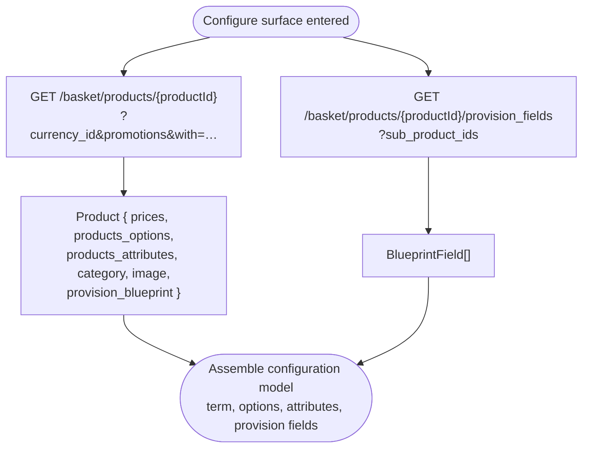
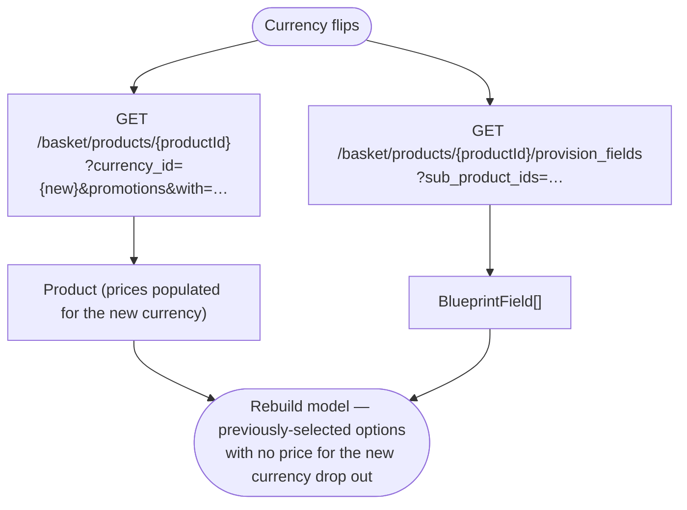
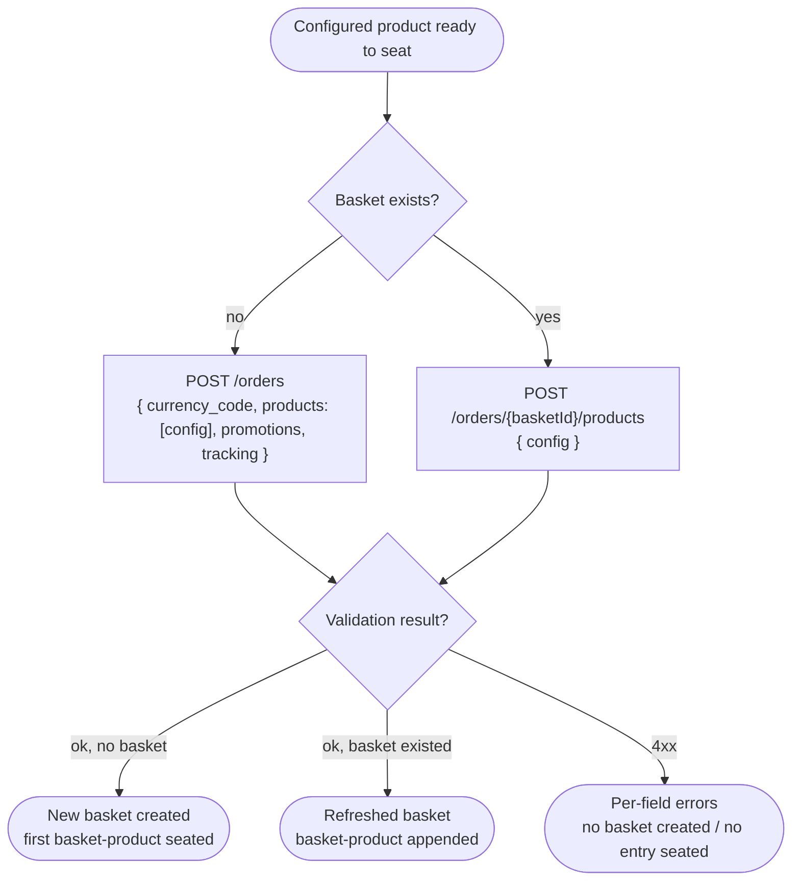

# Module: product

## What it is

Product covers the catalogue side of the cart: reading a sellable item, configuring it for the first time, and seating it into a basket. It answers three questions about one product at a time: _what is this thing_ (name, description, category, images, blueprint), _what can be configured on it_ (billing terms, configurable options, configurable attributes, provision fields), and _what does it cost right now_ (currency-converted price across every available billing cycle, including promotional discounts and price overrides driven by selected options). The same product returns different prices for different currencies and different prices when promotion codes are supplied at read time. Configuration validity is decided server-side at the seating call — required options, allowed quantities, and mandatory provision fields are enforced by the back end, which rejects invalid configurations with per-field errors.

Once a product is seated in a basket, the basket-product surface (`basketProduct` module) owns every subsequent operation against it — re-resolving with the basket's promotional context, editing the configuration, removing the entry. Product covers catalogue read and the seating call; basketProduct picks up from there.

> _Any `meta` field on the product response is UI-specific to our own client — ignore for spec purposes._

## Core concepts

- **Product** — one sellable item the storefront can present. Carries identity (name, category, images, blueprint), an order type (single, quantity-based, configuration-based), a `product_type` (single product, bundle, voucher), and the relations needed to render and price it.
- **Price** — one row per `(pricelist, currency, billing cycle)` combination on a product. A product without any matching `(currency, cycle)` price for the active currency is unsellable in that currency.
- **Billing cycle** — duration in months over which a recurring product is billed. `0` means one-off (no recurrence). The same product can offer multiple cycles; the customer picks one and the price changes accordingly.
- **Configurable option** — a sub-product the customer chooses _yes / no / one-of / many-of_ from. Selecting an option can override the parent's price (the option category carries `price_override`). Options have their own prices, their own billing cycles, and their own provision fields.
- **Configurable attribute** — same shape as an option but treated as an intrinsic property of the chosen configuration rather than an upsell. Categories can be `required` (must pick something) and `multiple` (can pick more than one).
- **Provision field** — typed input the customer must supply before the product can be provisioned (e.g. domain name, hostname, region). Field set is driven by the product's provisioning blueprint and changes when options/attributes change.
- **Coupon (code)** — the bare string a customer enters or a deep-link carries. Submitted as an input on the catalogue read or the seating call.
- **Promotion** — the resolved discount record returned on a product's price rows after the platform has validated a coupon (or auto-applied a promotion). Carries `id`, `type`, `value`, `display_type`, and (when sourced from a customer-entered coupon) `code`. Coupons are inputs; promotions are outputs.

## Operations

| #   | Capability                                                        | Inputs                                                                                                                                                                                                | Outputs                                                                                                                                                                                                                                                                                                                                                                                                                               |
| --- | ----------------------------------------------------------------- | ----------------------------------------------------------------------------------------------------------------------------------------------------------------------------------------------------- | ------------------------------------------------------------------------------------------------------------------------------------------------------------------------------------------------------------------------------------------------------------------------------------------------------------------------------------------------------------------------------------------------------------------------------------- |
| 1   | **Read a product for configuration**                              | product id, optional currency `{ id?, code? }`, optional coupon codes to apply, optional `basketId` (returns prices reflecting that basket's already-applied promotions / coupons / option overrides) | Full product record with prices, options (with their prices), attributes, category breadcrumb, primary image, image gallery, provisioning blueprint metadata (which embeds the initial provision-field definitions when the `provision_blueprint.category` expand is requested). Resolved promotions ride on each price row. Differs from a catalogue-list read by including every relation needed to _transact_ against the product. |
| 2   | **Read related products**                                         | product id, optional currency, optional coupon codes, pagination                                                                                                                                      | Catalogue products related to the input product, suitable for upsell / cross-sell surfaces. Same record shape as capability 1.                                                                                                                                                                                                                                                                                                        |
| 3   | **Re-fetch provision-field definitions after a selection change** | product id, list of currently-selected sub-product ids (options + attributes)                                                                                                                         | Array of typed field definitions describing what the customer must fill in to provision the service. The set is _dependent on the selected sub-products_, so the embedded definitions on the loaded product record become stale the moment the customer toggles an option or attribute — this endpoint re-derives them against the new selection.                                                                                     |
| 4   | **Calculate a configured price**                                  | currency id, set of unit prices already known from the product record (term + selected options + selected attributes)                                                                                 | Total price for the configuration in the requested currency, both raw and formatted. Used when the displayed total must match the back-end's currency formatting exactly.                                                                                                                                                                                                                                                             |
| 5   | **Create a basket with a configured product**                     | configured product, optional currency code, optional coupon codes, optional tracking envelope                                                                                                         | A new basket containing the supplied product as its first basket-product. Used when no basket exists yet — the first add-to-cart.                                                                                                                                                                                                                                                                                                     |
| 6   | **Add a configured product to an existing basket**                | `basketId`, configured product                                                                                                                                                                        | The refreshed basket, including the newly-added basket-product.                                                                                                                                                                                                                                                                                                                                                                       |

### Derived from a loaded product

The following are in-memory reads off a product record already retrieved via capability 1. They are not back-end calls — an architect rebuilding the platform plans for them as client-side derivations.

| #   | Capability                                                 | Inputs                                                                             | Outputs                                                                                                                                                                                                                                                                                                                   |
| --- | ---------------------------------------------------------- | ---------------------------------------------------------------------------------- | ------------------------------------------------------------------------------------------------------------------------------------------------------------------------------------------------------------------------------------------------------------------------------------------------------------------------- |
| 7   | **Read available billing terms**                           | a loaded product record                                                            | List of billing terms the product offers in the active currency. Each entry carries `{ cycle, price, promotions, displayed price }` and any per-term flags the catalogue uses (e.g. `default`, `discounted`). The list is sourced from the product's `prices` relation, filtered to entries matching the active currency. |
| 8   | **Read available configurable options**                    | a loaded product record                                                            | List of option _categories_ with their values. Each category exposes `{ required, multiple, price_override }`; each value exposes `{ id, title, price, billing cycle, quantifiable, default }`. The selectable set may change when the chosen term changes (some option prices are only available for some terms).        |
| 9   | **Read available configurable attributes**                 | a loaded product record                                                            | Same shape as options. The distinction is editorial (attributes describe what the thing _is_; options describe upsells / add-ons), not architectural — the back-end model is the same product-shaped sub-product.                                                                                                         |
| 10  | **Read provision-field definitions from a loaded product** | a loaded product record (with `provision_blueprint.category` expanded on the read) | The initial provision-field definitions ride embedded on the product record. Once the customer changes the selected sub-products, the embedded set is stale — re-fetch via capability 3 to get the field set for the new selection.                                                                                       |

## Data shape

### Product record — returned by `GET /basket/products/{productId}`

```ts
type Product = {
  id: string; // product UUID
  brand_id: string;
  org_id: string;
  category_id: string; // primary category — see ProductCategory below
  category: ProductCategory; // populated by the `category` relation expand
  products_category_id: string;
  products_options_category_id: string | null; // category enforcing the option layout
  products_attributes_category_id: string | null;

  name: string; // untranslated reporting name
  name_translated: string; // localised name for display
  description: string; // long-form, HTML allowed
  description_translated: string;
  short_description: string | null;
  short_description_translated: string | null;
  code: string | null; // brand-supplied SKU-style identifier
  external_id: string | null; // import_id passthrough

  product_type: 1 | 2 | 3 | 4 | 5 | 6; // 1=single, 2=bundle, 3=voucher, 4=option, 5=attribute, 6=subproduct
  order_type: 1 | 2 | 3; // 1=single-option, 2=quantity-based, 3=configuration-based
  main_product: 0 | 1; // 1 when this is a top-level orderable product
  in_group: 0 | 1; // 1 when this product is part of a parent's set
  hidden: boolean; // hide everywhere (catalogue + admin lists)
  hide_catalog: boolean; // hide from catalogue only
  available_for_sales: 0 | 1;
  clients_can_order: 0 | 1; // 0 makes the product non-orderable
  split_quantity: boolean;

  // --- order quantity constraints
  //
  // SENTINEL VALUES — 0 has special meaning on every field below. Treat as
  // "no constraint", not as literal zero. A naive `qty ?? 1` (nullish
  // coalesce) or `qty * step` will produce wrong behaviour for products
  // where the field is 0; use `qty || 1` / `step || 1` (truthy fallback)
  // when computing constraints.

  // Step size for quantity selection.
  //   0 = no stepping constraint (any integer >= min_order_quantity is valid)
  //   N > 0 = quantity must be a multiple of N (e.g. unit_quantity: 2 means
  //   the caller can order 2, 4, 6 — but NOT 1, 3, 5; the platform silently
  //   strips on PUT if the rule isn't satisfied — see basket.md "silent
  //   strip" lesson and basketProduct.md PUT failure modes).
  unit_quantity: number;

  // Minimum orderable quantity.
  //   0 = no minimum (any quantity >= 1 is valid, subject to unit_quantity stepping)
  //   N > 0 = quantity must be >= N
  min_order_quantity: number;

  // Maximum orderable quantity per order.
  //   0 = unlimited
  //   N > 0 = quantity must be <= N
  max_order_quantity: number;

  unit_id: string;
  max_order_billing_cycle: number;
  max_set_use_period: number;

  // --- billing
  billing_cycle_months: number; // default cycle. 0 = one-off
  currency_id: string; // product's source-of-truth currency
  default_payment_period: 0 | 1 | 2 | 3; // 0=inherit, 1=lowest, 2=lowest-monthly, 3=highest
  contract_type: number;
  auto_renew: 0 | 1;
  auto_create_renew_invoice: boolean;
  can_disable_auto_create_renew_invoice: boolean;
  cancel_anytime: boolean;
  cancel_interval: number | null;
  suspend_interval: number | null;
  close_interval: number | null;
  due_date_free_change: boolean;
  due_date_restriction: number | null;
  recommended_money_back_period: number | null;
  payment_days_term: number | null;
  create_invoice_term: number | null;
  invoice_consolidation_enabled: 0 | 1 | 2;
  manual_recurring_days_before_due_date: number | null;
  reactivate_status_restriction: string[] | null;

  // --- pricing
  display_price: string; // formatted headline price (brand currency by default)
  display_price_billing_cycle_months: number; // the cycle the headline refers to
  manual_price: 0 | 1; // 1 = manual override at order time
  set_price_type: number;
  set_order_type: number;
  set_end_date: number;
  additional_currency_recalculation: 0 | 1 | 2; // 0=never, 1=always, 2=brand-policy
  accounting_revenue_recognition: 0 | 1 | 2;
  tax_template_id: string | null;

  // --- trial
  trial_supported: boolean;
  trial_duration: number; // days
  trial_force: boolean; // customer cannot opt out
  trial_end_action: number; // 0=continue, 1=migrate, 2=cancel
  trial_pre_expire_notification: number;
  is_trial_only: boolean;

  // --- provisioning
  module_code: string | null; // e.g. "web_hosting"
  module_sub_id: string | null;
  provision_blueprint_id: string | null;
  provision_blueprint: Blueprint | null; // populated by the relation expand
  provision_category_id: string | null;
  provision_provider_id: string | null;
  provision_configuration_id: string | null;
  provision_configuration_mode: "static" | "dynamic" | null;
  provision_setup_field_defer_mode:
    | "none"
    | "after_order"
    | "before_completion"
    | null;
  provision_meta: Record<string, unknown> | null;
  domain_operation_code: string | null;
  domain_available?: boolean;
  operation_type: string | null;
  tld: string | null;
  tld_id: string | null;

  // --- voucher (only populated for product_type=3)
  voucher_value: string | null;
  voucher_currency_id: string | null;
  voucher_type: string | null;
  voucher_use_months: number | null;

  // --- relations populated by the `with=` query
  prices: Price[]; // one row per (currency, billing_cycle)
  products_options: SubProduct[]; // child sub-products treated as options
  products_attributes: SubProduct[]; // child sub-products treated as attributes
  options?: SubProduct[]; // legacy alias seen on some routes
  images: Image[];
  image: Image | null; // primary
  icon?: Image;
  brand?: Brand; // populated when expanded
  translations: Translation[];
  provision_fields?: BlueprintField[]; // populated when the response inlines blueprint fields directly on the product (see provision_blueprint.category expand)

  // --- admin / lifecycle
  allow_affiliate: boolean;
  affiliate_product_id: string | null;
  reseller_account_id: string | null;
  user_id: string;
  brand_ticket_department_id: string | null;
  report_code_1: string | null;
  report_code_2: string | null;
  manual_assistance: 0 | 1;
  auto_accept_cancel_request: 0 | 1;
  staged_import: boolean;
  finished_staged_import: boolean;
  import_id: string | null;
  start_date: string | null;
  end_date: string | null;
  created_at: string;
  updated_at: string;
  deleted_at: string | null;
};

// One pricing row. A product carries one row per (currency_id, billing_cycle_months).
type Price = {
  id: string;
  pricelist_id: string;
  product_id: string;
  currency_id: string;
  currency_code: string; // ISO 4217, e.g. "USD"
  currency_exchange_rate: number; // rate used to derive this row from the base price
  billing_cycle_months: number; // 0 = one-off
  price: number; // unit price for the cycle, decimal major units (e.g. 99 = $99.00)
  price_formatted: string; // e.g. "$99.00"
  monthly_price_from: number; // price / cycle, used by `lowest_monthly_price` display
  monthly_price_from_formatted: string;
  available_for_clients: boolean; // false = staff-only price row
  own_price: boolean; // false = inherited from parent pricelist
  overridden_price: boolean; // true = manually set on this pricelist
  original_price: number | null; // pre-override / pre-discount original
  original_price_formatted: string | null;

  // --- discount layering
  price_discounted: number | null; // null when no promotion applies
  price_discounted_formatted: string | null;
  monthly_price_from_discounted: number | null;
  monthly_price_from_discounted_formatted: string | null;
  mixed_promotions: boolean; // true when multiple promo display types collide
  promotions: Promotion[]; // promotions contributing to this row's discount

  from_datetime: string | null; // price effective-from
  to_datetime: string | null; // price effective-until
  external_id: string | null;
  import_id: string | null;
  staged_import: boolean;
  created_at: string | null;
  updated_at: string | null;
  deleted_at: string | null;
};

// Sub-product (option or attribute). Identical model to Product plus a pivot row
// linking it to the parent.
type SubProduct = Product & {
  pivot: {
    product_id: string; // parent
    option_id: string; // this sub-product
    order: number; // display order within the category
    default: 0 | 1; // pre-selected
  };
  prices: Price[]; // sub-products carry their own price rows
  icon?: Image; // populated by the `products_options.icon` expand
};

// Category record carried inline by the product. The top_category chain is
// nested up to 5 levels deep to support deep breadcrumb rendering.
type ProductCategory = {
  id: string;
  brand_id: string;
  org_id: string;
  parent_id: string | null;
  level: number; // 1-indexed depth in the category tree
  name: string;
  name_translated: string;
  description: string;
  description_translated: string;
  short_description: string | null;
  short_description_translated: string | null;
  external_id: string | null;
  category_type: 1 | 2 | 3; // 1=product, 2=option, 3=attribute
  multiple: boolean; // can the customer pick more than one value
  required: boolean; // must the customer pick at least one value
  price_override: boolean; // a selected value replaces (not adds to) the parent price
  provision_setup_field_defer_mode:
    | "none"
    | "after_order"
    | "before_completion";
  hidden: boolean;
  order: number;
  top_category: ProductCategory | null; // recursive parent chain
  translations: Translation[];
  created_at: string;
  updated_at: string;
  deleted_at: string | null;
};

// Promotion entry as it appears on a price row.
type Promotion = {
  id: string;
  promotion_id: string; // canonical promotion record id
  code: string | null; // coupon code; null for auto-applied promotions (no customer-entered code)
  type: string; // discount type (percent, amount, free, …)
  value: number;
  display_type: "percentage" | "amount" | "free_product" | "free_term" | string;
  description?: string | null;
};
```

### Provision-field definitions — returned by `GET /basket/products/{productId}/provision_fields`

Shape pinned from the captured v2 fixture `tests/fixtures/recordings/get-basket-products-20403869-...-provision_fields.json`. Earlier drafts of this type used `label` / `type` / `validation` / `default` — those names are wrong; the wire uses the prefixed / suffixed variants below.

```ts
type BlueprintField = {
  id: string;
  blueprint_id: string;            // same value as `id` in the capture — kept distinct on the type for clarity
  name: string;                    // machine identifier (e.g. "domain")
  field_label: string;             // display label — NOT `label`
  field_type: string;              // input widget — "input_text" | "input_select" | "input_checkbox" | …
  semantic_type: string | null;    // domain-modelling hint — e.g. "domain_name", "email", "username". Drives validation rule lookup and analytics.
  required: boolean;
  order: number;
  deferrable: boolean;             // true when the field can be left empty at seat with `provision_field_values_validate: false`
  defer_mode: "none" | string;     // how the platform handles the deferred-fill — verb pinned, full enum not pinned in capture
  is_setup: boolean;               // setup-time vs runtime field
  unique: "org" | "brand" | "client" | string | null;   // scope across which the value must be unique
  store_per: "blueprint" | "product" | string;          // where the value is recorded
  type: "order" | "service" | string;                   // top-level field category

  // Behaviour flags
  service_identifier: boolean;     // when true, this is the field that identifies the provisioned service (e.g. the domain name itself)
  indexed: boolean;                // searchable in admin
  track_changes: boolean;          // audit-log changes
  staff_can_update: boolean;
  customer_can_update: boolean;
  customer_enabled: boolean;
  highlight: boolean;              // surface prominently in UI

  // Constraints
  validation_rules: string[];      // array of named rules (e.g. ["required", "domain_name"]) — NOT a structured `validation` object
  options: Array<{ value: string; label: string }>;   // populated for select-style fields; empty array otherwise (NOT optional)
  default_value: string | number | boolean | null;    // NOT `default`
  extra_attributes: unknown[];     // platform-internal extension slot; shape not pinned in capture

  // Audit
  created_at: string;
  updated_at: string;
  deleted_at: string | null;
};
```

The endpoint accepts `?sub_product_ids=<csv>` for selection-driven re-reads, but the **initial product-page load fires without it** — the captured request from a live storefront is `GET /basket/products/{id}/provision_fields?lang=<lang>` only. Send `sub_product_ids` only when the user picks an option/attribute and you need the field set recomputed.

### Calculation request / response — `POST /cart/calculate`

```ts
type CalculateRequest = {
  currency_id: string;
  prices: Array<
    | number // raw amount
    | { price: number; quantity: number } // amount × quantity
  >;
};

type CalculateResponse = {
  total: number;
  total_formatted: string; // e.g. "$198.00"
  prices: number[]; // echoed normalised input amounts
};
```

### Configuration model — input to load and seat

```ts
type ProductModel = {
  productId: string;
  quantity: number;
  term?: number; // selected billing cycle in months
  options?: SubproductSelection;
  attributes?: SubproductSelection;
  provisionFields?: Record<string, unknown>;
  startTrial?: boolean;
};

// Nested selection record: option-category-id → value-id → selection.
type SubproductSelection = Record<
  string, // option/attribute category id
  Record<
    string, // selected value id
    { productId: string; cycle?: number; quantity?: number }
  >
>;
```

## Dependencies

### Dependants — modules that read from this one

| Module              | Weight | Reads                                                                                                                                                   | Why                                                                                                                                                                                                                                                                                          |
| ------------------- | ------ | ------------------------------------------------------------------------------------------------------------------------------------------------------- | -------------------------------------------------------------------------------------------------------------------------------------------------------------------------------------------------------------------------------------------------------------------------------------------- |
| `recommendations`   | 26     | product record, prices across cycles, billing cycles, configurable options                                                                              | Recommendation surfaces (upsells, cross-sells, suggested add-ons) walk product records to compute peer pricing, render cards, and filter by relevance.                                                                                                                                       |
| `system`            | 18     | product record, product name, category, billing cycle, currency                                                                                         | Analytics dispatch (`view_item`, `select_item`, `add_to_cart`, `remove_from_cart`) walks product records to populate event payloads; locale-driven translations resolve against product fields.                                                                                              |
| `basketProduct`     | 17     | product record (configuration model), prices, options, attributes, provision-field definitions, billing-cycle months, sub-product id list               | basketProduct hydrates its in-basket records against the same configuration model product describes — the catalogue read returns it standalone, the basket-product read returns it embedded. The configuration contract is shared; the seating + edit endpoints are basketProduct's concern. |
| `domain`            | 15     | product record, configurable options, billing cycles, prices, provisioning blueprint                                                                    | Domain registration, transfer, and renewal flows are products with TLD-specific options and cycle-priced records that resolve through the product surface.                                                                                                                                   |
| `productCategories` | 4      | product record, category id, product price summary                                                                                                      | Category browsing renders product cards from the product record's identity assets, headline price, and category-link metadata.                                                                                                                                                               |
| `productCatalogue`  | 3      | product record, configurable options, billing cycles, prices                                                                                            | Catalogue grids and detail pages render every product through the same surface — identity assets, price across cycles, configurable options.                                                                                                                                                 |
| `brand`             | 2      | product currency, product brand id                                                                                                                      | Brand's currency-resolution path consults the active product context when one is present — catalogue surfaces that need to respect a product's source-of-truth currency.                                                                                                                     |
| `basket`            | 1      | embedded product snapshot on line items, product name, product category                                                                                 | Basket lines carry an embedded `product` record sourced from the catalogue read at add-time; basket rendering reads product fields off this snapshot for line-item display.                                                                                                                  |
| Presentation layer  | —      | product name, description, images, badge, benefits, formatted price across cycles, formatted savings, option / attribute labels, provision-field labels | Catalogue cards, product configurator forms, basket-line summaries.                                                                                                                                                                                                                          |

> `query` (the HTTP transport layer) and `routing` (app-level navigation) reference product but are excluded from this table — they are foundational concerns, not domain consumers of product state.

### This module's own dependencies

- **HTTP transport layer** — bearer-token attachment, brand-currency injection on request, locale negotiation for translated fields, response shape normalisation.
- **Shared types / enums** — typed mirror of the API shape (product, sub-product, price, category, blueprint, blueprint field) plus the integer-enum keys for `product_type`, `order_type`, default-payment-period, trial actions, price display, promotion display, and payment-term designation.
- **Brand-derived inputs** — active currency (id and code), tax inclusion policy, price-display type, default payment period, promotion display style. Sourced from the brand record / brand config; the product module does not itself decide what currency or display style is in effect, it consumes them as inputs to resolution.

## API endpoints

### `GET /basket/products/{productId}`

Load one product for configuration. The `with` query parameter is comma-separated and selects which relations to inline — prices, options (with their own prices and icons), attributes (with icons), the category chain up to five levels, the primary image, the gallery, and the provisioning blueprint. The `currency_id` parameter selects which currency's prices to populate. The `promotions` query parameter takes a comma-separated list of coupon codes to apply; resolved promotions ride on each price row in the response. When the request also carries a `basket_id`, the response prices additionally reflect any coupons or promotions already applied to that basket — useful when browsing the catalogue while a basket is active.

```bash
curl -s "$API/basket/products/47d73824-8507-9315-345f-81e642d59e06?\
currency_id=e47d7382-4850-7931-56c8-1e642d59e063&\
promotions=&\
with=image,images,prices,products_attributes,products_attributes.icon,products_options,products_options.icon,products_options.prices,category.top_category.top_category.top_category.top_category,provision_blueprint.category" \
  -H "Authorization: Bearer $ACCESS_TOKEN"
```

```json
{
  "status": "ok",
  "data": {
    "id": "47d73824-8507-9315-345f-81e642d59e06",
    "external_id": "logo",
    "name": "Logo Design",
    "name_translated": "Logo Design",
    "description": "",
    "description_translated": "",
    "short_description": null,
    "short_description_translated": null,
    "code": null,
    "product_type": 1,
    "order_type": 2,
    "main_product": 1,
    "in_group": 0,
    "hidden": false,
    "hide_catalog": false,
    "available_for_sales": 1,
    "clients_can_order": 1,
    "split_quantity": false,
    "unit_quantity": 2,
    "min_order_quantity": 0,
    "max_order_quantity": 0,
    "unit_id": "5952098d-3de4-0917-76b3-1578626e347e",
    "billing_cycle_months": 0,
    "currency_id": "e47d7382-4850-7931-56c8-1e642d59e063",
    "default_payment_period": 2,
    "auto_renew": 0,
    "auto_create_renew_invoice": true,
    "cancel_anytime": true,
    "invoice_consolidation_enabled": 1,
    "display_price": "$99.00",
    "display_price_billing_cycle_months": 0,
    "is_trial_only": false,
    "trial_supported": false,
    "trial_duration": 0,
    "trial_force": false,
    "trial_end_action": 0,
    "module_code": null,
    "provision_blueprint_id": null,
    "provision_blueprint": null,
    "category_id": "8d632507-9806-5d1e-37ef-8174e234e98d",
    "products_category_id": "8d632507-9806-5d1e-37ef-8174e234e98d",
    "products_options_category_id": "8d632507-9806-5d1e-37ef-8174e234e98d",
    "products_attributes_category_id": "8d632507-9806-5d1e-37ef-8174e234e98d",
    "brand_id": "47d73824-8507-9315-e54f-81e642d59e06",
    "org_id": "5952098d-3de4-0917-e38a-31578626e347",
    "tax_template_id": "24d03679-424d-0e71-04b3-153698d582e8",
    "accounting_revenue_recognition": 0,
    "additional_currency_recalculation": 1,
    "allow_affiliate": true,
    "category": {
      "id": "8d632507-9806-5d1e-37ef-8174e234e98d",
      "external_id": "design_services",
      "name": "Design Services",
      "name_translated": "Design Services",
      "description": "From logos to UI/UX, our design services bring your brand to life. Visually compelling and user-centered creations tailored to your audience.",
      "short_description": "From logos to UI/UX, our design services bring your brand to life. Visually compelling and user-centered creations.",
      "parent_id": null,
      "level": 1,
      "category_type": 1,
      "multiple": false,
      "required": false,
      "price_override": false,
      "hidden": false,
      "order": 0,
      "top_category": null
    },
    "prices": [
      {
        "id": "de78642d-e539-7146-609b-21208469530d",
        "pricelist_id": "5952098d-3de4-0917-86a3-1578626e347e",
        "product_id": "47d73824-8507-9315-345f-81e642d59e06",
        "currency_id": "e47d7382-4850-7931-56c8-1e642d59e063",
        "currency_code": "USD",
        "currency_exchange_rate": 1,
        "billing_cycle_months": 0,
        "price": 99,
        "price_formatted": "$99.00",
        "monthly_price_from": 99,
        "monthly_price_from_formatted": "$99.00",
        "available_for_clients": true,
        "own_price": true,
        "overridden_price": false,
        "original_price": null,
        "original_price_formatted": null,
        "price_discounted": null,
        "price_discounted_formatted": null,
        "monthly_price_from_discounted": null,
        "monthly_price_from_discounted_formatted": null,
        "mixed_promotions": false,
        "promotions": []
      }
    ],
    "products_attributes": [],
    "products_options": [],
    "provision_blueprint": null,
    "images": [],
    "image": null
  }
}
```

> Sample trimmed for readability — additional admin-adjacent fields on the product (lifecycle timestamps, fraud / cancellation policy, voucher fields, report codes) are preserved in the captured fixture. Products with options/attributes return populated `products_options` / `products_attributes` arrays — each entry has the same shape as the root product plus a `pivot` row linking it to the parent.

### `GET /basket/products/{productId}/related`

Catalogue products related to the input product, suitable for upsell / cross-sell surfaces. Same per-product response shape as `GET /basket/products/{productId}`. Sorted by display order, paginated.

```bash
curl -s "$API/basket/products/47d73824-8507-9315-345f-81e642d59e06/related?\
currency_id=e47d7382-4850-7931-56c8-1e642d59e063&\
promotions=&\
limit=4&offset=0&\
filter[active]=true&\
with=image,images,prices,products_attributes,products_options,products_options.prices,related,category.top_category.top_category.top_category.top_category" \
  -H "Authorization: Bearer $ACCESS_TOKEN"
```

Response is `{ status, data: Product[], total }` — an array of the per-product shape shown in `GET /basket/products/{productId}` above.

### `GET /basket/products/{productId}/provision_fields`

The provision-field definitions for a product _given a specific set of selected sub-products_. The `sub_product_ids` query parameter is a comma-separated list of currently-selected option / attribute ids. The response set changes when the selection changes — different options can unlock or hide different provisioning fields.

```bash
curl -s "$API/basket/products/47d73824-8507-9315-345f-81e642d59e06/provision_fields?\
sub_product_ids=" \
  -H "Authorization: Bearer $ACCESS_TOKEN"
```

```json
{
  "status": "ok",
  "data": []
}
```

> Empty array means the product carries no provisioning fields for the supplied sub-product selection — typical for non-provisionable products (design services, one-off vouchers). Provisionable products (hosting, domains) return populated definitions; real captures will replace this placeholder once available.

### `POST /cart/calculate`

Sum a set of pre-known unit prices into a single configured total in the requested currency. The request body carries the currency and a list of price entries — each entry is either a raw number or a `{ price, quantity }` pair. The endpoint returns both the raw total and a brand-formatted string. Used to format a sum that the storefront could compute itself, when the client cannot be trusted to render currency the same way the back end will.

```bash
curl -s "$API/cart/calculate" \
  -H "Authorization: Bearer $ACCESS_TOKEN" \
  -H "Content-Type: application/json" \
  --data '{
    "currency_id": "e47d7382-4850-7931-56c8-1e642d59e063",
    "prices": [99, { "price": 49.50, "quantity": 2 }]
  }'
```

```json
{
  "status": "ok",
  "data": {
    "total": 198,
    "total_formatted": "$198.00",
    "prices": [198]
  }
}
```

### `POST /orders`

Create a basket with one or more configured products. Used when the customer adds the first product to the cart (no basket exists yet). The body carries the configured products in a `products` array, plus basket-level side data — currency, coupon codes to apply, optional tracking envelope. Coupon codes on this call attach at the _root_ of the payload (`promotions: [{ promocode: "X" }]`), not per product.

```bash
curl -s "$API/orders" \
  -X POST \
  -H "Authorization: Bearer $ACCESS_TOKEN" \
  -H "Content-Type: application/json" \
  --data '{
    "category_slug": "new_contract",
    "currency_code": "USD",
    "products": [
      {
        "product_id": "47d73824-8507-9315-345f-81e642d59e06",
        "quantity": 1,
        "billing_cycle_months": 0,
        "options": [],
        "attributes": [],
        "provision_field_values": {}
      }
    ],
    "promotions": [{ "promocode": "WELCOME20" }],
    "tracking": {}
  }'
```

Response is the new basket (`IBasket`) including the supplied product as its first basket-product. Full envelope and per-line fields documented in the basket module. Real fixture available at [`tests/fixtures/recordings/post-orders.json`](../../../../../../tests/fixtures/recordings/post-orders.json).

### `POST /orders/{basketId}/products`

Add a configured product to an existing basket. The body is the single-product configuration shape (the same shape that rides in the `products` array of `POST /orders`).

```bash
curl -s "$API/orders/63250798-065d-1e20-388f-8174e234e98d/products" \
  -X POST \
  -H "Authorization: Bearer $ACCESS_TOKEN" \
  -H "Content-Type: application/json" \
  --data '{
    "product_id": "3825d96e-763e-d091-3dc4-174825283406",
    "quantity": 1,
    "billing_cycle_months": 12,
    "options": [
      { "product_id": "85d085e6-9d56-2371-9ea2-18e940d42370", "unit_quantity": 1, "billing_cycle_months": 12 }
    ],
    "attributes": [],
    "provision_field_values": { "region": "eu-west" },
    "promotions": [{ "promocode": "WELCOME20" }],
    "start_trial": false
  }'
```

```json
{
  "status": "ok",
  "data": {
    "id": "5d96e763-ed09-13e9-e0df-417482528340",
    "brand_id": "47d73824-8507-9315-e54f-81e642d59e06",
    "currency_id": "e47d7382-4850-7931-56c8-1e642d59e063",
    "pricelist_id": "5952098d-3de4-0917-86a3-1578626e347e",
    "category_id": "3825d96e-763e-d091-3dc4-174825283406",
    "total_amount": 200,
    "net_amount": 166.6666,
    "tax_amount": 33.3334,
    "products": [
      {
        "id": "63250798-065d-1eed-942c-8174e234e98d",
        "product_id": "47d73824-8507-9315-345f-81e642d59e06",
        "name": "Logo Design",
        "quantity": 2,
        "billing_cycle_months": 0,
        "selling_price": 99,
        "total_amount": 198
      },
      {
        "id": "d7382485-0793-1567-845f-81e642d59e06",
        "product_id": "3825d96e-763e-d091-3dc4-174825283406",
        "name": "Blocos de desenvolvimento",
        "quantity": 1,
        "billing_cycle_months": 12,
        "selling_price": 1,
        "total_amount": 1
      }
    ]
  }
}
```

> Sample trimmed for readability — the response is the complete refreshed `IBasket` (every basket-envelope field, every basket-product, applied taxes, promotions, warning notes). Full capture in [`tests/fixtures/recordings/post-orders-5d96e763-ed09-13e9-e0df-417482528340-products.json`](../../../../../../tests/fixtures/recordings/post-orders-5d96e763-ed09-13e9-e0df-417482528340-products.json). Note: the basket above already held the Logo Design line before this call — the new entry is the "Blocos de desenvolvimento" basket-product. The platform doesn't flag it as new (see the diff-gotcha Lesson below).

## Flows

Product resolution is rarely a single request. The configurator surface plans around three multi-step interactions: load (product + provision fields), react to a currency switch (re-fetch against the new currency), and seat the configured product into a basket (POST against `/orders` or `/orders/{basketId}/products`).

### Resolve a product for configuration

Loading a product for the configure surface needs the product record _and_ its provisioning fields in the same beat. The two responses are independent — the product describes what _can_ be configured, the provision fields describe what _must_ be filled in once a selection exists — so they can run in parallel.



Guarantees the platform holds:

- The two requests are independent — neither response carries the other, and either can land first.
- Passing `promotions` and `coupons` returns prices that reflect those discounts; omitting them returns the standalone catalogue prices.
- The `with` expand list controls what relations are inlined; missing expands silently leave relation fields as `null` / empty arrays rather than triggering a second request.
- The provision-fields response can be empty — non-provisionable products (design services, one-off vouchers) carry no blueprint fields.

Constraints the caller has to plan around:

- The product response carries every option regardless of term — filtering by term to the `(option-value, billing_cycle)` pairs that actually exist is the caller's responsibility.
- The provision-field set is computed against the _currently-supplied_ sub-product ids, not the product's full option grid. The set returned at load time is not valid once the selection changes.

### Re-resolve on currency change

A currency change is not a re-format — it is a different fetch. Prices, promotions, and option price-overrides all key off `currency_id`, and the resolved product is unsellable in a currency it has no price row for. The caller restarts the full resolve flow against the new currency.



Guarantees the platform holds:

- The same endpoints serve the new currency. Currency is a query parameter, not a separate resource.
- The product's `prices` relation is filtered server-side to the requested currency. A product with no row for the new currency returns an empty `prices` array — that's the unsellable signal.
- Promotional context (applied coupons, applied basket promotions) is re-applied to the new currency's price rows.

Constraints the caller has to plan around:

- Selections do not carry across currencies. Option / attribute selections that exist in currency A but have no price row in currency B silently disappear from the new configuration. The caller has to reconcile against the new product and surface the drop, not preserve a phantom selection.
- The display headline price does not remain stable. The price the catalogue rendered in the previous currency is gone; the new product carries its own headline that may correspond to a different billing cycle entirely.

### Configure then seat into a basket

Adding a configured product to the basket is one of two calls depending on whether a basket already exists. Both calls take the same single-product configuration shape — the platform decides what to do with it based on the URL.



Guarantees the platform holds:

- A single round-trip seats the product — `POST /orders` both creates the basket and validates the first entry; `POST /orders/{basketId}/products` validates and seats into the existing basket.
- The returned basket-product id is the addressable identifier for every subsequent operation on that entry (re-resolve, edit, remove) — the catalogue `product_id` is not.
- Promotions on `POST /orders` live at the root of the body; per-product promotions sent on `POST /orders/{basketId}/products` ride on the configuration itself.

Constraints the caller has to plan around:

- A validation rejection to leave any state behind. A 4xx response with per-field errors means no basket was created (or no entry seated against an existing basket) — the caller has to resubmit the full payload after fixing the offending fields.
- Per-product coupon codes to be accepted on `POST /orders`. On basket creation only, coupon codes attach at the root of the body (`promotions: [{ promocode }]`); sent per-product they are silently dropped.
- The basket's currency to remain what the catalogue read returned. Once the basket exists, its currency wins — a subsequent add against `POST /orders/{basketId}/products` returns prices in the basket's currency regardless of what the catalogue read for the product showed.

## Lessons (hard-won)

- **A product's identity does not include its price.** The same product carries one price row per `(pricelist, currency, billing cycle)`. Resolving a product in a different currency is not a re-render — it is a different fetch, and a product with no price row for the active currency is unsellable in that currency without falling back to additional-currency-recalculation rules. A consumer that caches "the product" without keying the cache on currency serves stale or wrong prices the moment the customer flips currencies.

- **Configurable-option price overrides are not additive.** Most option selections add to the term price. Categories flagged `price_override: true` _replace_ the term price entirely. Without detecting this and zeroing the term contribution, totals double-count whenever an override option is selected — silently, because every line item still has a valid price.

- **Provision-field definitions depend on the current option selection.** The set of typed inputs a customer must fill in to provision the service is computed from the product's blueprint _and_ whichever options/attributes are currently chosen. Toggling an option can add, remove, or re-validate fields. A storefront that fetches provision fields once at product load and reuses them across the configuration session will render the wrong form for any selection that diverges from the load-time defaults.

- **Sub-products carry their own dependency chain on the parent.** A sub-product carries the full product shape — its own prices, its own billing cycles, its own provision fields, its own clients-can-order flag — not just a thin pivot record. A storefront that models options as a slim parent-pivot row loses every one of those concerns.

- **Some `(option-value, term)` pairs do not exist.** Option prices are themselves rows in a `(currency, billing_cycle)` grid. When the customer changes the parent's term, some previously-selected options may have no price for the new term and silently drop out of the configuration. Either the storefront filters the option grid by the active term, or selections will appear valid in the model and missing from the total.

- **Price-display headlines diverge from the actually-payable price.** The catalogue may render the lowest cycle's price, the lowest _monthly-equivalent_ across cycles, or the lowest _monthly-equivalent of monthly-billed products only_. None of these is the price the customer actually pays at checkout; that depends on which term they pick. A consumer that lets the catalogue's headline drift into the configurator without re-resolving creates a "price changed" experience between catalogue card and configure page that breaks trust.

- **A one-off product is `billing_cycle_months: 0`, not absent.** Zero is a real cycle carrying a real price row — rendering it as blank or as "0 months" mis-presents every one-off product in the catalogue. Code that treats zero as "no cycle selected" loses the term entirely.

- **Pricing is recalculated on every change, and the platform doesn't sequence responses.** Every option toggle, term change, or quantity bump triggers an independent `/cart/calculate` round-trip. Calculation responses for stale configurations can land after the user has already moved on; the platform does not surface a sequence number on responses, so the displayed price can flicker between configurations and settle on a value that no longer matches what is selected.

- **The product record carries promotion data that depends on the coupons supplied at read time.** Coupon codes passed on the read modify the returned price rows (`price_discounted`, `monthly_price_from_discounted`, `promotions` array per row). The same product fetched with different coupons — or fetched standalone vs scoped to a basket's applied coupons — returns different prices for the same currency. A consumer that loads products without the basket's coupon set and uses those prices to render savings on a basket-context surface will under- or over-display them.

- **Passing `basket_id` on a catalogue read is not free.** When `basket_id` is supplied, the back end loads the basket and recomputes every price row against its applied promotions, applied coupons, and the option overrides currently bound on the basket's line items. That work scales with the size of the basket and is paid on every request. Use the parameter when the catalogue surface needs basket-accurate prices (mini-cart upsell, "in your basket" badges on a product card, basket-aware recommendation lists); skip it on broad catalogue browsing where the basket-agnostic prices are sufficient, otherwise every product card on every page pays the recomputation cost.

- **The seating call returns the full basket, not just the newly-seated entry.** Both `POST /orders` and `POST /orders/{basketId}/products` respond with the complete refreshed `IBasket` — every basket-product in the basket, every total, every applied promotion. The newly-seated entry is _in_ the response but the platform doesn't flag it as new; its `id` (the basket-product id) is freshly assigned and the rest of the basket is reconciled around it. A consumer that needs to act on the new entry specifically (analytics `add_to_cart` dispatch with the seated configuration, animation, post-add redirect carrying the new basket-product id) diffs the post-seat basket's products against the pre-seat snapshot to identify the addition by id. Two non-obvious cases the diff has to handle (both niche but easy to miss):
  - **One seating call can yield multiple new basket-products.** Some catalogue products materialise as N separate entries on the basket rather than one — the diff produces N new ids, not one.
  - **Seating a quantifiable catalogue product already on the basket yields zero new entries.** The platform merges into the existing basket-product and bumps its quantity; the diff produces no new ids — the change shows up as a quantity delta on an existing id.

- **Client-side validation of a configured model is a UX optimisation, not a platform requirement.** Required options, allowed quantities, mandatory provision fields, and trial-flag combinations are all enforced server-side at the seating call — a configuration that's wrong gets rejected with per-field errors regardless of what the client checked. Pre-validating locally surfaces errors faster (one less round-trip for fixable mistakes) but duplicates rules that ultimately live on the back end. Skipping client-side validation entirely is valid; the trade-off is purely latency for the user's first mis-step.

- **Trial flags interact with payment requirements.** `trial_supported`, `trial_force`, `trial_end_action`, and the brand's "require payment details for zero-amount orders" key combine to decide whether a trial purchase needs a card before completion. The four-way matrix produces non-obvious outcomes — e.g. a forced trial on a brand that requires payment details for zero-amount orders still asks for a card, even though the purchase itself is free.

- **Quantity-constraint fields use `0` as "no constraint", not literal zero.** `unit_quantity: 0` means any integer is valid (no stepping); `min_order_quantity: 0` means no minimum (any quantity >= 1); `max_order_quantity: 0` means unlimited. A consumer that nullish-coalesces (`qty ?? 1`) when computing constraints treats the `0` field as set and applies a stepping or floor rule the platform doesn't enforce — and a consumer that multiplies (`qty * step`) silently zeroes out every product whose `unit_quantity` is `0`. Truthy fallback (`step || 1`, `floor || 1`) is the safe pattern. The platform silently strips lines that violate stepping post-acceptance — see basket.md "Mutations can silently strip what they accepted".
